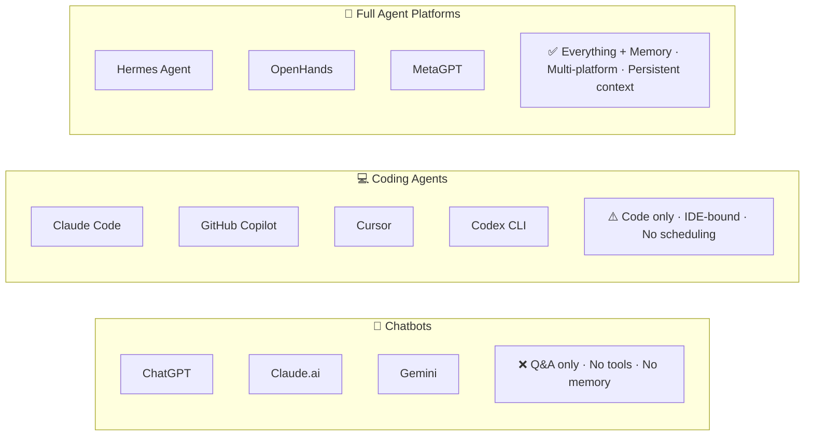
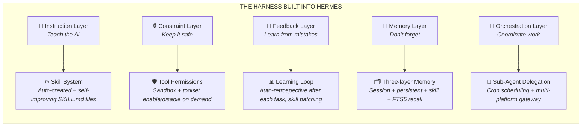
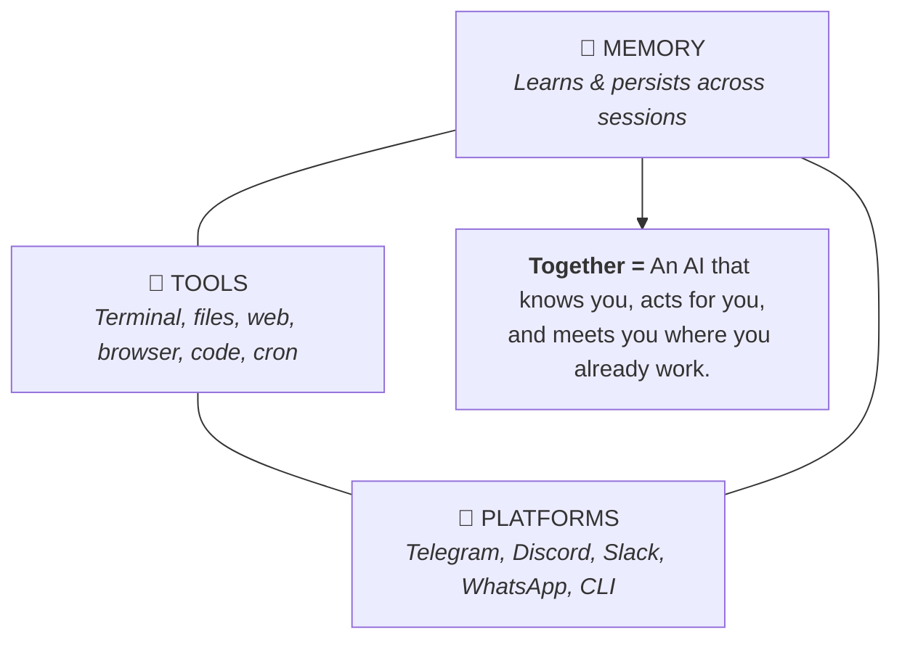

# Chapter 1: Hello Hermes

> **The AI agent that works while you sleep, chats where you chat, and gets smarter every time you use it.**

---

## 1.1 The Problem Hermes Solves

You've used ChatGPT. You've used Claude. Maybe Copilot, maybe Gemini. They're great at answering questions — but every time you open a new chat, you start from zero. No memory. No tools. No access to your files, your terminal, your workflow.

**Hermes Agent is different.**

Hermes is an **autonomous AI agent** that:

- **Remembers** — your preferences, your projects, your past conversations, across sessions
- **Acts** — reads files, writes code, runs terminal commands, searches the web, manages your schedule
- **Lives everywhere** — Telegram, Discord, Slack, WhatsApp, your terminal, your IDE
- **Improves** — learns from experience by saving reusable skills
- **Scales** — spawns parallel agents, schedules cron jobs, orchestrates multi-agent workflows

It's not a chatbot. It's an **AI employee** that works 24/7 across all your platforms with full system access.

---

## 1.2 What Makes Hermes Different

The AI agent space is crowded. Here's where Hermes sits:



**Key differentiators:**

| Feature | ChatGPT | Claude Code | Hermes |
|---------|---------|-------------|--------|
| Persistent memory | ❌ | Partial | ✅ Cross-session |
| Messaging platforms | ❌ | ❌ | ✅ 10+ platforms |
| Skill system | ❌ | ❌ | ✅ Learns & improves |
| Cron scheduling | ❌ | ❌ | ✅ Built-in |
| Multi-agent orchestration | ❌ | Partial | ✅ Delegation + Kanban |
| Provider-agnostic | ❌ | ❌ Anthropic only | ✅ 20+ providers |
| Self-improvement | ❌ | ❌ | ✅ Curator system |

### Three Tools, Three Jobs

Hermes isn't here to replace your existing tools. It's the next step in the progression:

| Tool | Job | Analogy |
|------|-----|---------|
| **Claude Code** | Interactive pair programming | Sitting with a senior dev at the terminal |
| **OpenClaw** | Configuration-as-behavior | Raising a pet — you shape it with SOUL.md |
| **Hermes Agent** | Autonomous self-improvement | An employee who learns on the job, works while you sleep |

Each tool excels at its job. You don't choose one — you use all three for different needs. And here's the best part: all three use the **agentskills.io standard**, meaning Skills are portable. A Skill written for Claude Code works in Hermes, and vice versa.

> **💡 When to reach for Hermes:** If you want an AI that runs background tasks, schedules itself, remembers everything across sessions, and gets better without you feeding it — that's Hermes. If you need real-time pair coding, that's Claude Code.

### The Harness Framework

In early 2026, a consensus emerged in the AI world: **the bottleneck isn't the model — it's the environment around it.** Mitchell Hashimoto (creator of Terraform) named this **Harness Engineering** — the practice of wrapping AI in rules, memory, and tools so it performs reliably.

Hermes is the first agent that **ships with the harness built in**. Every component maps to a proven principle:



Other tools require you to build this harness manually — writing config files, setting up hooks, managing memory by hand. Hermes does all five automatically, from your very first conversation.

---

## 1.3 System Requirements

Before we install, make sure you have:

**Required:**
- **Python 3.10+** — Hermes is a Python application
- **Git** — for installation and project management
- **4GB RAM minimum** — 8GB recommended for multi-agent workflows
- **Internet connection** — API calls to LLM providers

**Supported Operating Systems:**
- ✅ Linux (Ubuntu 20.04+, Fedora, Arch)
- ✅ macOS (Intel + Apple Silicon)
- ✅ Windows 10/11 (native, WSL2, or git-bash)
- ✅ Docker (any OS)

**One LLM provider API key** — pick one to start:
- OpenRouter (recommended — access to 200+ models)
- Anthropic (Claude models)
- OpenAI (GPT-4, GPT-4o)
- Google (Gemini)
- DeepSeek
- Or any of 15+ others

> **💡 Recommendation:** Start with OpenRouter. One API key gives you access to every major model, and you can switch between them freely. We'll cover provider setup in Section 1.5.

---

## 1.4 Installation

### Linux & macOS

```bash
# One-line install
curl -fsSL https://raw.githubusercontent.com/NousResearch/hermes-agent/main/scripts/install.sh | bash
```

This script will:
1. Clone the Hermes Agent repository
2. Create a Python virtual environment
3. Install all dependencies
4. Add `hermes` to your PATH

### Windows

```bash
# Using git-bash (recommended)
curl -fsSL https://raw.githubusercontent.com/NousResearch/hermes-agent/main/scripts/install.sh | bash
```

> **Windows users:** Hermes runs natively on Windows. Use git-bash, PowerShell, or Windows Terminal — all work. See [Appendix A: Windows Quirks] for platform-specific notes.

### Docker

```bash
docker pull ghcr.io/nousresearch/hermes-agent:latest
docker run -it --rm \
  -v ~/.hermes:/root/.hermes \
  -v ~/projects:/root/projects \
  ghcr.io/nousresearch/hermes-agent:latest
```

### Verify Installation

```bash
hermes --version
# Output: hermes x.x.x
```

If you see a version number, you're golden.

---

## 1.5 Your First Run — The Setup Wizard

```bash
hermes setup
```

Hermes launches an interactive wizard that walks you through:

**Step 1: Model Selection**
```
? Choose your default model:
  ❯ Anthropic Claude Sonnet 4 (recommended)
    OpenAI GPT-4o
    Google Gemini 2.5 Pro
    DeepSeek V3
    [100+ more via OpenRouter]
```

**Step 2: API Key**
```
? Enter your API key: sk-or-v1-xxxxx...
✓ Key validated. Provider: OpenRouter
```

**Step 3: Tool Configuration**
```
? Which toolsets would you like to enable?
  ❯ ◉ web (search + content extraction)
    ◉ terminal (shell commands)
    ◉ file (read/write/search)
    ◉ browser (web automation)
    ◯ image_gen (AI image generation)
    ◉ memory (persistent memory)
    ◉ delegation (subagent tasks)
    ◉ cronjob (scheduled tasks)
```

> **💡 Tip:** Enable `web`, `terminal`, `file`, `memory`, `delegation`, and `cronjob` at minimum. You can add more later with `hermes tools`.

**Step 4: Confirm**
```
✓ Setup complete!
  Model: openrouter/anthropic/claude-sonnet-4
  Provider: openrouter
  Tools: 6 toolsets enabled
  Config: ~/.hermes/config.yaml

Run 'hermes' to start chatting.
```

---

## 1.6 Your 5-Minute Win

Let's get you actual value right now. Start Hermes:

```bash
hermes
```

You'll see the welcome banner and a prompt:

```
╭──────────────────────────────────────────╮
│  Hermes Agent v2.x                       │
│  Model: claude-sonnet-4 (OpenRouter)     │
│  Tools: 42 loaded                        │
╰──────────────────────────────────────────╯

You: 
```

### Task 1: Ask It Anything

```
You: What are the top 5 most starred GitHub repos this week?
```

Hermes uses its web search tools, fetches live data, and gives you an answer with sources. Not cached — **live**.

### Task 2: Have It Do Real Work

```
You: Create a Python FastAPI project called "my-api" in ~/projects/ 
    with a health check endpoint, Dockerfile, and README
```

Watch what happens:

```
Hermes: I'll set up a FastAPI project with the requested structure.

  [terminal] mkdir -p ~/projects/my-api/app
  [write]   ~/projects/my-api/app/main.py (created)
  [write]   ~/projects/my-api/Dockerfile (created)
  [write]   ~/projects/my-api/README.md (created)
  [write]   ~/projects/my-api/requirements.txt (created)

  Done! Project created at ~/projects/my-api/

  Structure:
  my-api/
  ├── app/
  │   └── main.py          ← FastAPI app with GET /health
  ├── Dockerfile            ← Multi-stage Python 3.12 build
  ├── requirements.txt      ← fastapi, uvicorn
  └── README.md             ← Setup & run instructions

  Run it: cd ~/projects/my-api && python -m uvicorn app.main:app --reload
```

**That just happened.** Hermes created real files on your real filesystem, with working code, in seconds.

### Task 3: Make It Remember

```
You: Remember that my preferred Python framework is FastAPI and I use 
    4-space indentation.

Hermes: ✓ Saved to memory:
  - Preferred Python framework: FastAPI
  - Code style: 4-space indentation
```

Next session, next week, next month — Hermes will **still remember this**. No re-explaining.

---

## 1.7 The Big Picture — What You Just Unlocked

In 5 minutes, you've experienced three core capabilities:



**What's next:** In Chapter 2, we'll dive into *how* Hermes works — the agent loop, model selection, toolsets, and configuration. You'll understand what's happening under the hood so you can bend Hermes to your will.

But first — if you want Hermes on your phone right now...

### Bonus: Connect to Telegram (2 minutes)

```bash
hermes gateway setup
```

Select Telegram, enter your bot token (from [@BotFather](https://t.me/BotFather)), and:

```
✓ Gateway running
✓ Telegram connected: @YourHermesBot

Message your bot on Telegram to start chatting.
Same agent, same memory, same tools — now in your pocket.
```

Now you have Hermes on your phone. **Every feature from the CLI is available through Telegram.** Send voice messages, images, files — Hermes handles them all.

---

## Chapter 1 Summary

| Concept | What You Learned |
|---------|-----------------|
| What Hermes is | Autonomous AI agent with memory, tools, and multi-platform presence |
| Installation | One command: `curl ... \| bash` then `hermes setup` |
| First interaction | `hermes` → chat, create projects, save memories |
| Quick win | Created a real FastAPI project in seconds |
| Telegram gateway | `hermes gateway setup` → AI in your pocket |
| Key insight | Hermes remembers, acts, and lives where you work |

**Next:** [Chapter 2: Core Concepts →](ch02-core-concepts.md)

---

<!-- SCREENSHOT: Hermes welcome banner in terminal -->
<!-- SCREENSHOT: Setup wizard model selection -->
<!-- SCREENSHOT: FastAPI project creation output -->
<!-- SCREENSHOT: Telegram bot first message -->
