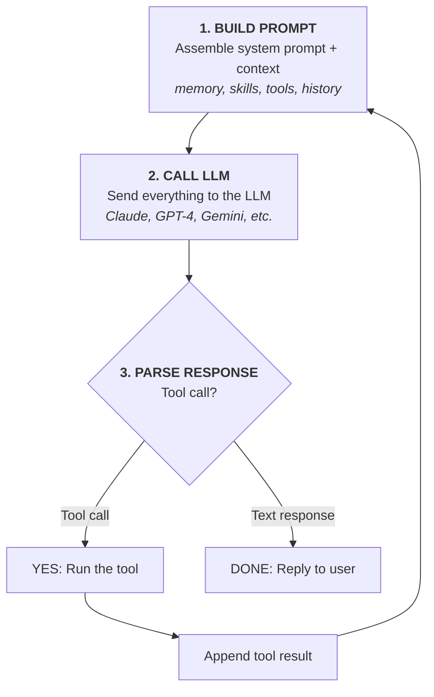
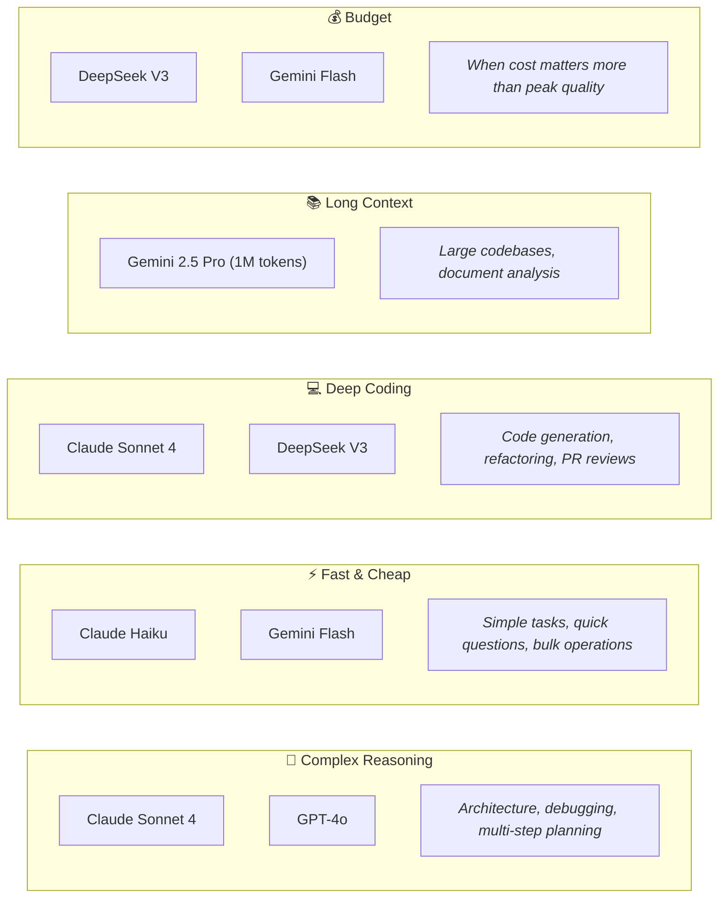
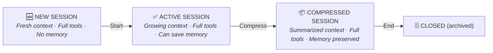
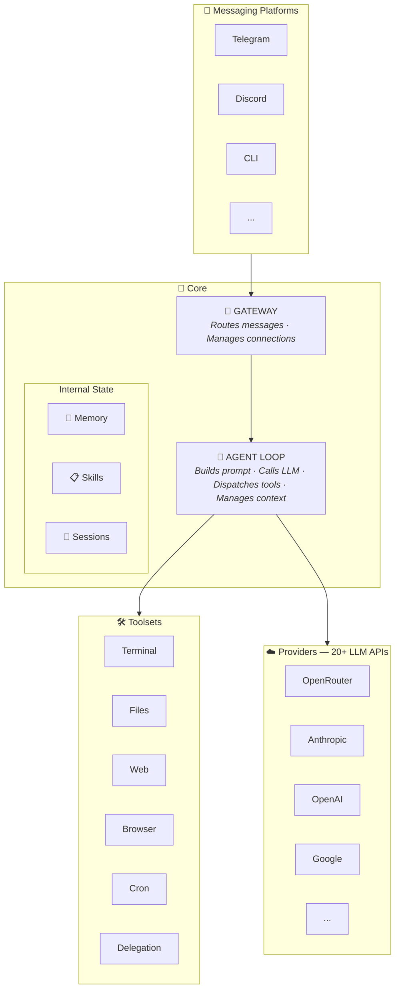

# Chapter 2: Core Concepts

> **Understand the engine before you drive the car. This chapter demystifies how Hermes thinks, acts, and remembers.**

---

## 2.1 The Agent Loop — How Hermes Thinks

Everything Hermes does follows one repeating pattern — the **agent loop**:



Here's what that looks like in practice:

```
You: Set up a Python project with pytest

Turn 1:
  LLM → "I'll create the project structure."
       Tool call: terminal("mkdir -p myproject/tests")
       Tool call: write_file("myproject/tests/__init__.py", "")
       
Turn 2:
  LLM → "Now I'll add the test configuration."
       Tool call: write_file("myproject/pyproject.toml", "[tool.pytest]...")
       
Turn 3:
  LLM → "Project created! Here's the structure:
       myproject/
       ├── src/
       ├── tests/
       │   └── __init__.py
       └── pyproject.toml
       
       Run tests with: pytest"
```

**Three things to notice:**

1. **Multiple turns** — Hermes doesn't do everything in one shot. Each LLM call is a "turn," and complex tasks take multiple turns
2. **Tool results feed back** — the output of one tool call becomes context for the next
3. **It stops when done** — the LLM decides when to respond with text instead of more tool calls

### Turn Limits

Hermes doesn't loop forever. The default is **90 turns per conversation turn** (configurable):

```yaml
# ~/.hermes/config.yaml
agent:
  max_turns: 90
```

Most tasks complete in 2-15 turns. If Hermes hits the limit, it summarizes what it accomplished and what's left.

### Context Compression

When the conversation gets long (near the model's token limit), Hermes automatically **compresses context** — summarizing older messages while keeping recent ones intact:

```yaml
compression:
  enabled: true
  threshold: 0.50    # Compress when 50% of context window used
  target_ratio: 0.20  # Compress down to 20% of original
```

You can also trigger it manually:

```
/compress
```

---

## 2.2 Models & Providers — The Brains

Hermes is **provider-agnostic** — it doesn't care which LLM powers it. You choose.

### Provider Overview

| Provider | Auth Method | Key Env Var | Best For |
|----------|-------------|-------------|----------|
| **OpenRouter** | API key | `OPENROUTER_API_KEY` | Access to 200+ models, one key |
| **Anthropic** | API key | `ANTHROPIC_API_KEY` | Claude models — best for coding |
| **OpenAI** | API key | `OPENAI_API_KEY` | GPT-4o, o3 |
| **Google Gemini** | API key | `GOOGLE_API_KEY` | Large context windows |
| **DeepSeek** | API key | `DEEPSEEK_API_KEY` | Budget-friendly coding |
| **xAI / Grok** | API key | `XAI_API_KEY` | Grok models |
| **Z.AI / GLM** | API key | `GLM_API_KEY` | GLM models |
| **GitHub Copilot** | OAuth | `hermes login` | Free with Copilot subscription |
| **Custom endpoint** | Config | `model.base_url` + `model.api_key` | Self-hosted, local models |

### Choosing Your Model

```bash
# Interactive model picker
hermes model

# Set directly
hermes config set model.default anthropic/claude-sonnet-4
hermes config set model.provider openrouter
```

**Model tiers for different tasks:**



### Switching Models Mid-Conversation

You don't need to restart to change models:

```
/model anthropic/claude-sonnet-4    # Switch for this session
/model deepseek/deepseek-chat       # Switch to budget model
```

### Credential Pools

Running multiple API keys for the same provider? Hermes rotates them automatically:

```bash
# Add additional keys
hermes auth add

# View all keys
hermes auth list openrouter
```

When one key hits a rate limit, Hermes silently rotates to the next. No interruption.

---

## 2.3 Toolsets — The Hands

Models think. **Toolsets act.** Each toolset is a bundle of related capabilities:

```mermaid
flowchart LR
    subgraph Toolsets["HERMES TOOLSETS"]
        direction TB
        T1["🌐 web — Search engines + content extraction"]
        T2["🔍 search — Web search only"]
        T3["🖥️ terminal — Shell commands + process management"]
        T4["📁 file — Read, write, search, patch files"]
        T5["🌍 browser — Browser automation (Chromium)"]
        T6["🐍 code_exec — Sandboxed Python execution"]
        T7["👁️ vision — Image analysis"]
        T8["🎨 image_gen — AI image generation"]
        T9["🎬 video — Video analysis & generation"]
        T10["🔊 tts — Text-to-speech"]
        T11["🧠 memory — Persistent cross-session memory"]
        T12["🔎 session_search — Search past conversations"]
        T13["👥 delegation — Subagent task delegation"]
        T14["⏰ cronjob — Scheduled task management"]
        T15["❓ clarify — Ask user clarifying questions"]
        T16["📨 messaging — Cross-platform message sending"]
        T17["✅ todo — In-session task planning"]
        T18["📋 kanban — Multi-agent work queues"]
        T19["🎵 spotify — Spotify playback control"]
        T20["🏠 homeassistant — Smart home control"]
        T21["🔒 safe — Minimal toolset for locked sessions"]
    end
```



### Managing Toolsets

```bash
# Interactive curses UI — toggle toolsets on/off
hermes tools

# Command line
hermes tools enable browser
hermes tools disable spotify

# List all
hermes tools list
```

**Important:** Tool changes take effect on the **next session** (`/reset` or new `hermes` invocation), not mid-conversation. This preserves prompt caching.

### The Tools in Action

Here's what a typical tool-enabled workflow looks like:

```
You: Find the latest version of React and update my project

Hermes uses: web (search for latest React version)
Hermes uses: file (read package.json)
Hermes uses: file (patch package.json with new version)
Hermes uses: terminal (npm install)

✓ React updated from 19.0.0 to 19.1.0 in ~/my-project/
```

Each tool call is a separate turn in the agent loop. Hermes decides which tools to use, in what order, based on your request.

---

## 2.4 Sessions — The Conversations

Every chat you have with Hermes is a **session** — a self-contained conversation with its own history, context, and state.

### Session Lifecycle



### Session Commands

```bash
# CLI — start a new session
hermes

# Resume most recent session
hermes --continue

# Resume a specific session by ID
hermes --resume 20260101_143052_abc123

# Resume by name
hermes --continue my-project
```

Inside a session:

```
/new              # Start fresh (same process, clean context)
/title auth-work  # Name this session for easy resume later
/undo             # Remove last exchange (oops, wrong prompt)
/history          # See conversation history (CLI)
```

### Session Storage

Sessions are stored in a local SQLite database:

```bash
# Browse sessions interactively
hermes sessions browse

# List recent sessions
hermes sessions list

# Export a session
hermes sessions export session_2026.jsonl

# Clean up old sessions
hermes sessions prune --older-than 30
```

**Key insight:** Sessions are local and private. Your conversation history never leaves your machine (unless you explicitly export or share it).

---

## 2.5 Configuration — The Control Panel

Hermes is configured through one YAML file and one `.env` file:

```
~/.hermes/
├── config.yaml     ← All settings (model, tools, agent behavior)
├── .env            ← API keys and secrets (never committed to git)
├── skills/         ← Installed skills
├── sessions/       ← Session transcripts
├── state.db        ← Session store (SQLite)
└── logs/           ← Gateway and error logs
```

### config.yaml — The Main Config

```yaml
# ~/.hermes/config.yaml

# Model configuration
model:
  default: anthropic/claude-sonnet-4
  provider: openrouter
  context_length: 200000

# Agent behavior
agent:
  max_turns: 90
  tool_use_enforcement: true

# Terminal settings
terminal:
  backend: local       # local, docker, ssh
  timeout: 180         # seconds

# Context compression
compression:
  enabled: true
  threshold: 0.50
  target_ratio: 0.20

# Memory
memory:
  memory_enabled: true
  user_profile_enabled: true
  provider: builtin    # builtin, honcho, mem0

# Security
security:
  tirith_enabled: false
  redact_secrets: false

# Delegation (subagents)
delegation:
  max_iterations: 50
  max_spawn_depth: 1
  max_concurrent_children: 3
```

### .env — Secrets

```bash
# ~/.hermes/.env
OPENROUTER_API_KEY=sk-or-v1-xxxxx
ANTHROPIC_API_KEY=sk-ant-xxxxx
GOOGLE_API_KEY=AIzaxxxxx
```

### Quick Config Commands

```bash
# View current config
hermes config

# Edit config in your editor
hermes config edit

# Set individual values
hermes config set model.default deepseek/deepseek-chat
hermes config set agent.max_turns 120
hermes config set terminal.timeout 300

# Check for issues
hermes doctor
```

### Profiles — Multiple Configurations

If you need different setups for different projects:

```bash
# Create a profile (clones current config)
hermes profile create work --clone

# Switch to it
hermes profile use work

# Use a profile for one command
hermes -p work chat -q "Check production logs"
```

Each profile gets its own:
- Config and .env
- Sessions and memory
- Skills and history

```
~/.hermes/
├── config.yaml              ← Default profile
├── .env
├── profiles/
│   ├── work/
│   │   ├── config.yaml      ← Work profile
│   │   └── .env
│   └── personal/
│       ├── config.yaml      ← Personal profile
│       └── .env
```

---

## 2.6 How It All Fits Together

Let's zoom out and see the complete picture:



**The flow:**
1. You send a message (Telegram, Discord, CLI, etc.)
2. Gateway receives it and routes to a session
3. Agent loop builds a prompt with your message + memory + skills + tool schemas
4. LLM processes the prompt and decides: respond with text, or call a tool
5. If tool call → execute it → feed result back → repeat
6. If text response → deliver back through the same platform

**All platforms share the same session, memory, and tools.** Start a conversation on Telegram, continue it on CLI — seamless.

---

## 2.7 Key Vocabulary

Before we move on, let's lock in the terminology:

| Term | Definition |
|------|-----------|
| **Agent loop** | The think → act → observe cycle Hermes repeats until done |
| **Turn** | One cycle of the agent loop (one LLM call) |
| **Session** | A complete conversation with its own history and context |
| **Provider** | The LLM API service (OpenRouter, Anthropic, etc.) |
| **Model** | The specific LLM (Claude Sonnet 4, GPT-4o, etc.) |
| **Toolset** | A bundle of related tools (web, terminal, file, etc.) |
| **Tool** | A single capability (web_search, terminal, read_file, etc.) |
| **Skill** | A reusable procedure Hermes learns and reloads |
| **Memory** | Persistent facts that survive across sessions |
| **Profile** | An isolated Hermes configuration (config + .env + sessions) |
| **Gateway** | The service connecting Hermes to messaging platforms |
| **Context** | Everything the LLM sees: system prompt + history + tool output |
| **Compression** | Summarizing old context to stay within token limits |
| **Delegation** | Spawning a subagent to handle a subtask in isolation |
| **Cron** | A scheduled task that runs automatically at set times |

---

## Chapter 2 Summary

| Concept | What You Learned |
|---------|-----------------|
| Agent loop | Think → Act → Observe cycle, max 90 turns, auto-compression |
| Models & providers | 20+ providers, switch freely, credential rotation |
| Toolsets | 20+ tool bundles, enable/disable per platform |
| Sessions | Self-contained conversations, resumable, stored locally |
| Configuration | config.yaml + .env, quick commands, profiles for isolation |
| Architecture | Platform → Gateway → Agent Loop → Tools → Provider |

**Next:** [Chapter 3: Messaging Gateway →](ch03-messaging-gateway.md)

---

<!-- SCREENSHOT: Agent loop terminal output showing multiple tool calls -->
<!-- SCREENSHOT: hermes model interactive picker -->
<!-- SCREENSHOT: hermes tools curses UI -->
<!-- SCREENSHOT: hermes sessions browse list -->
<!-- SCREENSHOT: config.yaml in editor -->
