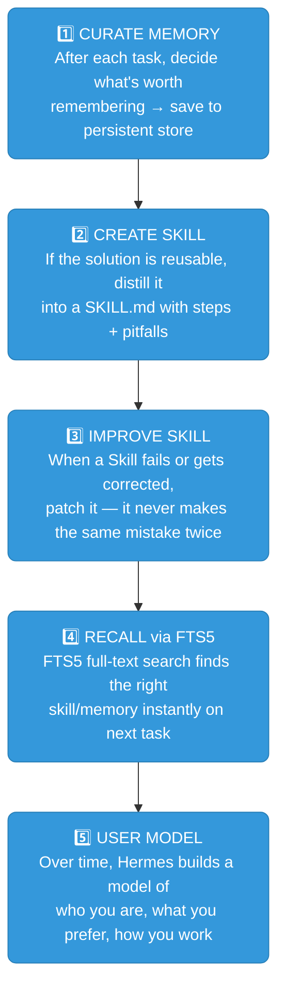
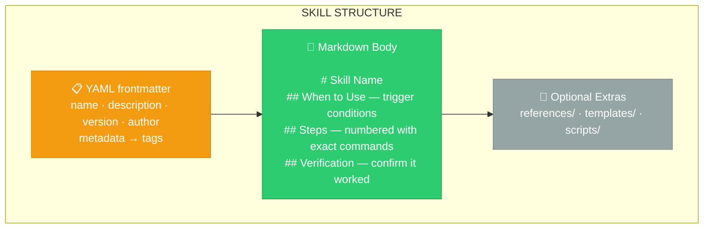
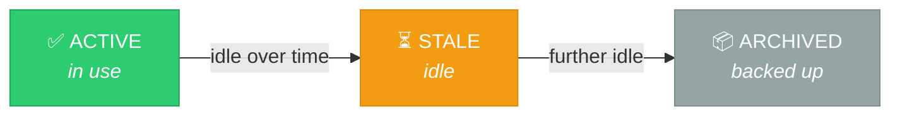
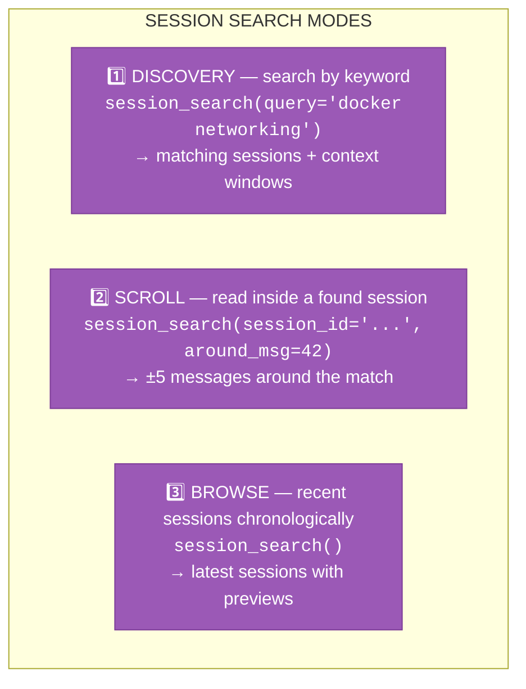
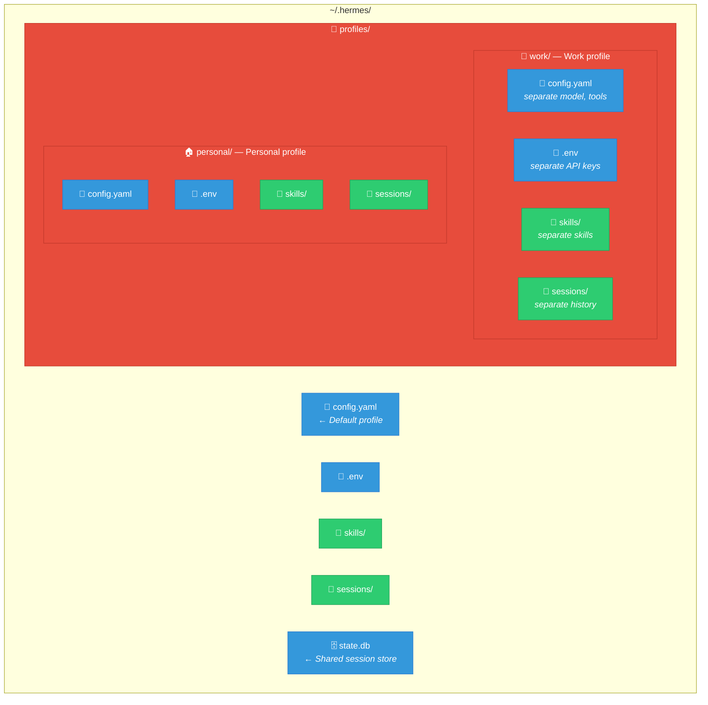
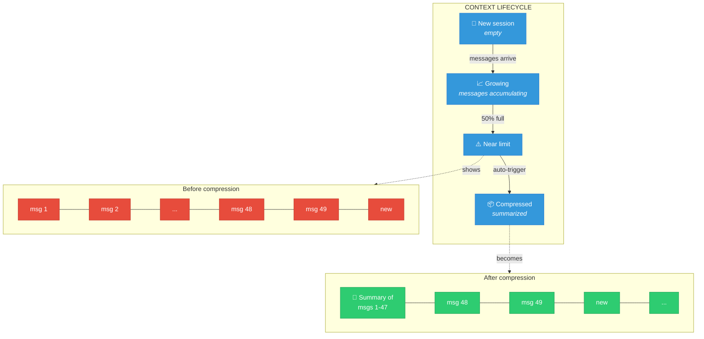

# Chapter 4: Skills & Memory — Making Hermes Smarter Over Time

> **Every conversation with Hermes makes it better. Skills teach it procedures. Memory gives it permanence. Together, they transform a general AI into your personal expert.**

---

## 4.1 The Learning Loop — How Hermes Improves Itself

The most surprising thing about Hermes isn't what it can do — it's that **it changes**. The more you use it, the better it gets. This isn't marketing. It's an observable, verifiable closed loop.



*Nobody teaches it any of this. It figures it out alone.*

**Step 1: Memory Curation** — After each conversation, Hermes actively decides what's worth remembering. Not brute-force chat history dumps — selective, indexed saves to a SQLite database with FTS5 full-text search. (Covered in §4.3)

**Step 2: Skill Creation** — When Hermes finishes a complex task, it asks: *will this solution be useful again?* If yes, it distills the approach into a standalone Skill file. (Covered in §4.2)

**Step 3: Skill Self-Improvement** — Creating a Skill isn't the end. Every time you correct Hermes or a Skill produces a suboptimal result, it patches the Skill itself. The longer you use it, the fewer mistakes it repeats. (Covered in §4.2, Curator section)

**Step 4: FTS5 Recall** — When a new task arrives, Hermes searches its skill library and memory with full-text search. It finds relevant experience in milliseconds, not by re-deriving solutions from scratch. (Covered in §4.3, Session Search)

**Step 5: User Modeling** — Over time, Hermes builds a picture of who you are — your stack, your style, your quirks. This is injected into every session automatically. (Covered in §4.3, Memory Architecture)

These five steps form a flywheel: **more use → more data → better skills → better results → more use.** The harness grows on its own.

---

## 4.2 Skills — Reusable Procedures

A **skill** is a structured document that teaches Hermes how to handle a specific type of task. Think of it as a playbook — step-by-step instructions, pitfalls, commands, and context that load into the agent's prompt when relevant.

### What Skills Look Like

Every skill is a `SKILL.md` file with YAML frontmatter and a markdown body:



The YAML frontmatter provides metadata (name, description, tags, version). The markdown body is the actual knowledge — step-by-step procedures, commands, pitfalls, and verification steps.

### The Skills Hub — 88+ Pre-Built Skills

Hermes ships with a **skills hub** — a curated catalog of community-maintained skills across 17+ categories:

```bash
# Browse all available skills interactively
hermes skills browse

# Search by keyword
hermes skills search "docker"

# Preview without installing
hermes skills inspect github-code-review

# Install a skill
hermes skills install github-code-review

# Install from a direct URL
hermes skills install https://raw.githubusercontent.com/user/repo/main/SKILL.md
```

**Category highlights:**

```mermaid
flowchart LR
    subgraph cats["SKILL CATEGORIES — 88+ skills"]
        direction TB
        subgraph sw["🔧 Software Dev"]
            SW1["debugging · test-driven-dev<br/>writing-plans · spike"]
        end
        subgraph cr["🎨 Creative"]
            CR1["ascii-art · design-md<br/>excalidraw · sketch"]
        end
        subgraph wd["🌐 Web Dev"]
            WD1["blog · fullstack<br/>devcard · web-dkc"]
        end
        subgraph ai["🤖 AI Agents"]
            AI1["claude-code · codex<br/>kilocode · opencode"]
        end
        subgraph ds["📊 Data Science"]
            DS1["jupyter-live"]
        end
        subgraph pr["📝 Productivity"]
            PR1["notion · linear<br/>google-ws · powerpoint"]
        end
        subgraph gm["🎮 Gaming & Media"]
            GM1["youtube-content · gif-search<br/>spotify · songsee"]
        end
        subgraph rs["🔬 Research"]
            RS1["arxiv · blogwatcher<br/>polymarket · llm-wiki"]
        end
        subgraph sh["🏠 Smart Home"]
            SH1["openhue"]
        end
        subgraph rt["🔒 Red Teaming"]
            RT1["godmode"]
        end
        subgraph dv["🛠 DevOps"]
            DV1["webhook-subs · kanban"]
        end
        subgraph em["📧 Email"]
            EM1["himalaya"]
        end
        subgraph aa["🚀 Autonomous Agents"]
            AA1["hermes-agent<br/>kanban-worker · kanban-orchestrator"]
        end
    end

    classDef cat fill:#3498db,color:#fff,stroke:#2980b9
    class SW1,CR1,WD1,AI1,DS1,PR1,GM1,RS1,SH1,RT1,DV1,EM1,AA1 cat
```



### Loading Skills into a Session

Skills are loaded automatically when relevant, or manually when you need them:

```bash
# Preload skills at startup
hermes -s github-code-review,plan

# Load inside a session
/skill plan

# Browse and install from inside a session
/skills
```

**In cron jobs**, attach skills so the scheduled agent has the right knowledge:

```yaml
# A cron job that writes blog articles
skills: ["blog", "marketing-copy", "humanizer"]
prompt: "Write and publish today's blog article"
```

### Creating Your Own Skills

When Hermes solves a complex problem or discovers a non-trivial workflow, save it:

```
You: That debugging session was rough. Save it as a skill so you 
     never have to rediscover all this.

Hermes: ✓ Skill saved as "systematic-debugging"

  Covers:
  - 4-phase root cause analysis
  - Environment-specific pitfalls
  - Verification steps
  - Exact commands for each phase
```

**When to save a skill:**
- Complex task with 5+ tool calls that succeeded
- You corrected Hermes and the corrected approach worked
- Non-trivial workflow discovered (API integration, deployment pipeline, etc.)
- User asked you to remember a procedure

**What makes a good skill:**
- Clear trigger conditions ("Use when...")
- Numbered steps with exact commands
- Pitfalls section (what went wrong before)
- Verification steps (how to confirm it worked)

### The Curator — Automatic Skill Maintenance

Hermes has a built-in **curator** that automatically maintains skills over time:



- Usage tracked via `.usage.json`
- Pinned skills are exempt from all auto-transitions
- Only agent-created skills are touched; hub/bundled skills are never modified
- Nothing is ever deleted — max action is archive

```bash
# Check curator status
hermes curator status
/curator status

# Pin a skill (protect from archive)
hermes curator pin my-critical-skill

# Force a maintenance run
hermes curator run

# Restore an archived skill
hermes curator restore my-old-skill
```

**The curator never deletes** — it archives with a backup. Pinned skills are completely protected.

---

## 4.3 Memory — Persistent Knowledge Across Sessions

While skills store *procedures*, **memory** stores *facts*. Memory survives across sessions — when you close a conversation and start a new one, Hermes still knows who you are, what you're working on, and what matters to you.

### Two Memory Stores

```mermaid
flowchart TD
    subgraph memory["MEMORY ARCHITECTURE"]
        UP["👤 USER PROFILE<br/><b>Who you are:</b><br/>• Name, role, timezone<br/>• Tech stack preferences<br/>• Communication style<br/>• Device info<br/><br/><i>\"Bio is a senior fullstack<br/>architect using React,<br/>TypeScript, Flutter...\"</i>"]
        AN["🤖 AGENT NOTES<br/><b>What Hermes has learned:</b><br/>• Environment facts<br/>• Project conventions<br/>• Tool quirks discovered<br/>• Lessons from mistakes<br/><br/><i>\"Hermes home is at<br/>C:\\Users\\bio\\AppData...\"</i>"]
    end

    UP & AN -->|"injected into<br/>every session"| SESSION["💬 Every Session"]

    classDef profile fill:#3498db,color:#fff,stroke:#2d7dd2
    classDef notes fill:#e74c3c,color:#fff,stroke:#c0392b
    classDef session fill:#2ecc71,color:#fff,stroke:#25a25a
    class UP profile
    class AN notes
    class SESSION session
```

*Both are injected into every session automatically. Memory is compact — only facts that persist.*

### How Memory Gets Saved

Memory is saved proactively — Hermes stores facts that will matter later:

**User profile** — saved when:
- User shares personal details (name, role, timezone)
- User corrects behavior or states preferences
- User's tech stack or workflow becomes clear

**Agent notes** — saved when:
- Environment facts discovered (OS, paths, tool versions)
- Project conventions identified
- Tool quirks or non-obvious behaviors found
- User corrects an approach

**What NOT to save to memory:**
- Task progress or session outcomes → use `session_search` instead
- Temporary TODO state → use the `todo` tool
- Raw data dumps → save to files
- Anything that will be stale in 7 days

### Memory Commands

```bash
# Check memory status
hermes memory status

# In-session memory management (Hermes does this automatically,
# but you can also request it)
```

Inside a session:
```
You: Remember that I always use pytest with xdist for testing

Hermes: ✓ Saved to memory: "User prefers pytest with xdist for 
        parallel test execution."
```

### Session Search — Recalling the Past

When you need to find something from a previous conversation, **session search** is your time machine. It uses FTS5 (full-text search) against the local SQLite session store — no LLM calls, instant results.

```bash
# Browse recent sessions
hermes sessions browse

# Search sessions by keyword
hermes sessions list --search "auth refactor"
```

Inside a session, Hermes uses session_search automatically when you reference past events:

```
You: What did we decide about the database schema last week?

Hermes: [searches session history]
        Last week in the "project-setup" session, we decided on:
        - PostgreSQL 16 with UUID primary keys
        - Async SQLAlchemy 2.0
        - Alembic for migrations
        - Separate read/write connection pools
```

**Three search modes:**



### Memory Backends

Hermes supports pluggable memory backends:

| Backend | Setup | Best For |
|---------|-------|----------|
| **Built-in** (default) | No config needed | Most users — fast, local, private |
| **Honcho** | `hermes honcho setup` | Multi-agent memory sharing, cloud sync |
| **Mem0** | Set `MEM0_API_KEY` | Advanced memory with deduplication |

```bash
# Switch memory provider
hermes config set memory.provider honcho
hermes memory setup

# Disable memory entirely
hermes memory off
```

**Recommendation:** Stick with built-in unless you need multi-agent memory sharing or cloud sync.

---

## 4.4 Profiles — Isolated Hermes Instances

Profiles let you run multiple independent Hermes configurations on the same machine:



**Each profile gets its own:** config, API keys, skills, sessions, and memory.

```bash
# Create a profile (clones current config)
hermes profile create work --clone

# Create with everything cloned (sessions, skills, memory)
hermes profile create work --clone-all

# Switch default profile
hermes profile use work

# Use a profile for one command
hermes -p work chat -q "Check production logs"

# List profiles
hermes profile list

# Export/import (share configs between machines)
hermes profile export work > work-profile.tar.gz
hermes profile import work-profile.tar.gz
```

**When to use profiles:**
- **Work vs personal** — different API keys, different projects, different memory
- **Client work** — each client gets isolated memory and sessions
- **Experimentation** — test new models/configs without risking your main setup
- **Multi-tenant** — run separate Hermes instances for different purposes

---

## 4.5 Credential Pools — Rate Limit Busting

Running into rate limits? Add multiple API keys for the same provider and Hermes rotates automatically:

```bash
# Add additional API keys interactively
hermes auth add

# View all keys for a provider
hermes auth list openrouter

# Remove a specific key
hermes auth remove openrouter 2

# Reset exhaustion status (if keys recover)
hermes auth reset openrouter
```


*Automatic, silent, zero interruption.*

**When this matters:**
- Heavy cron job schedules hitting the same provider
- Multiple concurrent agents sharing keys
- Free tier keys with low rate limits
- Batch processing large datasets

---

## 4.6 Context Compression — Staying Within Limits

When a conversation grows long (approaching the model's token limit), Hermes automatically **compresses context** — summarizing older messages while preserving recent ones:

```yaml
# config.yaml
compression:
  enabled: true
  threshold: 0.50    # Compress when 50% of context window used
  target_ratio: 0.20  # Compress down to 20% of original
```



*Recent messages preserved verbatim. Older messages become a summary. You can also trigger manually: `/compress`*

---

## 4.7 Skills + Memory in Practice

Let's see how skills and memory work together in a real workflow:

### Scenario: Building a New Project

```
Day 1 — First time building a FastAPI project with auth:

You: Set up a FastAPI project with JWT auth and PostgreSQL

Hermes: [uses tools to create project structure]
        [hits a few snags with async SQLAlchemy setup]
        [eventually gets everything working]
        
        ✓ Project created. That async SQLAlchemy + Alembic 
        setup had some version-specific quirks.
        
You: Save this as a skill and remember the key facts.

Hermes: ✓ Skill saved: "fastapi-auth-setup"
        ✓ Memory saved: "User prefers FastAPI with SQLAlchemy 
          2.0 async, Alembic migrations, JWT auth via 
          python-jose"

──────────────────────────────────────────────────────

Day 15 — Building another API project:

You: Set up another FastAPI project, this time for inventory 
     management.

Hermes: [loads skill: fastapi-auth-setup]
        [loads memory: user's FastAPI preferences]
        [skips all the discovery from Day 1]
        
        ✓ Project created with your preferred stack:
        FastAPI + SQLAlchemy 2.0 async + Alembic + JWT.
        Used the same auth pattern from the skill.
        3 minutes instead of 15.
```

### Scenario: Cross-Session Continuity

```
Monday — You tell Hermes about your project:

You: I'm working on a fintech dashboard at ~/projects/dashboard.
     Stack is Next.js 15 with App Router, Tailwind, and tRPC.

Hermes: ✓ Saved to memory: project details, tech stack, path.

──────────────────────────────────────────────────────

Wednesday — New session, different platform:

You: [on Telegram] What was the tech stack for the dashboard 
     project?

Hermes: Your fintech dashboard at ~/projects/dashboard uses:
        Next.js 15 (App Router) + Tailwind CSS + tRPC.
        I remember from Monday.

──────────────────────────────────────────────────────

Friday — Yet another session:

You: Add a new route to the dashboard for transaction history.

Hermes: [loads memory, knows the project structure]
        [uses correct patterns: App Router, tRPC procedure]
        [follows project conventions automatically]
        
        ✓ Added /transactions route with tRPC router.
```

**Memory makes every session feel like a continuation, not a fresh start.**

---

## Chapter 4 Key Vocabulary

| Term | Definition |
|------|-----------|
| **Skill** | A reusable procedure document (SKILL.md) that teaches Hermes how to handle a task type |
| **Skill hub** | The curated catalog of 88+ community-maintained skills |
| **Frontmatter** | YAML metadata at the top of a skill (name, description, tags, version) |
| **Curator** | Automatic maintenance system that tracks skill usage and archives idle ones |
| **Memory** | Persistent facts (user profile + agent notes) that survive across sessions |
| **User profile** | Facts about the user (name, role, preferences, tech stack) |
| **Agent notes** | Facts Hermes discovers (environment, conventions, tool quirks) |
| **Session search** | FTS5-powered search across past conversation transcripts |
| **Profile** | An isolated Hermes configuration (config + .env + skills + sessions + memory) |
| **Credential pool** | Multiple API keys for the same provider, auto-rotated on rate limits |
| **Context compression** | Automatic summarization of old messages when approaching token limits |
| **Pin** | Protect a skill from curator auto-archival |

---

## Chapter 4 Summary

| Topic | What You Learned |
|-------|-----------------|
| Why skills & memory | The improvement flywheel — solve, save, reuse |
| Skill structure | YAML frontmatter + markdown body, stored as SKILL.md |
| Skills hub | 88+ skills across 17 categories, browse/install/search |
| Creating skills | Save after complex tasks, good skills have triggers + steps + pitfalls |
| Curator | Auto-maintenance lifecycle: active → stale → archived (never deleted) |
| Memory stores | User profile (who you are) + agent notes (what Hermes learned) |
| Session search | FTS5 full-text search across past conversations, instant recall |
| Profiles | Isolated configs for work/personal/client/experiment separation |
| Credential pools | Multiple API keys, auto-rotation on rate limits |
| Context compression | Auto-summarize old messages when approaching token limits |

**Next:** [Chapter 5: Automation & Scheduling →](ch05-automation-scheduling.md)

---

<!-- SCREENSHOT: hermes skills browse interactive UI -->
<!-- SCREENSHOT: Skill SKILL.md file in editor -->
<!-- SCREENSHOT: Memory injection in session startup -->
<!-- SCREENSHOT: hermes profile list output -->
<!-- SCREENSHOT: hermes auth list openrouter showing multiple keys -->
<!-- SCREENSHOT: Context compression notification in chat -->
