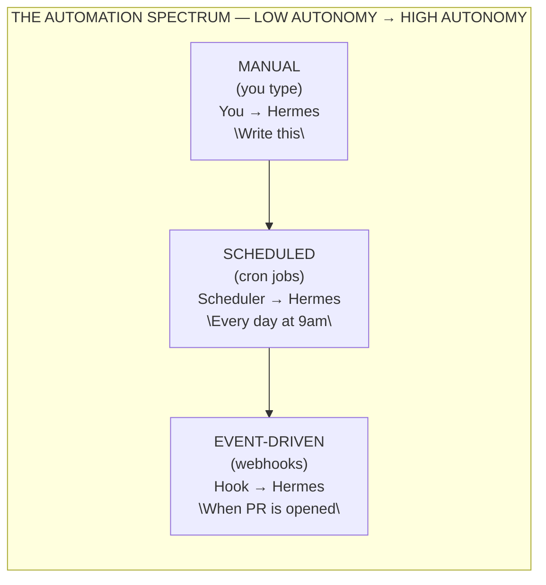
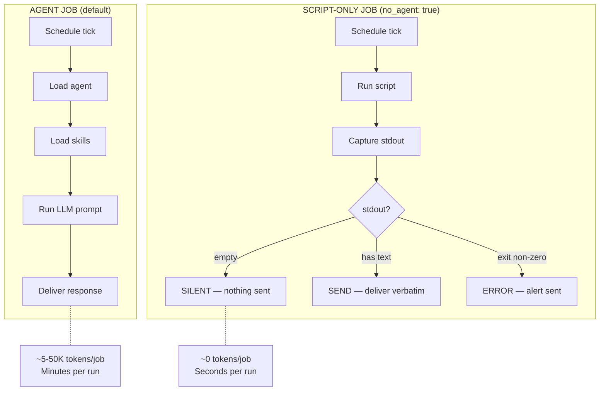
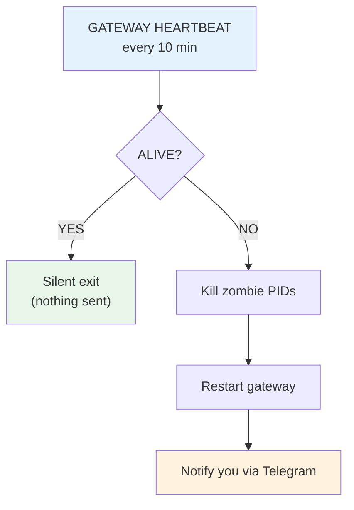
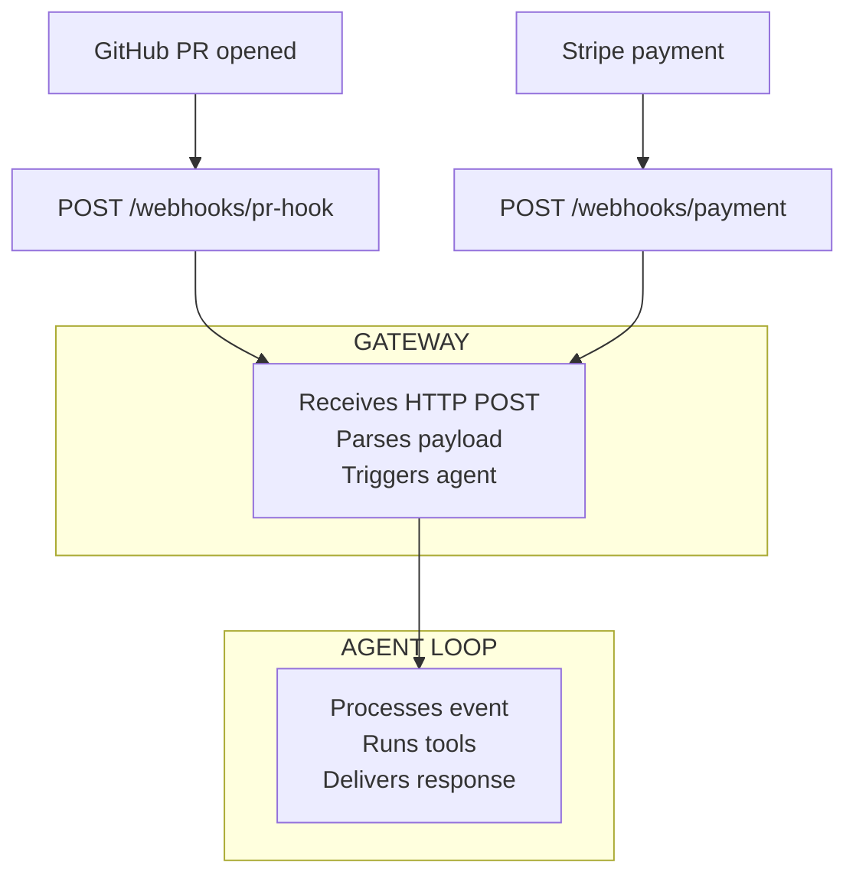
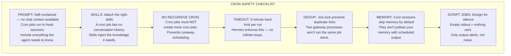
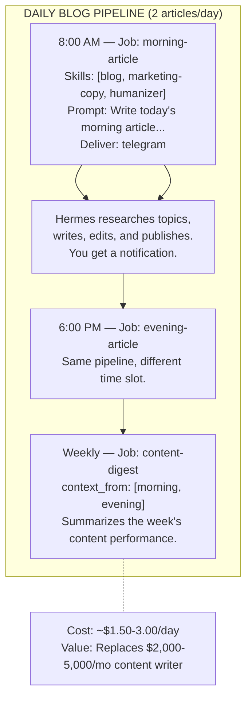
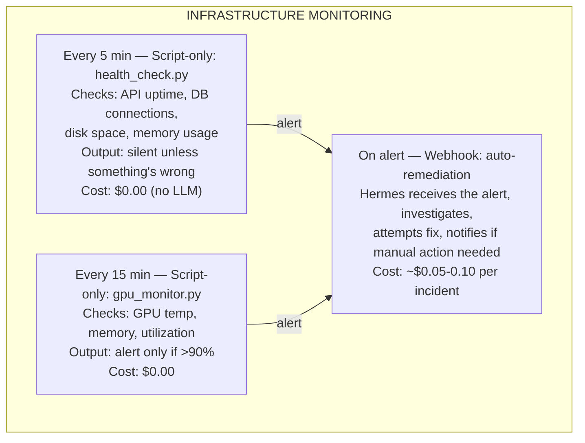
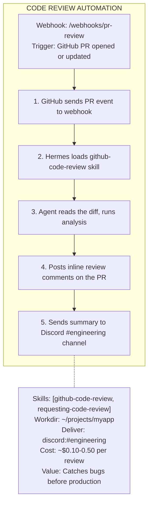

# Chapter 5: Automation & Scheduling — Hermes Never Sleeps

> **The real power of an AI agent isn't in answering questions — it's in running tasks on autopilot. Cron jobs, webhooks, background processes, and job chaining turn Hermes from a chat partner into a 24/7 operations engine.**

---

## 5.1 Why Automation Matters

You've set up Hermes, connected it to Telegram, built up skills and memory. But you're still *driving* every interaction manually. Automation changes the game:

- **Consistency** — tasks run at the same time, every time, without you remembering
- **Speed** — Hermes reacts to events the moment they happen
- **Scale** — one Hermes can monitor 10 systems, write 2 blog posts a day, and review every PR
- **Freedom** — you sleep, Hermes works. You code, Hermes handles ops.



Hermes gives you four automation mechanisms, each with a different trigger:

| Mechanism | Trigger | Duration | Best For |
|-----------|---------|----------|----------|
| **Cron jobs** | Time-based schedule | Minutes to hours | Daily digests, periodic checks, content pipeline |
| **Script-only jobs** | Time-based schedule | Seconds | Watchdogs, health checks, threshold alerts |
| **Webhooks** | External HTTP event | Minutes | CI/CD, GitHub events, payment notifications |
| **Background tasks** | Manual kick-off | Minutes to hours | Long builds, test suites, data processing |

---

## 5.2 Cron Jobs — Scheduled Intelligence

Cron jobs are the backbone of Hermes automation. They run a full agent loop on a schedule — the same Hermes brain, same tools, same memory, just autonomous.

### Creating a Cron Job

```bash
# Interactive creation (recommended)
hermes cron create "0 9 * * *"

# Or use natural language
hermes cron create "every day at 9am"
hermes cron create "every 2 hours"
hermes cron create "30m"
```

During creation, Hermes walks you through the key settings:

```mermaid
flowchart TD
    subgraph anatomy ["CRON JOB ANATOMY"]
        direction TB
        S["Schedule: \"0 9 * * *\" — When it runs"]
        N["Name: \"morning-digest\" — Human label"]
        P["Prompt: \"Check emails...\" — What Hermes does"]
        SK["Skills: [email, summary] — Preloaded knowledge"]
        MO["Model: claude-sonnet-4 — Optional override"]
        D["Deliver: telegram — Where output goes"]
        W["Workdir: ~/projects/app — Project context"]
        E["Enabled: [x] — Active or paused"]
    end
    S --> N --> P --> SK --> MO --> D --> W --> E
    E -.->|"Result: Hermes wakes up at 9am,\nloads skills, checks inbox,\nwrites digest, delivers to Telegram"| R((📰 Digest))
```

### Schedule Formats

Hermes supports four schedule formats:

```bash
# 1. Duration — runs every N minutes/hours
"30m"           # Every 30 minutes
"2h"            # Every 2 hours

# 2. "Every" phrase — natural language
"every monday 9am"
"every weekday at 8:30"
"every 6 hours"

# 3. Standard cron — 5-field expression
"0 9 * * *"     # Every day at 9:00
"*/15 * * * *"  # Every 15 minutes
"0 9 * * 1-5"   # Weekdays at 9:00

# 4. One-shot — ISO timestamp
"2026-06-01T09:00:00"   # Once, at a specific time
```

### Managing Cron Jobs

```bash
# List all jobs
hermes cron list

# List including disabled/paused jobs
hermes cron list --all

# Pause a job (stop it from running)
hermes cron pause <job_id>

# Resume a paused job
hermes cron resume <job_id>

# Trigger a job manually (run on next tick)
hermes cron run <job_id>

# Edit a job's schedule, prompt, or delivery
hermes cron edit <job_id>

# Delete a job
hermes cron remove <job_id>

# Check scheduler status
hermes cron status
```

Inside a session, use `/cron` to manage jobs from chat.

### Delivery Targets

Cron job output needs to go somewhere. Hermes supports multiple delivery targets:

```bash
# Default: deliver back to the current chat
deliver: "origin"

# Deliver to all connected channels
deliver: "all"

# Deliver to a specific platform chat
deliver: "telegram"
deliver: "discord:#engineering"
deliver: "telegram:-1001234567890:17585"

# Combine targets
deliver: "origin,all"
```

### Model Overrides

Different jobs may need different models. Override per-job without changing your default:

```yaml
model:
  model: "anthropic/claude-sonnet-4"
  provider: "anthropic"
```

A daily digest might use a fast/cheap model, while a code review job needs the best reasoning. You control this per-job.

---

## 5.3 Script-Only Jobs — Lightweight Watchdogs

Not every scheduled task needs an LLM. **Script-only jobs** run a script and deliver its output verbatim — no agent loop, no tokens, no model call:



**When to use script-only:**
- Server uptime checks (`curl -sf https://api.example.com/health`)
- Disk/memory/GPU threshold alerts
- Git repo status checks
- Any fixed-output health check where the script IS the message

```bash
# Example: a GPU memory watchdog
hermes cron create "5m" \
  --script scripts/gpu_watchdog.py \
  --no-agent \
  --deliver telegram
```

The script at `~/.hermes/scripts/gpu_watchdog.py` might look like:

```python
#!/usr/bin/env python3
import subprocess, sys
result = subprocess.run(["nvidia-smi", "--query-gpu=memory.used", "--format=csv,noheader,nounits"],
                       capture_output=True, text=True)
used = int(result.stdout.strip().split("\n")[0])
if used > 90:
    print(f"⚠️ GPU memory at {used}% — over 90% threshold!")
# No output = silent (nothing sent)
```

**Key behavior:**
- Empty stdout → nothing sent (you won't even know it ran)
- Non-empty stdout → delivered verbatim as the message
- Non-zero exit → error alert sent
- Maximum efficiency — zero tokens, zero model cost

### Real-World Example: Gateway Heartbeat

The most important script-only job is one that keeps Hermes itself alive. System failures happen — Windows sleep/hibernate kills processes, OOM killers strike on Linux, unexpected crashes occur at 3 AM. Without a heartbeat, your gateway silently dies and you lose hours of coverage.

Hermes ships with a built-in heartbeat script at `~/.hermes/scripts/heartbeat.py`:

```bash
# Set up the gateway heartbeat — runs every 10 minutes, zero tokens
hermes cron create "every 10m" \
  --script scripts/heartbeat.py \
  --no-agent \
  --deliver origin
```

**How it works:**



**Key details:**
- **Zero tokens.** The heartbeat is a pure Python script (`no_agent: true`). It checks processes and log files locally — no API calls, no model involved. Your LLM bill is unaffected.
- **Silent when healthy.** If the gateway is running fine, the script prints nothing and exits with code 0. You never see a message. Only problems get reported.
- **Auto-restart.** When the gateway is down, the script kills any zombie processes and starts a fresh instance.
- **Survives sleep/hibernate.** On Windows, pair this with a Scheduled Task (every 10 min + at logon, with `StartWhenAvailable`). On Linux, use systemd timers. The watchdog catches up after wake.

**On Windows — add a Scheduled Task for extra reliability:**

```powershell
# Run as admin in PowerShell
$action = New-ScheduledTaskAction -Execute "python" `
  -Argument "$env:LOCALAPPDATA\hermes\scripts\heartbeat.py --restart"
$trigger1 = New-ScheduledTaskTrigger -Once -At (Get-Date) `
  -RepetitionInterval (New-Timespan -Minutes 10) `
  -RepetitionDuration (New-Timespan -Days 365)
$trigger2 = New-ScheduledTaskTrigger -AtLogOn
$settings = New-ScheduledTaskSettingsSet `
  -StartWhenAvailable -DontStopOnIdleEnd `
  -AllowStartIfOnBatteries -DontStopIfGoingOnBatteries
Register-ScheduledTask -TaskName "HermesHeartbeat" `
  -Action $action -Trigger $trigger1,$trigger2 `
  -Settings $settings -Description "Restarts Hermes gateway if down"
```

This gives you **two safety nets** — the internal cron heartbeat (runs while the gateway is alive) and the OS-level Scheduled Task (runs even when the gateway is dead). Maximum downtime after any failure: ~15 minutes.

> **💡 Cost clarification:** The heartbeat costs **nothing** in LLM tokens. It's a `no_agent: true` cron job running a local Python script. No model is invoked. The only cost is ~2 seconds of CPU every 10 minutes — negligible on any machine.

---

## 5.4 Job Chaining — Output Pipelines

Jobs can chain together — the output of Job A feeds as context into Job B:

```mermaid
flowchart LR
    subgraph chain ["JOB CHAINING WITH context_from"]
        A["JOB A\nCollect data\n(script)"]
        B["JOB B\nSummarize\n(LLM agent)"]
        C["JOB C\nDeliver\n(telegram)"]
    end
    A -->|"stdout"| B
    B -->|"analysis"| C

    B -.- NOTE_B["context_from: [\"job-a-id\"]"]
    C -.- NOTE_C["context_from: [\"job-b-id\"]"]
```

**Practical example — daily competitive intelligence:**

```bash
# Job 1: Collect competitor updates (script-only, zero tokens)
hermes cron create "0 8 * * *" \
  --name "competitor-collect" \
  --script scripts/competitor_check.py \
  --no-agent

# Job 2: Analyze and summarize (agent, uses Job 1 output)
hermes cron create "0 8 * * *" \
  --name "competitor-analysis" \
  --prompt "Analyze the competitor updates below. Flag any threats or opportunities. Be concise." \
  --context-from "competitor-collect" \
  --skills "research,marketing-copy" \
  --deliver "telegram"
```

Job 1 runs at 8am, collects raw data. Job 2 runs at 8am on the same tick, but uses Job 1's *most recent completed output* as injected context. The result: a smart analysis delivered to your Telegram, powered by free data collection + paid LLM reasoning only where it adds value.

---

## 5.5 Webhooks — Event-Driven Automation

Webhooks flip the model: instead of Hermes checking on a schedule, external systems *push* events to Hermes:

```bash
# Subscribe to a webhook route
hermes webhook subscribe deploy-hook

# List active webhooks
hermes webhook list

# Test a webhook
hermes webhook test deploy-hook

# Remove a webhook
hermes webhook remove deploy-hook
```

This creates an HTTP endpoint at `/webhooks/deploy-hook`. When an external service (GitHub, Stripe, your CI) sends a POST to that endpoint, Hermes processes it.



**Common webhook patterns:**
- **CI/CD** — auto-review code when a PR opens
- **Payments** — log transactions, send confirmations
- **Monitoring** — PagerDuty alert → Hermes investigates
- **Forms** — new submission → CRM update + notification

---

## 5.6 Background Tasks — Long-Running Work

For tasks too long for a single turn but not recurring enough for cron, use **background terminal processes**:

```bash
# Start a long-running build
terminal(command="npm run build", background=True, notify_on_complete=True)

# The process runs in the background
# Hermes is free to work on other things
# You get notified when it finishes
```

```mermaid
flowchart TD
    START["START\nterminal(bg=true)"] --> RUNNING["RUNNING\nprocess(poll)"]
    RUNNING --> DONE["DONE\nAuto-notify"]
    RUNNING --> CHECK["CHECK PROGRESS\npoll → see progress\nlog → full output\nwait → block until done"]

    DONE -.- NOTE1["notify_on_complete=True →\none notification at end"]
    CHECK -.- NOTE2["watch_patterns=[\"Build OK\"] →\nnotify on rare mid-run text\n(rate limit: 1 per 15 sec)"]
```

**Process management commands:**

```bash
# List all background processes
process(action="list")

# Check status + new output
process(action="poll", session_id="...")

# Full output with pagination
process(action="log", session_id="...", offset=0, limit=200)

# Block until done (with timeout)
process(action="wait", session_id="...", timeout=300)

# Send input to a running process
process(action="submit", session_id="...", data="y")

# Kill a running process
process(action="kill", session_id="...")

# Send raw stdin without newline
process(action="write", session_id="...", data="partial input")

# Close stdin / send EOF
process(action="close", session_id="...")
```

---

## 5.7 Cron Safety & Best Practices

Running autonomous agents on a schedule comes with responsibility. Here's how to keep things safe:



### Cost Awareness

Cron jobs consume tokens. Here's a rough guide:

| Job Type | Tokens/Run | Runs/Day | Est. Daily Cost |
|----------|-----------|----------|-----------------|
| Script-only (no_agent) | 0 | 288 (every 5min) | $0.00 |
| Simple digest (short prompt) | ~2-5K | 1 | ~$0.01-0.05 |
| Research + summary | ~10-30K | 2 | ~$0.10-0.30 |
| Code review (full PR) | ~20-50K | 5 | ~$0.50-2.50 |
| Blog article generation | ~30-80K | 2 | ~$0.60-3.20 |

**Tip:** Use script-only jobs for data collection (free), reserve LLM agent jobs for tasks that actually need reasoning.

---

## 5.8 Automation in Practice — Three Real Workflows

### Workflow 1: Content Marketing Engine



### Workflow 2: Server Watchdog



### Workflow 3: GitHub PR Auto-Review



---

## Chapter 5 Key Vocabulary

| Term | Definition |
|------|-----------|
| **Cron job** | A scheduled task that runs a full agent loop on a time-based schedule |
| **Schedule** | When a cron job runs — supports duration, natural language, cron expression, or ISO timestamp |
| **Script-only job** | A cron job with `no_agent=True` — runs a script, no LLM, zero token cost |
| **Job chaining** | Connecting jobs via `context_from` so Job B receives Job A's output as context |
| **Webhook** | An HTTP endpoint that triggers Hermes when an external event occurs |
| **Delivery target** | Where cron job output is sent — Telegram, Discord, Slack, or any connected platform |
| **Background task** | A terminal process started with `background=True` that runs while you continue working |
| **Model override** | Per-job model/provider setting independent of your default configuration |
| **Workdir** | The working directory for a cron job — loads project context files (AGENTS.md, etc.) |
| **.tick.lock** | Lock file preventing duplicate cron ticks across multiple processes |

---

## Chapter 5 Summary

| Topic | What You Learned |
|-------|-----------------|
| Why automation | From manual to autonomous — consistency, speed, scale, freedom |
| Cron jobs | Full agent loop on schedule, multiple schedule formats, delivery targets |
| Script-only jobs | Zero-token watchdogs — script output delivered verbatim, silent when empty |
| Gateway heartbeat | Built-in heartbeat.py keeps gateway alive after crashes, sleep, hibernation — zero cost |
| Job chaining | `context_from` pipeline — data collection → analysis → delivery |
| Webhooks | Event-driven triggers — external systems push events to Hermes |
| Background tasks | Long-running processes with `notify_on_complete` for non-blocking work |
| Safety | Self-contained prompts, no recursive cron, 3-min timeout, dedup locks |
| Cost awareness | Script-only = free, simple = pennies, complex = dollars — design accordingly |
| Real workflows | Content engine, server watchdog, PR auto-review — end-to-end examples |

**Next:** [Chapter 6: Multi-Agent Orchestration →](ch06-multi-agent.md)

---

<!-- SCREENSHOT: hermes cron list showing active jobs -->
<!-- SCREENSHOT: Cron job creation interactive flow -->
<!-- SCREENSHOT: Webhook POST in browser devtools -->
<!-- SCREENSHOT: Background task notification in Telegram -->
<!-- SCREENSHOT: process(action="log") output showing build progress -->
