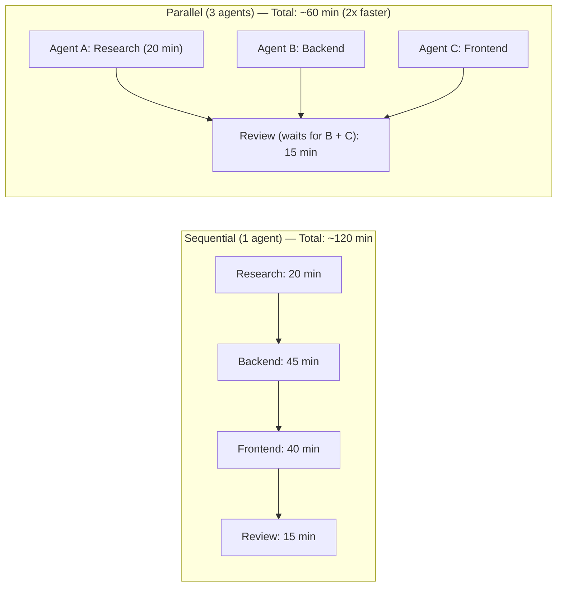
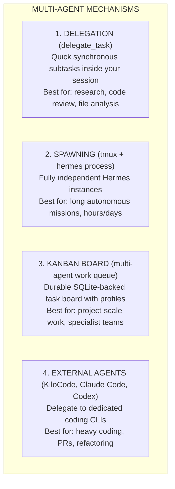
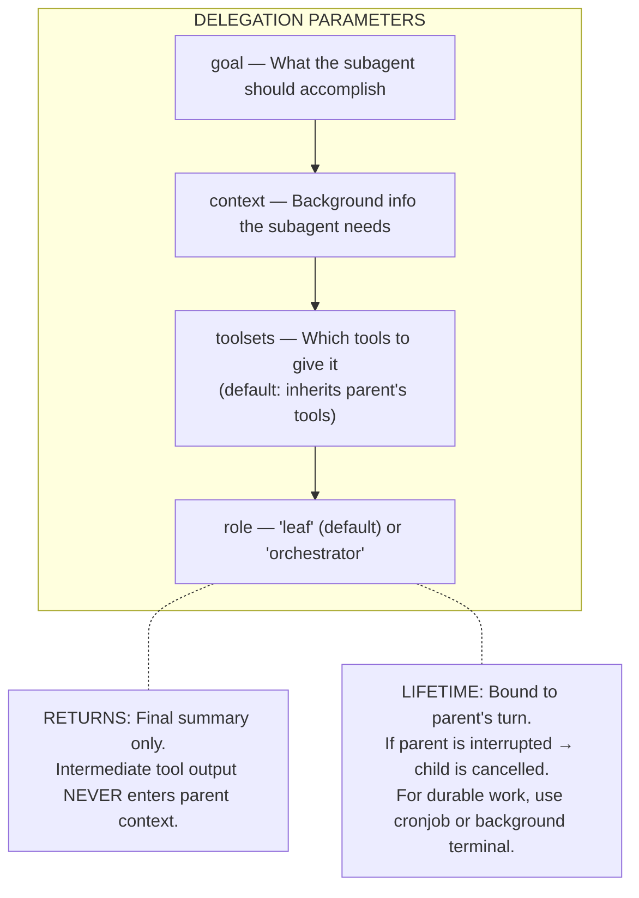
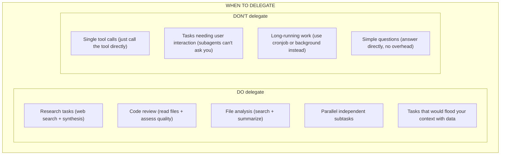
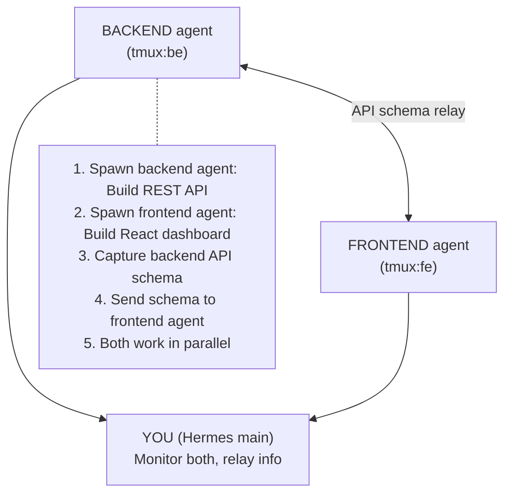
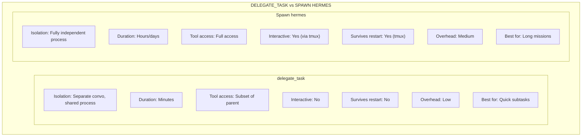
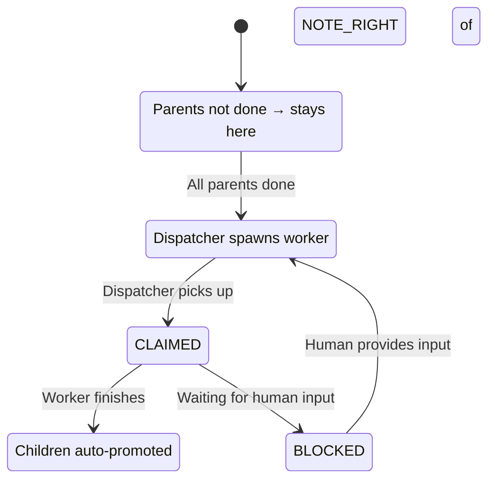
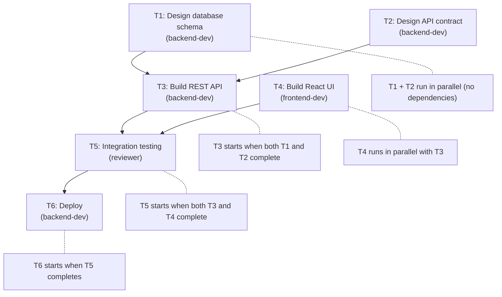
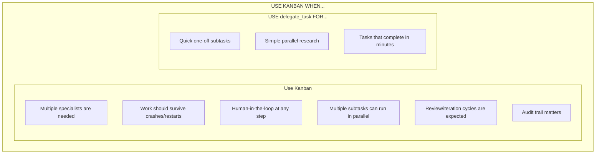
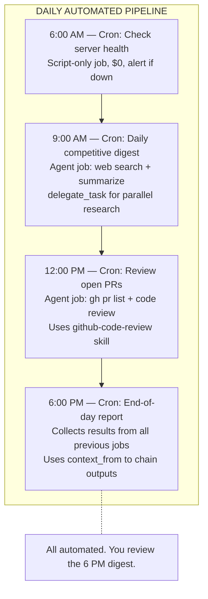

# Chapter 6: Multi-Agent Orchestration — An Army of One

> **One agent is powerful. Multiple agents working together are unstoppable. Delegation, parallel execution, Kanban boards, and external coding agents turn Hermes from a solo performer into an orchestral conductor.**

---

## 6.1 Why Multi-Agent?

You've seen Hermes handle single tasks well — write code, search the web, manage files. But real work is rarely single-threaded. A typical project involves:

- **Research** + **implementation** happening simultaneously
- **Frontend** + **backend** features built in parallel
- **Writing** + **review** as a quality gate
- **Monitoring** across multiple systems at once

One agent does these sequentially. Multiple agents do them in parallel — and parallelism is where the real throughput gains live.



Hermes gives you **four mechanisms** for multi-agent work, each suited to different scenarios:



---

## 6.2 Delegation — `delegate_task`

The fastest way to parallelize. You spawn a **subagent** — an isolated worker with its own conversation, terminal session, and toolset. The parent waits for the result, then continues.

### Single Task Delegation

```
You: Research the top 5 React form libraries and compare them

Hermes: I'll delegate that research to a subagent.

  [delegate_task(
    goal="Research and compare top 5 React form libraries",
    toolsets=['web'],
    role='leaf'
  )]

  Subagent uses: web_search, web_extract
  Subagent returns: summary of 5 libraries with pros/cons

Hermes: Here's the comparison:
  1. React Hook Form — best performance, smallest bundle
  2. Formik — mature, large community
  3. Zod + React — best TypeScript integration
  ...etc
```

### Batch Delegation — Up to 3 in Parallel

Need multiple things at once? Batch them:

```
You: I need three things done: check the API health, review the
     latest PR, and find me a good icon library.

Hermes: Dispatching 3 subagents in parallel...

  [delegate_task(tasks=[
    {
      goal: "Check API health endpoints and report status",
      toolsets: ['terminal', 'web'],
    },
    {
      goal: "Review PR #42 for security and code quality",
      toolsets: ['terminal', 'file'],
    },
    {
      goal: "Find the best React icon library for a dashboard",
      toolsets: ['web'],
    }
  ])]

  All 3 run simultaneously. Results arrive together.
```

### Delegation Anatomy



### Leaf vs Orchestrator Roles

- **Leaf** (default) — focused worker. Cannot re-delegate. Best for 95% of tasks.
- **Orchestrator** — can spawn its own subagents. For multi-step workflows where a subagent needs to coordinate further workers.

```yaml
# Enable deeper nesting in config.yaml
delegation:
  max_spawn_depth: 2        # allow orchestrator subagents
  max_concurrent_children: 3  # max parallel children
  max_iterations: 50         # max agent loop turns per child
```

### Choosing What to Delegate



---

## 6.3 Spawning Independent Agents

Delegation is bounded by the parent session. For **long autonomous missions** — tasks that run for hours or days — spawn a fully independent Hermes process.

### One-Shot Mode

Fire-and-forget a single task:

```bash
# Foreground (waits for completion)
hermes chat -q "Refactor the auth module to use dependency injection"

# Background (non-blocking, from inside a session)
terminal(command="hermes chat -q 'Set up CI/CD for ~/myapp'", timeout=300)
```

No PTY needed. The agent runs, finishes, and exits.

### Interactive Mode via tmux

For tasks where you want to interact with the spawned agent or monitor progress:

```bash
# 1. Start a new Hermes in tmux
tmux new-session -d -s backend -x 120 -y 40 'hermes'

# 2. Wait for startup, then send a task
sleep 8 && tmux send-keys -t backend 'Build REST API for user management' Enter

# 3. Check progress anytime
tmux capture-pane -t backend -p | tail -30

# 4. Send follow-up instructions
tmux send-keys -t backend 'Add rate limiting middleware' Enter

# 5. Done? Kill the session
tmux send-keys -t backend '/exit' Enter && sleep 2 && tmux kill-session -t backend
```

### Multi-Agent Coordination

The real power: spawn multiple agents, each on a different workstream, and relay context between them:



```bash
# Agent A: Backend API
tmux new-session -d -s backend -x 120 -y 40 'hermes -w'
sleep 8 && tmux send-keys -t backend 'Build REST API for user management at ~/myapp' Enter

# Agent B: Frontend dashboard (simultaneously)
tmux new-session -d -s frontend -x 120 -y 40 'hermes -w'
sleep 8 && tmux send-keys -t frontend 'Build React dashboard for user management at ~/myapp/frontend' Enter

# Later: relay API schema from backend to frontend
BACKEND_OUTPUT=$(tmux capture-pane -t backend -p | tail -50)
tmux send-keys -t frontend "Here is the API schema from the backend agent:\n$BACKEND_OUTPUT\nBuild the frontend to consume these endpoints." Enter
```

**The `-w` flag** is crucial when spawning agents that edit code — it creates an isolated git worktree so agents don't conflict with each other's changes.

### Delegation vs Spawning — Quick Reference



---

## 6.4 Kanban Board — Multi-Agent Work Queue

For **project-scale work** that needs coordination, persistence, and specialist roles, use the Kanban board. It's a durable SQLite-backed task board where multiple Hermes profiles collaborate.

### What Makes Kanban Different

Unlike delegation (ephemeral) or spawning (manual coordination), Kanban provides:

- **Persistence** — tasks survive crashes, restarts, and reboots
- **Specialization** — different profiles handle different task types
- **Dependency tracking** — Task C waits for Task A and B to finish
- **Automatic dispatch** — the dispatcher assigns and spawns workers
- **Audit trail** — every action logged in the board's history



### Setting Up the Board

```bash
# Initialize a Kanban board
hermes kanban init

# Create tasks with profile assignment
hermes kanban create "Build authentication service" --assignee backend-dev
hermes kanban create "Design login UI" --assignee frontend-dev
hermes kanban create "Write auth documentation" --assignee writer

# View the board
hermes kanban list

# Show task details
hermes kanban show <task_id>

# Link dependencies (task 3 waits for tasks 1 and 2)
hermes kanban link <task1_id> <task3_id>
hermes kanban link <task2_id> <task3_id>
```

### The Dispatcher — Automatic Worker Spawning

The dispatcher runs inside the gateway and automatically:

1. **Claims** ready tasks for the assigned profile
2. **Spawns** a worker Hermes instance for that profile
3. **Monitors** the worker's progress
4. **Promotes** dependent tasks when parents complete
5. **Reclaims** stale claims if a worker crashes

```bash
# Start the dispatcher (runs in gateway by default)
hermes kanban dispatch

# Watch live progress
hermes kanban tail

# View run history
hermes kanban runs
```

### Profiles as Specialists

Each profile is a specialist. You configure them with different models, tools, and skills:

```bash
# Create specialist profiles
hermes profile create backend-dev --clone
hermes profile create frontend-dev --clone
hermes profile create reviewer --clone

# Configure each one
hermes -p backend-dev config set model.default deepseek/deepseek-chat
hermes -p frontend-dev config set model.default anthropic/claude-sonnet-4
hermes -p reviewer config set model.default anthropic/claude-sonnet-4

# Assign skills per profile
hermes -p backend-dev skills install test-driven-development
hermes -p reviewer skills install requesting-code-review
```

### Task Dependencies — The Real Power

Dependencies are what make Kanban shine for complex projects:



### Managing Tasks

```bash
# Block a task (waiting for human input)
hermes kanban block <task_id> --reason "Need client approval on design"

# Unblock and resume
hermes kanban unblock <task_id>

# Add comments
hermes kanban comment <task_id> "Use JWT instead of session cookies"

# Link related tasks
hermes kanban link <parent_id> <child_id>

# Complete a task manually
hermes kanban complete <task_id> --summary "Auth service built with JWT"

# Archive completed tasks to clean the board
hermes kanban archive <task_id>

# View statistics
hermes kanban stats
```

### When to Use Kanban



---

## 6.5 External Coding Agents

Beyond its own subagents, Hermes can delegate to **dedicated coding CLIs** — specialized agents designed for heavy coding work.

### Available External Agents

| Agent | Install | Best For |
|-------|---------|----------|
| **KiloCode** | `npm i -g @anthropic/kilocode` | Multi-specialist coding, GitNexus integration |
| **Claude Code** | `npm i -g @anthropic/claude-code` | Anthropic-native coding, deep reasoning |
| **OpenAI Codex** | `npm i -g @openai/codex` | OpenAI-native coding, sandboxed execution |
| **OpenCode** | Build from source | Lightweight, extensible |

### Delegating to External Agents

```bash
# KiloCode — full feature with GitNexus context injection
kilo run --auto --format json "Implement user authentication with JWT"

# Claude Code — deep reasoning coding
claude --acp --stdio "Refactor the database layer to use repositories"

# Codex — sandboxed execution
codex "Write unit tests for the payment module"
```

Hermes wraps these via the terminal tool:

```
You: Implement the payment service with Stripe integration

Hermes: I'll delegate this to KiloCode for heavy coding.

  [terminal(command="kilo run --auto --format json 'Implement payment
   service with Stripe integration at ~/myapp/src/services/payment.ts'",
   timeout=300)]

  KiloCode completes: creates file, writes tests, commits.

Hermes: ✅ Payment service implemented by KiloCode:
  - Stripe integration with webhook handling
  - Unit tests passing (12/12)
  - Committed as feat: add payment service
```

### Why Use External Agents?

- **Specialization** — they're built specifically for coding, with deep IDE integration
- **Cost efficiency** — use cheaper models for bulk coding, premium models for review
- **Safety** — sandboxes and approval flows prevent unauthorized changes
- **Context windows** — dedicated agents can focus their entire context on the code

---

## 6.6 Coordination Patterns — Real Workflows

Let's see how these mechanisms combine in practice.

### Pattern 1: Research + Write (Delegation)

```
You: Write a blog post about Rust's ownership model

Hermes:

  1. [delegate_task: Research subagent]
     goal: "Research Rust ownership model — key concepts, common
            misconceptions, real-world examples"
     toolsets: ['web']
     → Returns: research summary with sources

  2. [Hermes writes using research]
     Uses research as context, applies blog skill,
     produces final article

  Total: ~3 minutes vs ~8 minutes sequential
```

### Pattern 2: Backend + Frontend (Spawning)

```
You: Build a user management feature — API and dashboard

Hermes:

  1. [Spawn backend agent via tmux]
     "Build REST API: /users CRUD + /auth/login + /auth/register"

  2. [Spawn frontend agent via tmux — simultaneously]
     "Build React dashboard: user list, create/edit forms, login page"

  3. [Monitor both, relay API schema when backend finishes]

  4. [Review integration when both complete]

  Total: ~50 minutes vs ~95 minutes sequential
```

### Pattern 3: Full Project Pipeline (Kanban)

```
You: Build an e-commerce checkout system

Hermes:

  T1: Design checkout database schema      [backend-dev]
  T2: Design checkout API contract          [backend-dev]    } parallel
  T3: Design checkout UI mockups            [frontend-dev]   }

  T4: Implement checkout API                [backend-dev]    ← depends on T1, T2
  T5: Implement checkout UI                 [frontend-dev]   ← depends on T3

  T6: Integration testing                   [reviewer]       ← depends on T4, T5

  T7: Security review                       [reviewer]       ← depends on T6

  T8: Deploy to staging                     [backend-dev]    ← depends on T7

  Dispatcher handles all spawning, monitoring, and promotion automatically.
```

### Pattern 4: Daily Operations (Cron + Delegation)



---

## 6.7 Multi-Agent Best Practices

### 1. Right-Size Your Tooling

Don't use a Kanban board for a 10-minute task. Don't manually coordinate what the dispatcher can automate.

```
Quick subtask (minutes)     → delegate_task
Parallel research (minutes) → delegate_task (batch)
Long coding (hours)         → spawn hermes (tmux)
Project with specialists    → Kanban board
```

### 2. Isolate File Edits

When multiple agents touch the same codebase, use **git worktrees** (`-w` flag):

```bash
hermes -w    # creates an isolated worktree for this agent
```

Without worktrees, two agents editing the same files will create merge conflicts.

### 3. Keep Subagent Context Focused

Subagents get a **fresh conversation** — no memory of your session. Provide everything they need in the `context` parameter:

```
❌ "Fix the bug we discussed earlier"
✅ "Fix the TypeError in src/api/auth.py line 42 — the login
    function expects a dict but receives a string. The function
    signature is def login(credentials: dict)."
```

### 4. Verify External Results

Subagents are **self-reporting**. They might claim "uploaded successfully" when they didn't. For operations with side effects:

```bash
# After a subagent claims it created a file:
read_file("path/to/file")  # verify it exists and has content

# After a subagent claims it deployed:
terminal(command="curl -s https://myapp.com/health")  # verify it's live
```

### 5. Don't Delegate Trivial Work

```
❌ delegate_task(goal="Read package.json")
   → Just use read_file("package.json") directly

✅ delegate_task(goal="Analyze all dependencies in package.json,
    check for security vulnerabilities, find outdated packages,
    and suggest updates")
   → Complex analysis worth the overhead
```

### 6. Handle Stuck Kanban Workers

When a worker crashes or hallucinates:

```bash
# Reclaim — abort and reset to ready
hermes kanban reclaim <task_id>

# Reassign — switch to a different profile
hermes kanban reassign <task_id> backend-dev --reclaim

# View the audit trail
hermes kanban log <task_id>
```

---

## 6.8 Key Vocabulary

| Term | Definition |
|------|-----------|
| **Delegation** | Spawning a synchronous subagent via `delegate_task` |
| **Subagent** | An isolated worker with its own conversation and tools |
| **Leaf** | A subagent that cannot re-delegate (default role) |
| **Orchestrator** | A subagent that can spawn its own subagents |
| **Batch delegation** | Running up to 3 subagent tasks in parallel |
| **Spawning** | Launching a fully independent Hermes process via tmux |
| **Worktree** | Isolated git working directory (`-w` flag) for parallel agents |
| **Kanban board** | Durable SQLite-backed task queue for multi-profile coordination |
| **Dispatcher** | Background service that auto-claims and spawns workers for ready tasks |
| **Profile** | An isolated Hermes configuration used as a specialist role |
| **Dependency** | Parent-child link — child waits for parent(s) to complete |
| **External agent** | Third-party coding CLI (KiloCode, Claude Code, Codex) |

---

## Chapter 6 Summary

| Topic | What You Learned |
|-------|-----------------|
| Why multi-agent | Parallelism = 2-5x throughput for multi-workstream tasks |
| Delegation | Quick synchronous subagents, batch up to 3 in parallel, leaf vs orchestrator |
| Spawning | Independent Hermes processes via tmux for long autonomous missions |
| Kanban board | Durable task queue with dependencies, specialist profiles, auto-dispatch |
| External agents | KiloCode, Claude Code, Codex for heavy coding with specialized CLIs |
| Coordination patterns | Research+write, backend+frontend, project pipeline, daily operations |
| Best practices | Right-size tooling, isolate edits, focused context, verify results |

**Next:** [Chapter 7: Advanced Configuration & Power User Tips →](ch07-advanced-config.md)

---

<!-- SCREENSHOT: delegate_task parallel execution output -->
<!-- SCREENSHOT: tmux multi-agent session layout -->
<!-- SCREENSHOT: hermes kanban list showing task board -->
<!-- SCREENSHOT: Kanban dependency graph visualization -->
<!-- SCREENSHOT: External agent delegation output -->
