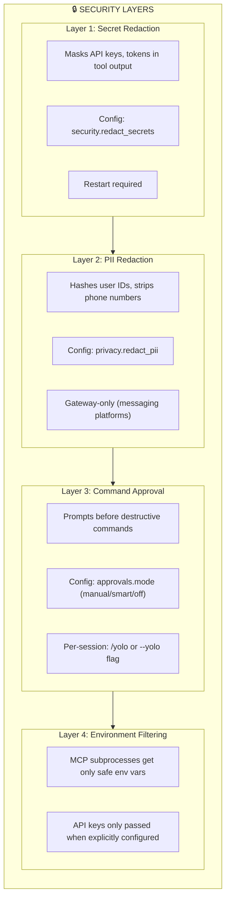
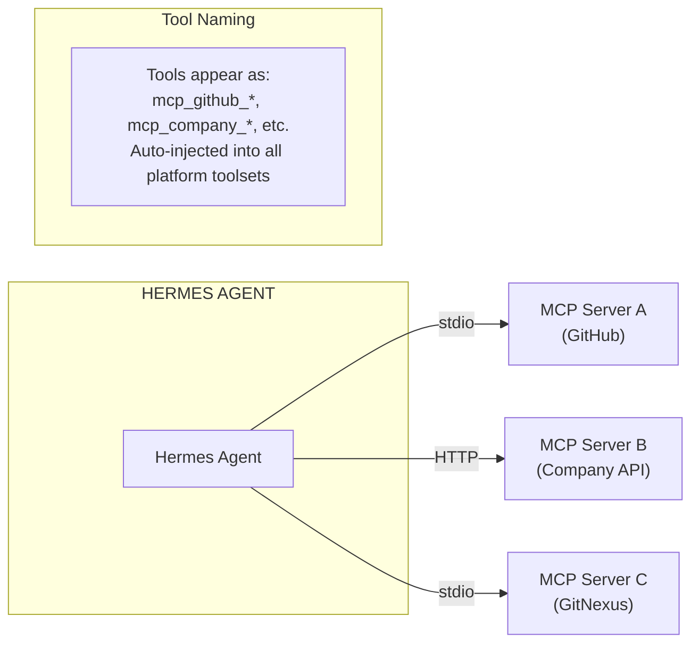
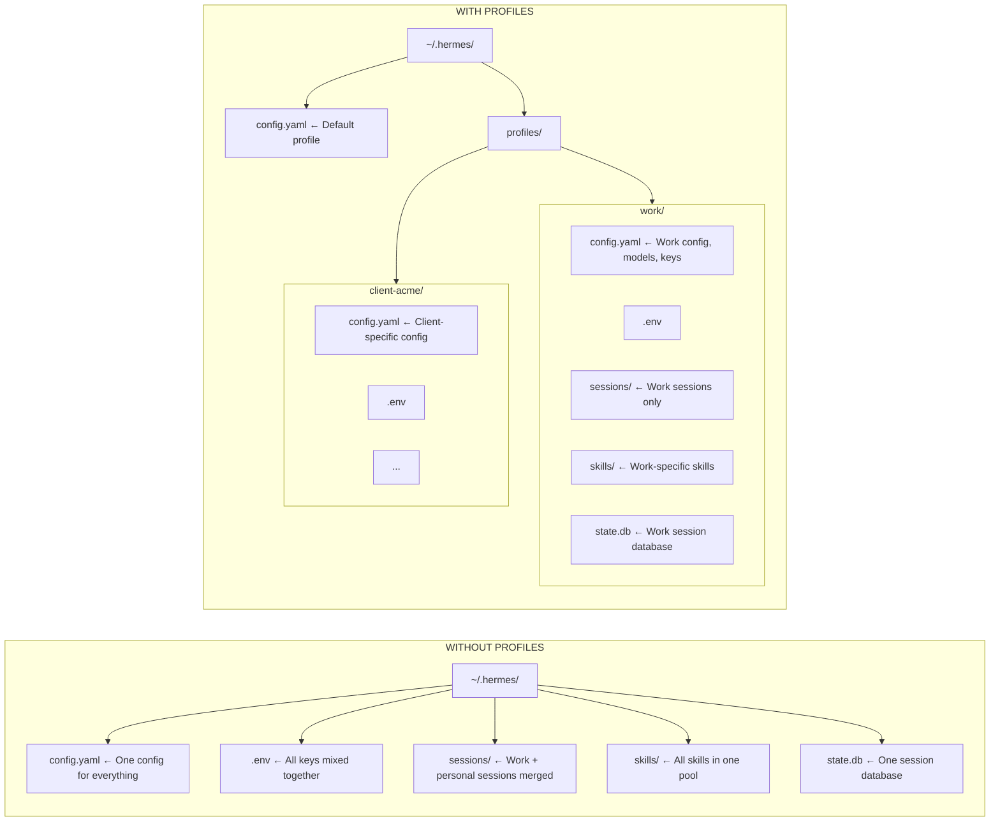
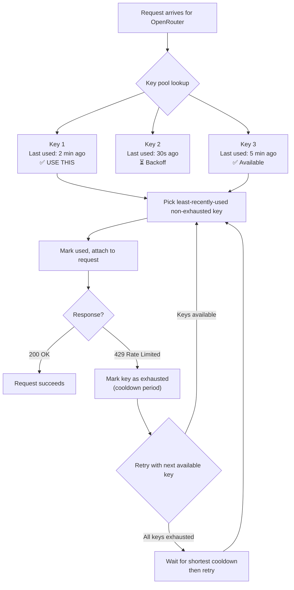
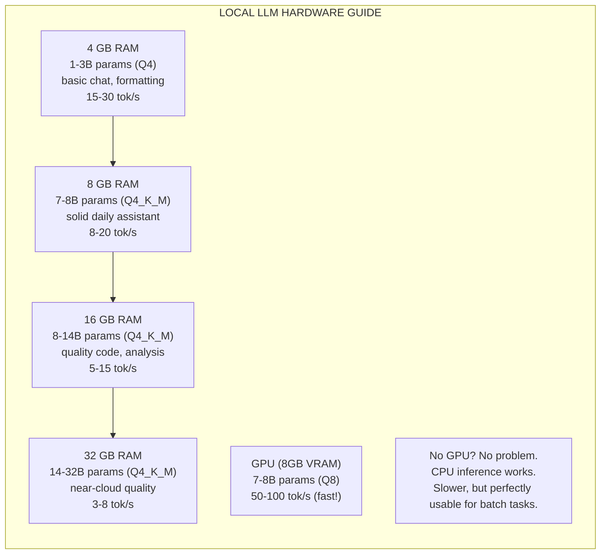
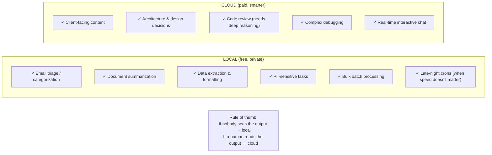
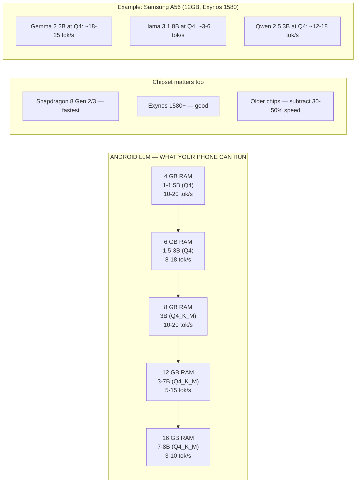
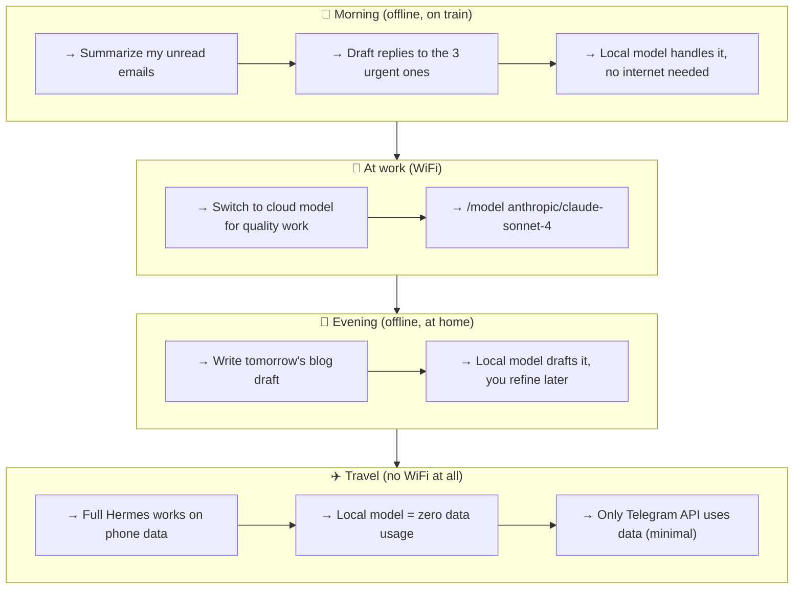

# Chapter 7: Advanced Configuration — Taming the Machine

> **Default Hermes works out of the box. Advanced Hermes runs securely across clients, extends with external tools, isolates environments, and never hits a rate limit. This chapter turns you from a user into an operator.**

---

## 7.1 Security & Privacy

Hermes has access to your terminal, your files, your API keys, and your messaging platforms. That power demands guardrails. Let's walk through every security control — and when to use each.

### Secret Redaction

By default, Hermes passes tool output through unmodified — terminal stdout, file contents, web responses, everything reaches the conversation verbatim. If you want Hermes to auto-mask strings that look like API keys, tokens, and secrets before they enter the context window and logs:

```bash
hermes config set security.redact_secrets true
```

After enabling, strings matching patterns like `sk-...`, `ghp_...`, `xoxb-...`, and generic `API_KEY=`, `password=`, `secret=` values get replaced with `[REDACTED]` in tool output.

**Important:** This takes effect on the next session start — not mid-conversation. That's deliberate. It prevents the LLM from flipping its own security toggle during a task.

```bash
# Verify it's on
hermes config get security.redact_secrets

# Turn it off
hermes config set security.redact_secrets false
```

### PII Redaction in Gateway Messages

Separate from secret redaction. When enabled, the gateway hashes user IDs and strips phone numbers from session context before it reaches the model:

```bash
hermes config set privacy.redact_pii true    # enable
hermes config set privacy.redact_pii false   # disable (default)
```

💡 **Tip:** If you run Hermes on a shared Telegram group or Discord server, enable PII redaction. For personal DMs, it's usually unnecessary.

### Command Approval Modes

Hermes asks for permission before running destructive shell commands (`rm -rf`, `git reset --hard`, etc.) by default. Three modes:

| Mode | Behavior | Best for |
|------|----------|----------|
| `manual` | Always prompt on flagged commands (default) | Most users — safe default |
| `smart` | Auxiliary LLM auto-approves low-risk, prompts on high-risk | Power users who want speed without full YOLO |
| `off` | Skip all approval prompts | Trusted environments, automated workflows |

```bash
# Recommended for power users
hermes config set approvals.mode smart

# Full bypass (not recommended for production)
hermes config set approvals.mode off
```

Per-session override without changing config:

```bash
# One-shot YOLO
hermes --yolo chat -q "Clean up temp files"

# Or in session
/yolo
```

**Key insight:** YOLO mode (`off`) and secret redaction are independent. Turning off approvals does NOT disable secret redaction. You can be fast AND secure.

### Security Quick Reference



---

## 7.2 MCP Servers — Extending Hermes with External Tools

Hermes has 20+ built-in toolsets. But what if you need something it doesn't have — a database query tool, a custom API integration, or a specialized analysis engine?

**MCP (Model Context Protocol)** is the answer. MCP servers expose external tools that Hermes discovers automatically and uses like native ones.

### How It Works



1. You declare MCP servers in `config.yaml`
2. On startup, Hermes connects to each server and discovers its tools
3. Tools appear with `mcp_{server}_{tool}` naming — available everywhere
4. Connections persist for the agent's lifetime with auto-reconnection

### Adding an MCP Server

**Prerequisite:** Install the MCP Python package:

```bash
pip install mcp
```

#### Stdio Transport (Local Subprocess)

Most common pattern — Hermes launches the server as a subprocess:

```yaml
# In ~/.hermes/config.yaml
mcp_servers:
  filesystem:
    command: "npx"
    args: ["-y", "@modelcontextprotocol/server-filesystem", "/home/user/projects"]
    timeout: 30

  gitnexus:
    command: "uvx"
    args: ["gitnexus-mcp"]
    timeout: 120
```

#### HTTP Transport (Remote Server)

For shared or remote MCP servers:

```yaml
mcp_servers:
  company_api:
    url: "https://mcp.mycompany.com/v1/mcp"
    headers:
      Authorization: "Bearer sk-your-token-here"
    timeout: 180
    connect_timeout: 30
```

#### CLI Commands

```bash
# Add interactively
hermes mcp add gitnexus --url http://localhost:3000

# List configured servers
hermes mcp list

# Test a connection
hermes mcp test gitnexus

# Remove a server
hermes mcp remove gitnexus

# Toggle specific tools from a server
hermes mcp configure gitnexus
```

### Security: Environment Filtering

MCP subprocesses do NOT get your full shell environment. Only safe baseline variables (`PATH`, `HOME`, `USER`, `LANG`, etc.) are inherited. API keys and secrets are excluded unless you explicitly pass them:

```yaml
mcp_servers:
  github:
    command: "npx"
    args: ["-y", "@modelcontextprotocol/server-github"]
    env:
      # Only this token reaches the subprocess
      GITHUB_PERSONAL_ACCESS_TOKEN: "ghp_xxxx"
```

💡 **Tip:** If an MCP tool fails with a credential error, check that you've passed the required env vars in the server config — they won't come from your shell automatically.

### Multiple Servers

Stack them in config — all tools from all servers are available simultaneously:

```yaml
mcp_servers:
  time:
    command: "uvx"
    args: ["mcp-server-time"]

  filesystem:
    command: "npx"
    args: ["-y", "@modelcontextprotocol/server-filesystem", "/tmp"]

  github:
    command: "npx"
    args: ["-y", "@modelcontextprotocol/server-github"]
    env:
      GITHUB_PERSONAL_ACCESS_TOKEN: "ghp_xxxx"

  company_api:
    url: "https://mcp.internal.company.com/mcp"
    headers:
      Authorization: "Bearer sk-xxxx"
```

**Restart required** after adding or removing servers — no hot-reload yet. In gateway: `/restart`. In CLI: exit and relaunch.

---

## 7.3 Custom Providers & Base URLs

Hermes ships with 20+ built-in providers. But sometimes you need:

- A **self-hosted model** (vLLM, Ollama, LocalAI)
- A **corporate proxy** that speaks OpenAI-compatible API
- A **custom endpoint** with different auth

### Setting a Custom Base URL

```bash
# Point to a self-hosted endpoint
hermes config set model.base_url "http://localhost:11434/v1"

# Use with any model name
hermes config set model.default "local/llama3"

# Set the API key (if your endpoint requires one)
hermes config set model.api_key "your-key-here"
```

### Common Self-Hosted Setups

| Server | Base URL | Notes |
|--------|----------|-------|
| Ollama | `http://localhost:11434/v1` | Free, runs locally, no API key needed |
| vLLM | `http://localhost:8000/v1` | Production-grade, OpenAI-compatible |
| LocalAI | `http://localhost:8080/v1` | Drop-in OpenAI replacement |
| LM Studio | `http://localhost:1234/v1` | GUI app, OpenAI-compatible |
| Corporate proxy | `https://api.company.com/v1` | May require API key or Bearer token |

**Example: Ollama setup**

```bash
# Install and run Ollama (separate step)
ollama serve
ollama pull llama3

# Point Hermes to it
hermes config set model.base_url "http://localhost:11434/v1"
hermes config set model.default "local/llama3"

# Verify
hermes chat -q "Hello, are you running locally?"
```

**Example: Corporate proxy with API key**

```bash
hermes config set model.base_url "https://ai-proxy.company.com/v1"
hermes config set model.api_key "corp-key-xxxxx"
hermes config set model.default "gpt-4o"
```

### Switching Back

```bash
# Remove custom URL to use provider defaults
hermes config set model.base_url ""

# Or switch to a built-in provider
hermes model    # Interactive picker
```

💡 **Tip:** Custom base URLs apply globally. If you need different models for different tasks, use **profiles** (Section 7.4) or per-job model overrides in cron tasks.

---

## 7.4 Profiles — Isolated Hermes Instances

Profiles give you completely separate Hermes environments — each with its own config, sessions, skills, memory, and API keys. Think of them as separate users on the same machine.

### Why Profiles?



**Use cases:**

- **Work / personal separation** — different models, different API keys, different skills
- **Client isolation** — each client gets their own profile, sessions never leak
- **Experimentation** — a "lab" profile for testing new models without risking your main setup
- **Kanban workers** — specialist profiles for different task types (Chapter 6)

### Creating & Managing Profiles

```bash
# List existing profiles
hermes profile list

# Create a new profile (starts blank)
hermes profile create work

# Clone your current config into the new profile
hermes profile create work --clone

# Clone everything (config + sessions + skills + memory)
hermes profile create work --clone-all

# Set a sticky default
hermes profile use work

# Launch with a specific profile (overrides default)
hermes -p work chat -q "Check staging server logs"

# Show profile details
hermes profile show work

# Rename a profile
hermes profile rename work company

# Export/import (for backup or migration)
hermes profile export work    # Creates work.tar.gz
hermes profile import work.tar.gz

# Delete a profile
hermes profile delete old-client
```

### Per-Invocation Profile

You don't need to change your default. Use `-p` for one-off switches:

```bash
# Quick personal task from work machine
hermes -p personal chat -q "What's on my shopping list?"

# Run a cron job under a specific profile
# (via cronjob tool's profile parameter)
```

### Profile-Aware Paths

Inside a profile, all the standard paths resolve correctly:

| What | Default Profile | Named Profile |
|------|----------------|---------------|
| Config | `~/.hermes/config.yaml` | `~/.hermes/profiles/work/config.yaml` |
| Sessions | `~/.hermes/sessions/` | `~/.hermes/profiles/work/sessions/` |
| Skills | `~/.hermes/skills/` | `~/.hermes/profiles/work/skills/` |
| State DB | `~/.hermes/state.db` | `~/.hermes/profiles/work/state.db` |
| Env | `~/.hermes/.env` | `~/.hermes/profiles/work/.env` |
| Auth | `~/.hermes/auth.json` | `~/.hermes/profiles/work/auth.json` |

Hermes handles this automatically — you never need to construct these paths manually.

---

## 7.5 Credential Pools — Rate Limit Busting

API providers enforce rate limits per key. When you're running multiple agents, cron jobs, and background tasks simultaneously, a single key can throttle fast.

**Credential pools** solve this. Register multiple API keys for the same provider, and Hermes rotates across them automatically.

### Setting Up Credential Pools

```bash
# Interactive wizard — add a new credential
hermes auth add

# List all credentials for a provider
hermes auth list openrouter

# Remove a specific credential by index
hermes auth remove openrouter 2

# Reset exhaustion status (if keys got flagged)
hermes auth reset openrouter
```

### How Rotation Works



**Key insight:** You don't need to manage rotation manually. Just register multiple keys and Hermes handles the rest — picking the least-recently-used key, respecting cooldowns, and spreading load evenly.

### When to Use Credential Pools

| Scenario | Single Key | Credential Pool |
|----------|-----------|-----------------|
| Personal use, light automation | ✅ | — |
| Multiple cron jobs running concurrently | — | ✅ |
| Kanban workers (3+ parallel agents) | — | ✅ |
| Heavy delegation (batch `delegate_task`) | — | ✅ |
| Production gateway with daily users | — | ✅ |

💡 **Tip:** Even 2-3 keys per provider dramatically reduces throttling. Many providers offer free tiers — stack them for burst capacity without cost.

---

## 7.6 Context Window Optimization

LLMs have finite context windows. Hermes has several mechanisms to stay within limits while keeping the most relevant information available.

### Automatic Compression

When the conversation approaches the token limit, Hermes automatically compresses older messages into a compact summary:

```yaml
# config.yaml — compression settings
compression:
  enabled: true            # default: true
  threshold: 0.50          # trigger when 50% of context is used
  target_ratio: 0.20       # compress down to 20% of context
```

```bash
# Adjust thresholds
hermes config set compression.threshold 0.40   # compress sooner
hermes config set compression.target_ratio 0.15 # compress smaller

# Manual compression mid-session
/compress
```

### Toolset Pruning

Every enabled toolset adds schema definitions to the system prompt. If you're only using 3 tools but have 20 toolsets enabled, you're wasting tokens on unused schemas.

```bash
# Interactive tool manager
hermes tools

# Enable only what you need
hermes tools enable terminal
hermes tools enable file
hermes tools enable web

# Disable everything else
hermes tools disable browser
hermes tools disable spotify
# ...
```

💡 **Tip:** A minimal toolset (`terminal` + `file` + `web`) uses ~40% fewer tokens in the system prompt than the full bundle. For long sessions or complex tasks, this matters.

### Cron Jobs: Enabled Toolsets

Cron jobs can restrict which toolsets the agent has access to — reducing both token overhead and attack surface:

```yaml
# In the cronjob tool:
enabled_toolsets: ["web", "terminal", "file"]
```

This is especially valuable for scheduled tasks that only need a few capabilities.

---

## 7.7 Debugging Hermes

When something goes wrong, Hermes has built-in diagnostic tools.

### `hermes doctor` — Health Check

```bash
# Full system check
hermes doctor

# Auto-fix common issues
hermes doctor --fix
```

Checks:
- Python version and dependencies
- Config file validity
- API key presence
- Gateway service status
- MCP server connectivity
- Session store integrity

### `/debug` — Upload Debug Report

In any session:

```
/debug
```

Uploads a debug report (system info + recent logs) and returns a shareable link. Useful for getting help from the community or filing bug reports.

### Log Inspection

```bash
# Gateway logs
cat ~/.hermes/logs/gateway.log

# Recent errors
grep -i "error\|failed\|traceback" ~/.hermes/logs/gateway.log | tail -30

# Follow logs in real-time
tail -f ~/.hermes/logs/gateway.log
```

### `hermes status` — Component Status

```bash
# Quick status
hermes status

# Detailed status (all components)
hermes status --all
```

Shows gateway state, cron scheduler, MCP connections, memory provider, and active sessions.

### Common Issues Quick-Fix

| Symptom | Fix |
|---------|-----|
| "No models provided" (HTTP 400) | Config has UTF-8 BOM — re-save without BOM (`hermes config edit`) |
| Tool not available | `hermes tools list` → check enablement → `/reset` |
| Changes not taking effect | Restart session: `/reset` (CLI) or `/restart` (gateway) |
| Model/provider errors | `hermes doctor` → check API key → `hermes model` to reconfigure |
| Voice not working | Check `stt.enabled: true` + provider setup → `/restart` |
| MCP server won't connect | `hermes mcp test <name>` → check `command` is on PATH → check YAML indent |
| Copilot 403 | `gh auth` tokens don't work for Copilot API — use `hermes model` → GitHub Copilot OAuth |

---

## 7.8 Windows-Specific Tips

Hermes runs natively on Windows — PowerShell, cmd, Windows Terminal, git-bash mintty, VS Code terminal all work. But Windows has quirks.

### Input: Ctrl+Enter for Newlines

**Alt+Enter doesn't insert a newline on Windows.** Windows Terminal intercepts it for fullscreen toggle. Use **Ctrl+Enter** instead.

```bash
# Diagnostic: see exactly how your terminal sends keystrokes
python scripts/keystroke_diagnostic.py
```

### Config: UTF-8 BOM

If `config.yaml` was saved by Notepad or another Windows editor with a UTF-8 BOM, you'll get "No models provided" errors on first run. Fix:

```bash
# Re-save without BOM
hermes config edit
```

### Paths: Forward Slashes

```bash
# ✅ Works everywhere
C:/Users/you/project
~/project

# ❌ Avoid in bash (escape hell)
C:\\Users\\you\\project
```

Forward slashes work in every Hermes tool and most Windows APIs. Prefer them.

### `execute_code` Sandbox: WinError 10106

If you see "The requested service provider could not be loaded" from the sandbox — it's usually the env scrubber dropping `SYSTEMROOT` from the child process. Fixed in current versions. If it recurs, check inside `execute_code`:

```python
import os
print(os.environ.get("SYSTEMROOT"))  # Should be C:\Windows
```

### Shell: Hermes Uses Bash on Windows

The `terminal` tool runs commands through bash (git-bash / MSYS), not PowerShell. Use POSIX syntax:

```bash
# ✅ Correct
ls $HOME && echo "done"
grep "pattern" file.txt

# ❌ Won't work
Get-ChildItem
Select-String "pattern" file.txt
$env:FOO
```

---

## Practical Patterns

### Pattern 1: Secure Production Setup

Setting up Hermes for a production gateway with multiple users:

```bash
# 1. Enable security features
hermes config set security.redact_secrets true
hermes config set privacy.redact_pii true
hermes config set approvals.mode smart

# 2. Add credential pool for rate limit handling
hermes auth add   # Add OpenRouter key 1
hermes auth add   # Add OpenRouter key 2

# 3. Create a production profile
hermes profile create prod --clone
hermes profile use prod

# 4. Tighten compression for long sessions
hermes config set compression.threshold 0.40

# 5. Verify everything
hermes doctor --fix
hermes status --all
```

### Pattern 2: Local-Model Lab Profile

Experimenting with local models without touching your main setup:

```bash
# Create isolated lab profile
hermes profile create lab

# Point to local Ollama
hermes config set model.base_url "http://localhost:11434/v1"
hermes config set model.default "local/llama3"

# Run a quick test
hermes -p lab chat -q "Explain transformer attention in one paragraph"
```

### Pattern 3: Multi-Client Agency Setup

Running Hermes for multiple clients with full isolation:

```bash
# Create per-client profiles
hermes profile create client-acme --clone
hermes profile create client-globex --clone
hermes profile create client-stark --clone

# Each gets their own:
# - config.yaml (different models, base URLs)
# - .env (different API keys)
# - sessions/ (isolated conversation history)
# - skills/ (client-specific workflows)

# Run a task for a specific client
hermes -p client-acme chat -q "Generate monthly report"

# Use Kanban with specialist profiles (Chapter 6)
```

### Pattern 4: MCP-Powered Development Environment

Extending Hermes with project-specific tools:

```yaml
# config.yaml
mcp_servers:
  gitnexus:
    command: "uvx"
    args: ["gitnexus-mcp"]
    timeout: 120

  filesystem:
    command: "npx"
    args: ["-y", "@modelcontextprotocol/server-filesystem", "/home/user/projects"]
    timeout: 30

  database:
    command: "npx"
    args: ["-y", "@modelcontextprotocol/server-postgres", "postgresql://localhost/mydb"]
    timeout: 60
```

```bash
# After adding servers
hermes mcp list       # Verify all connected
hermes mcp test gitnexus  # Test specific server
/reload-mcp           # Reload in session (gateway)
```

---

## 7.9 Local Models — Running Hermes Completely Offline

Cloud APIs are great until they're not. Rate limits, outages, pricing changes, data privacy concerns — local models eliminate all of them. Zero cost per token. Zero data leaving your machine. Zero dependency on anyone else's server.

### The Hardware Reality



### Setup: llama.cpp (Recommended)

```bash
# 1. Install llama.cpp
git clone https://github.com/ggerganov/llama.cpp ~/llama.cpp
cd ~/llama.cpp && make -j$(nproc)

# 2. Download a model (pick one based on your RAM)
# Option A: 8B params, 4.9GB — best for 16GB RAM
# Search huggingface.co for "llama 3.1 8b instruct gguf q4_k_m"

# Option B: 3B params, 2GB — best for 8GB RAM  
# Search for "phi-3 mini gguf q4_k_m"

# Option C: 1.5B params, 1.1GB — runs on anything
# Search for "qwen 2.5 1.5b gguf q4"

# 3. Save to ~/models/
mkdir -p ~/models
# Place your .gguf file there

# 4. Test it works
cd ~/llama.cpp
./llama-cli -m ~/models/llama-3.1-8b-instruct-q4_k_m.gguf \
  -p "Hello, explain quantum computing in one sentence." \
  -n 100 -c 2048
```

### Connecting Hermes to Your Local Model

```bash
# Start the local model server
./llama-server -m ~/models/llama-3.1-8b-instruct-q4_k_m.gguf \
  --host 127.0.0.1 --port 8080 \
  -c 4096 -ngl 0    # -ngl 0 = CPU only; set to 99 for GPU

# In another terminal, configure Hermes
hermes config set providers.local.type openai-compatible
hermes config set providers.local.base_url http://127.0.0.1:8080/v1
hermes config set providers.local.model "local-model"

# Use it
hermes -m local "Summarize this document for me"
```

### Setup: Ollama (Easiest)

```bash
# 1. Install Ollama
curl -fsSL https://ollama.com/install.sh | sh

# 2. Pull a model
ollama pull llama3.1:8b       # 4.9GB, best all-rounder
ollama pull phi3:mini          # 2.2GB, great for low-RAM
ollama pull deepseek-coder-v2  # For code tasks

# 3. It auto-starts on port 11434
# Configure Hermes
hermes config set providers.ollama.type ollama
hermes config set providers.ollama.base_url http://127.0.0.1:11434

# Use it
hermes -m ollama/llama3.1:8b "Write a Python script to parse CSV files"
```

### Hybrid Strategy — Best of Both Worlds



### The Cost Difference

| Task | Cloud (Sonnet) | Local (llama.cpp) |
|------|---------------|-------------------|
| 100 email triages/day | ~$0.50/day = $15/mo | $0 forever |
| Daily 2000-word blog | ~$0.10/article | $0 forever |
| Weekly data report | ~$0.50/report | $0 forever |
| 24/7 monitoring analysis | ~$30/mo | $0 forever |
| **Total for 1 year** | **~$540** | **$0** |

Local models pay for themselves in electricity (negligible) after the first month.

💡 **Tip:** Create a `local` profile that defaults to your local model. Use it for batch crons and PII-heavy tasks. Switch to your cloud profile for interactive work.

---

## 7.10 Running Hermes on Android

Your phone is always with you. Your laptop isn't. Running a local LLM on Android means Hermes works anywhere — on the train, at a café, even without internet.

### Hardware Requirements



### Setup: Termux + llama.cpp

```bash
# 1. Install Termux from F-Droid (NOT Play Store — outdated)
#    https://f-droid.org/packages/com.termux/

# 2. Inside Termux, install dependencies
pkg update && pkg upgrade
pkg install git cmake wget

# 3. Build llama.cpp for ARM
git clone https://github.com/ggerganov/llama.cpp
cd llama.cpp
mkdir build && cd build
cmake .. -DGGML_OPENMP=ON
cmake --build . --config Release -j$(nproc)

# 4. Download a phone-friendly model
# Best pick: Qwen 2.5 3B Instruct (Q4_K_M, ~1.9GB)
# Or: Gemma 2 2B (Q4_K_M, ~1.4GB) — faster
mkdir -p ~/models
cd ~/models
wget "https://huggingface.co/Qwen/Qwen2.5-3B-Instruct-GGUF/resolve/main/qwen2.5-3b-instruct-q4_k_m.gguf"

# 5. Test it
cd ~/llama.cpp/build/bin
./llama-cli \
  -m ~/models/qwen2.5-3b-instruct-q4_k_m.gguf \
  -p "Explain Docker in 3 sentences" \
  -n 150 -c 2048
```

### Connecting Phone Hermes to Telegram

```bash
# Start the model server in Termux
./llama-server \
  -m ~/models/qwen2.5-3b-instruct-q4_k_m.gguf \
  --host 127.0.0.1 --port 8080 \
  -c 2048 -t 4    # -t 4 = 4 threads (adjust for your CPU)

# In another Termux session:
# Install Hermes (if not already)
pip install hermes-agent

# Configure to use local model
hermes config set providers.local.type openai-compatible
hermes config set providers.local.base_url http://127.0.0.1:8080/v1
hermes config set providers.local.model "local"

# Connect to your existing Telegram bot
hermes gateway run

# Now your phone IS your AI assistant.
# Fully offline. Fully private. Zero API cost.
```

### The Mobile Workflow



### Tips for Mobile Performance

- **Use Q4_K_M quantization** — best speed/quality tradeoff
- **Limit context to 2048 tokens** (`-c 2048`) — saves RAM
- **Use 4 threads** (`-t 4`) — optimal for phone CPUs
- **Close other apps** — LLM needs all available RAM
- **Keep phone plugged in** — inference drains battery fast
- **Use a cooling pad** for extended sessions — phones throttle when hot

💡 **Tip:** If you have a phone + laptop on the same WiFi, run the model on your phone (it's always on) and connect your laptop's Hermes to it. Phone becomes a dedicated AI server.

---

## Summary

| Topic | Key takeaway |
|-------|-------------|
| Secret redaction | Masks API keys in tool output — `security.redact_secrets true` |
| PII redaction | Hashes user IDs in gateway messages — `privacy.redact_pii true` |
| Command approval | `manual` / `smart` / `off` — `approvals.mode smart` recommended |
| MCP servers | Extend Hermes with external tools via stdio or HTTP transport |
| Custom providers | Point to self-hosted models via `model.base_url` |
| Profiles | Isolated Hermes instances — separate config, sessions, skills, memory |
| Credential pools | Multiple API keys per provider, automatic rotation |
| Context optimization | Compression + toolset pruning = more room for real work |
| Local models | llama.cpp or Ollama — free, private, offline AI |
| Android setup | Termux + llama.cpp — AI assistant in your pocket |
| Debugging | `hermes doctor`, `/debug`, log inspection, `hermes status` |
| Windows tips | Ctrl+Enter, UTF-8 BOM, forward slashes, bash not PowerShell |

**Next:** [Chapter 8: Power Techniques — Goal, Checkpoints, Steer, Compression →](ch08-power-techniques.md)

---

<!-- SCREENSHOT: hermes doctor output showing all checks passed -->
<!-- SCREENSHOT: hermes mcp list showing connected servers -->
<!-- SCREENSHOT: hermes profile list showing multiple profiles -->
<!-- SCREENSHOT: hermes auth list showing credential pool -->
<!-- SCREENSHOT: Windows Terminal Ctrl+Enter newline -->
