# Chapter 8: Power Techniques — The Expert's Toolkit

> **You've configured Hermes. You've automated workflows. Now learn the shortcuts, steering wheels, and escape hatches that separate power users from everyone else. This chapter is your black belt.**

---

## 8.1 YOLO Mode — Skip Approvals for Speed

Every time Hermes wants to run a flagged shell command, it pauses and asks for permission. That's safe — but slow. YOLO mode skips all approval prompts.

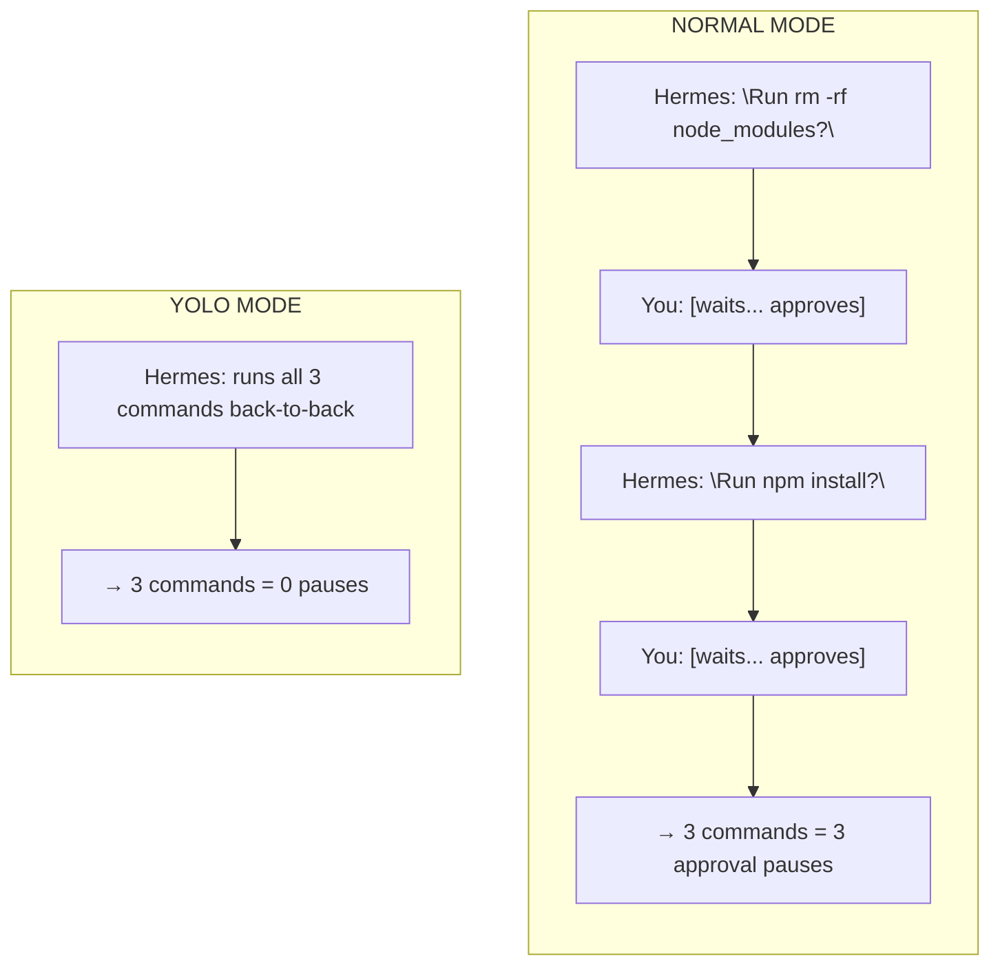

### Three Ways to Activate

```bash
# 1. Per-invocation flag
hermes --yolo

# 2. Toggle mid-session
/yolo          # toggles on/off

# 3. Environment variable
export HERMES_YOLO_MODE=1
```

### When to Use It

| Scenario | YOLO? | Why |
|----------|-------|-----|
| Local development, trusted codebase | ✅ | You wrote the code, you trust it |
| CI/CD pipeline scripts | ✅ | Automated, no human in the loop |
| Exploring a new repo | ⚠️ | Risky — Hermes might modify unknown files |
| Production servers | ❌ | Always review before touching prod |
| Cron jobs / background tasks | ✅ | Unattended — needs to run autonomously |

💡 **Tip:** The sweet spot is `approvals.mode: smart` (covered in Chapter 7) — auto-approves low-risk commands, still prompts on destructive ones. Reserve full YOLO for trusted environments.

---

## 8.2 `/goal` — Standing Objectives Across Turns

Sometimes a task takes more than one message. You want Hermes to keep working on something across multiple turns without you repeating the objective every time.

```mermaid
flowchart TD
    subgraph without["WITHOUT /goal"]
        direction TB
        U1["You: \"Refactor the auth module\""]
        U2["Hermes: refactors auth"]
        U3["You: \"Also update the tests\""]
        U4["Hermes: \"What tests?\" (lost context)"]
        U1 --> U2 --> U3 --> U4
    end
    subgraph with["WITH /goal"]
        direction TB
        G1["You: /goal Refactor auth module to use JWT"]
        G2["Hermes: Goal set. Working on JWT refactor..."]
        G3["You: \"Also update the tests\""]
        G4["Hermes: Still in JWT context, updates tests"]
        G5["You: \"Check the middleware too\""]
        G6["Hermes: Still in JWT context, checks MW"]
        G1 --> G2 --> G3 --> G4 --> G5 --> G6
    end
```

### Goal Commands

```
/goal Refactor auth module to use JWT tokens     # Set a new goal
/goal status                                      # Check current goal
/goal pause                                       # Pause (keeps goal, stops steering)
/goal resume                                      # Resume a paused goal
/goal clear                                       # Clear the goal entirely
```

The goal gets injected into every subsequent turn until you clear it. It's like giving Hermes a north star — every action it takes should move toward that objective.

💡 **Tip:** Use `/goal` for multi-step refactors, research projects, or any task where you'll send 3+ follow-up messages. It prevents context drift.

---

## 8.3 `/steer` — Inject Context Mid-Task Without Interrupting

Hermes is in the middle of a 10-step refactor. You just realized it should also update the TypeScript types. But you don't want to interrupt the current step.

```
/steer Also update the TypeScript type definitions when you modify the interfaces
```

`/steer` queues a message that gets injected **after the next tool call completes** — not immediately, not at the end. It's a course correction that doesn't break stride.

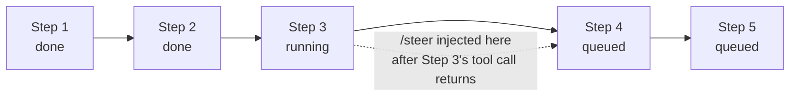

### When to Steer vs. Queue vs. New Message

| Method | When to use | Effect |
|--------|-------------|--------|
| `/steer` | Course-correct without stopping | Injects after next tool call |
| `/queue` | Add a follow-up task for after | Waits until current turn ends |
| New message | Change direction entirely | Interrupts current work |

💡 **Tip:** `/steer` is perfect for "also do X" and "don't forget about Y" — small additions that shouldn't derail the current operation.

---

## 8.4 `/queue` — Stack Commands While Hermes Works

Hermes is running a long test suite. You have three more things you want done after it finishes. Instead of waiting, queue them:

```
/queue Run the linter on the auth module
/queue Check if the Docker build still works
/queue Update the README with the new env vars
```

Each queued command runs sequentially after the current turn completes. You can stack as many as you want.

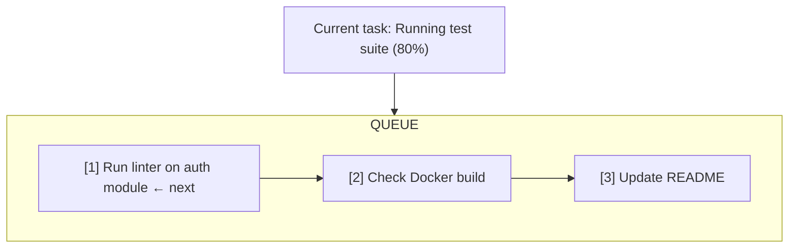

💡 **Tip:** `/queue` is FIFO (first in, first out). Plan your order — lint before build, build before docs.

---

## 8.5 `/branch` — Fork Conversations for Exploration

You're in the middle of a productive session and want to try a risky approach without losing your current state. Branch it.

```
/branch
```

This creates a **fork** of the current conversation — a new session that starts with the same history. Your original session remains untouched.

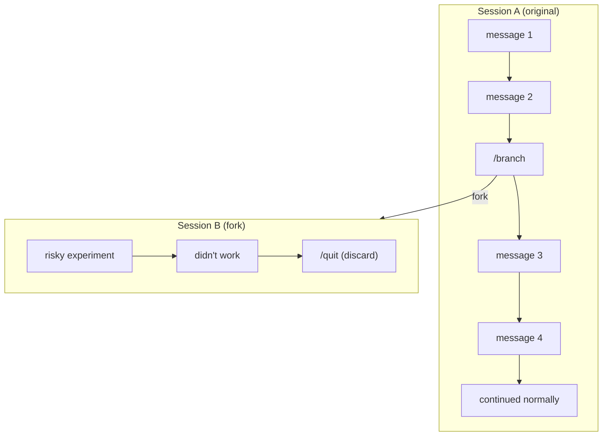

Use cases:
- **Try a risky refactor** — branch, test the approach, discard if it fails
- **Explore alternatives** — branch from the same point, try two different architectures
- **Parallel research** — branch to investigate a library while main thread continues coding

💡 **Tip:** Branches are cheap — they share no state with the parent after forking. Go wild in a branch without consequences.

---

## 8.6 Checkpoints & Rollback — Time Travel for Your Codebase

Hermes is about to modify 15 files in a complex refactor. What if something goes wrong? Checkpoints let you snapshot the filesystem and roll back if needed.

### Setup

```bash
# Enable checkpoints at invocation
hermes --checkpoints

# Or enable in config
hermes config set checkpoints.enabled true
hermes config set checkpoints.max_snapshots 50
```

### Using Checkpoints

```bash
# In-session: rollback to last checkpoint
/rollback

# Rollback to specific checkpoint (N steps back)
/rollback 3
```

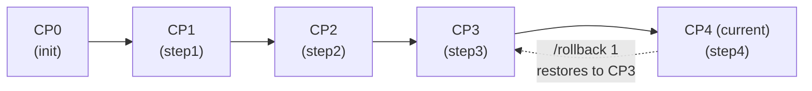

Each checkpoint captures file state at that moment. Hermes creates them automatically before each tool call that modifies files when checkpoints are enabled.

⚠️ **Warning:** Checkpoints capture filesystem state, NOT conversation state. Rolling back restores files but keeps the conversation history. Use `/branch` if you need to fork the entire session.

---

## 8.7 Session Snapshots — Save and Restore Full State

While checkpoints protect the filesystem, snapshots protect your **entire Hermes configuration and state**:

```
/snapshot                    # Create a named snapshot
/snapshot pre-refactor       # Named snapshot for easy reference
/snapshot restore pre-refactor  # Restore a named snapshot
```

Snapshots capture:
- Config.yaml state
- Session transcript
- Skill loading state
- Memory state at that point

Use snapshots before major changes — model switches, config experiments, or any "I might want to undo this completely" moment.

---

## 8.8 Fast Mode — Priority Processing

```
/fast
```

Toggles fast/priority processing mode. When enabled, Hermes optimizes for speed:

- Reduced reasoning overhead
- Fewer intermediate explanations
- Streamlined tool output processing
- Prioritized in the processing queue

Use it for:
- Quick fire-and-forget questions
- Batch operations where you just want results
- Time-sensitive tasks

Toggle off with `/fast` again when you want thorough, detailed responses back.

---

## 8.9 Reasoning Control — Dial In How Hard Hermes Thinks

Different tasks need different levels of reasoning. A typo fix doesn't need extended thinking. A system architecture decision does.

```
/reasoning none       # No reasoning shown, fastest responses
/reasoning minimal    # Brief reasoning, good for simple tasks
/reasoning low        # Light reasoning for routine work
/reasoning medium     # Default — balanced
/reasoning high       # Extended reasoning for complex problems
/reasoning xhigh      # Maximum reasoning for architecture decisions
/reasoning show       # Show reasoning tokens (if model supports it)
/reasoning hide       # Hide reasoning tokens
```

### Reasoning Level Guide

| Level | When to use | Token cost | Example |
|-------|-------------|------------|---------|
| `none` | Formatting, quick lookups | Lowest | "What's the capital of France?" |
| `minimal` | Simple edits, known patterns | Low | "Fix the typo on line 42" |
| `low` | Routine coding tasks | Medium | "Add input validation to this form" |
| `medium` | Default — most tasks | Medium | "Implement user authentication" |
| `high` | Complex logic, debugging | High | "Debug this race condition" |
| `xhigh` | Architecture, multi-system design | Highest | "Design the event-driven pipeline" |

💡 **Tip:** Higher reasoning = more tokens = more cost. Use `xhigh` sparingly — only for genuinely hard problems. Default `medium` handles 90% of tasks well.

---

## 8.10 Busy Mode — What Happens When You Type While Hermes Works

Hermes is in the middle of a long operation. You send a message. What happens? That depends on your **busy mode** setting.

```
/busy queue       # Your message waits in line (default)
/busy steer       # Your message gets injected mid-task
/busy interrupt   # Your message interrupts current work
/busy status      # Check current mode
```

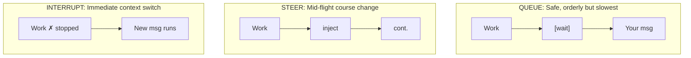

**Recommendation:**
- **`queue`** (default) — safest, use for most work
- **`steer`** — when you need to course-correct without stopping
- **`interrupt`** — emergency stop + new direction

---

## 8.11 Background Prompts — Fire and Forget

```
/background Research the latest Next.js 15 features and write a summary to ~/research/nextjs15.md
```

Runs a prompt in the background inside your session. Hermes processes it independently while you continue chatting normally.

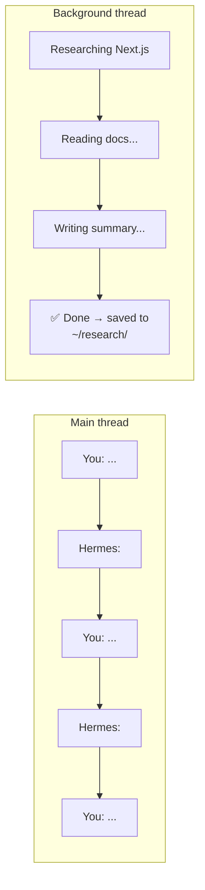

Background prompts:
- Don't block your main conversation
- Complete even if you send new messages
- Report back when finished (in CLI) or silently complete (in gateway)

💡 **Tip:** Use `/background` for research tasks, file generation, or any work that takes more than a minute but doesn't need your immediate attention.

---

## 8.12 Pipe Tricks — Unix Power Meets AI

Hermes runs in your terminal. That means it plays well with Unix pipes, redirects, and heredocs.

### Piped Input

```bash
# Pipe a file into Hermes for analysis
cat error.log | hermes chat -q "What's causing these errors?"

# Pipe command output
docker logs myapp 2>&1 | hermes chat -q "Diagnose the crash"

# Pipe git diff for review
git diff | hermes chat -q "Review these changes"
```

### Heredoc for Complex Prompts

```bash
hermes chat -q "$(cat <<'EOF'
Analyze the following architecture and identify:
1. Single points of failure
2. Scalability bottlenecks
3. Security concerns
4. Cost optimization opportunities

The system uses: FastAPI backend, PostgreSQL, Redis cache,
Elasticsearch, and 3 microservices on Docker Compose.
EOF
)"
```

### Chaining with Other Tools

```bash
# Generate code, format it, write to file
hermes chat -q "Write a Python FastAPI health check endpoint" | black - | tee api/health.py

# Extract todos from codebase and summarize
grep -r "TODO\|FIXME\|HACK" src/ | hermes chat -q "Prioritize these TODOs by urgency"

# Combine with jq for JSON processing
curl -s https://api.example.com/data | hermes chat -q "Extract the top 5 records by revenue and format as CSV"
```

💡 **Tip:** The `-q` flag (query mode) is essential for pipe tricks — it runs a single query non-interactively, perfect for scripting.

---

## 8.13 Model Mid-Task Switching — Change Horses Mid-Race

You started a coding task with a fast, cheap model. Halfway through, you realize you need a smarter model for the complex logic. Don't restart — switch models mid-task.

```
/model anthropic/claude-sonnet-4    # Switch to a smarter model
```

Hermes keeps the full conversation context. The new model picks up exactly where the old one left off — same session, same history, same tool state.

### Strategic Model Switching

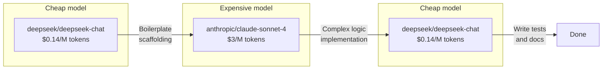

💡 **Tip:** Use cheap models for scaffolding, formatting, and boilerplate. Switch to expensive models only for the hard parts — complex algorithms, architecture decisions, debugging. Switch back for tests and docs.

---

## 8.14 Compression Tricks — Squeeze More Into Every Session

Long conversations eat tokens. When you hit the context window limit, Hermes auto-compresses — but you can control it.

### Manual Compression

```
/compress
```

Forces an immediate compression cycle. Hermes summarizes the conversation so far and replaces the full history with a compressed version, freeing up context space for continued work.

### Compression Configuration

```bash
# Tune when compression triggers (fraction of context window)
hermes config set compression.threshold 0.50    # Default: compress at 50% full
hermes config set compression.threshold 0.70    # Later: more context before compressing
hermes config set compression.threshold 0.30    # Earlier: keep more room free

# Set how aggressively to compress
hermes config set compression.target_ratio 0.20  # Compress to 20% of original (default)
hermes config set compression.target_ratio 0.40  # Less aggressive: keep 40%
```

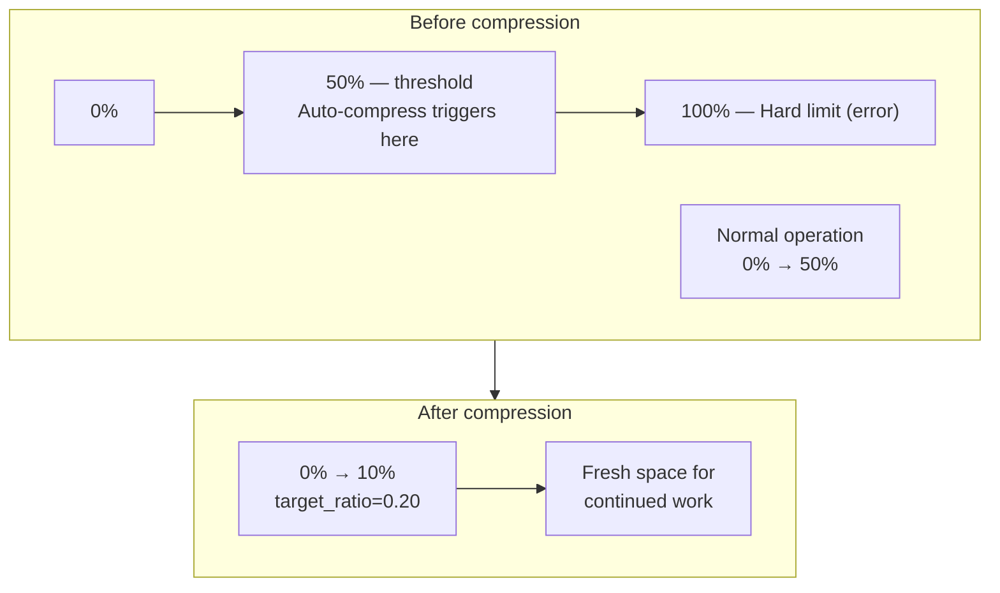

### Compression Best Practices

| Strategy | When | How |
|----------|------|-----|
| Manual `/compress` | After completing a major task phase | Clears out the detailed work, keeps the conclusions |
| Lower threshold | Long automated sessions (cron) | `compression.threshold: 0.40` |
| Higher target ratio | Tasks where detail matters | `compression.target_ratio: 0.35` |
| Toolset pruning | Cron jobs with specific needs | `enabled_toolsets: ["terminal", "file"]` |

💡 **Tip:** The best compression strategy is prevention. Use `/goal` to keep Hermes focused, `/new` to start fresh between unrelated tasks, and toolset pruning on cron jobs to reduce prompt size from the start.

---

## 8.15 Profile-Based Separation — Work, Personal, Lab

You covered profiles in Chapter 7 for configuration isolation. Here's the **power-user pattern**: using profiles as completely separate workspaces.

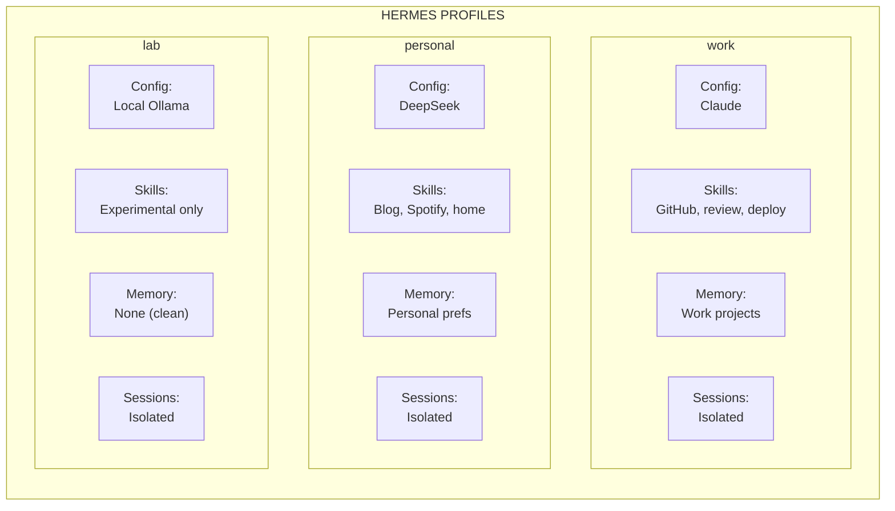

### The Three-Profile Setup

```bash
# Create work profile (clone defaults)
hermes profile create work --clone
hermes profile use work
# Now configure: business model, work skills, work memory

# Create personal profile
hermes profile create personal --clone
# Configure: cheaper model, personal skills

# Create lab profile (clean slate, no memory)
hermes profile create lab
# Configure: local Ollama model, experimental skills
```

### Switching Contexts

```bash
# CLI: use per-invocation flag
hermes -p work        # Work session
hermes -p personal    # Personal session
hermes -p lab         # Lab experiment

# Gateway: each profile can run its own gateway
# or share one with platform routing
```

### Why This Matters

1. **No context pollution** — work projects never leak into personal chat
2. **Cost optimization** — cheap model for personal, premium for work
3. **Safe experimentation** — lab profile with local models, no API costs
4. **Memory isolation** — each profile remembers only what's relevant
5. **Skill separation** — no need to load 50 skills when you only need 5

---

## Power Techniques Quick Reference

| Technique | Command | Best for |
|-----------|---------|----------|
| Skip approvals | `/yolo` or `--yolo` | Trusted environments |
| Standing objective | `/goal <text>` | Multi-step tasks |
| Mid-task injection | `/steer <text>` | Course correction |
| Stack follow-ups | `/queue <text>` | Sequential after-current |
| Fork conversation | `/branch` | Risk-free exploration |
| Time travel | `--checkpoints` + `/rollback` | Dangerous refactors |
| Full state save | `/snapshot` | Before major changes |
| Speed mode | `/fast` | Quick results |
| Think harder | `/reasoning high` | Complex problems |
| Control busy behavior | `/busy queue\|steer\|interrupt` | Long operations |
| Fire and forget | `/background <prompt>` | Independent tasks |
| Unix integration | `hermes chat -q` + pipes | Scripting |
| Switch models | `/model <name>` | Cost/performance tuning |
| Free up context | `/compress` | Long sessions |
| Isolate workspaces | `hermes -p <profile>` | Work/life separation |

---

## Three Power-User Patterns

### Pattern 1: The Safe Refactor

```
# Step 1: Enable safety nets
hermes --checkpoints -p work

# Step 2: Set the objective
/goal Refactor the auth module from session-based to JWT

# Step 3: Let Hermes work, steering as needed
/steer Keep the existing API contract unchanged

# Step 4: If something breaks
/rollback 1

# Step 5: If everything works
/compress          # free up context
/goal clear        # done
```

### Pattern 2: The Cost-Optimized Sprint

```
# Start with cheap model for boilerplate
hermes -m deepseek/deepseek-chat

# Switch to premium for the hard part
/model anthropic/claude-sonnet-4

# Queue follow-up tasks
/queue Write unit tests for the new module
/queue Update the API documentation

# Switch back to cheap for tests and docs
/model deepseek/deepseek-chat
```

### Pattern 3: The Research Pipeline

```
# Branch for exploration
/branch

# Background research task
/background Analyze all competitors and write comparison to ~/research/competitors.md

# Meanwhile, continue main work
# ... (work on your project normally)

# When background finishes, review results
# and merge insights into main thread
```

---

## 8.16 Let Hermes Solve Its Own Problems

This is the most underused power technique. When Hermes hits an error, crashes, or produces bad output — **ask Hermes to fix itself.**

### Why This Works

Hermes has access to the same tools you do. It can read logs, inspect config, search files, run commands, and read its own source code. It knows more about its own internals than you do. Use that.

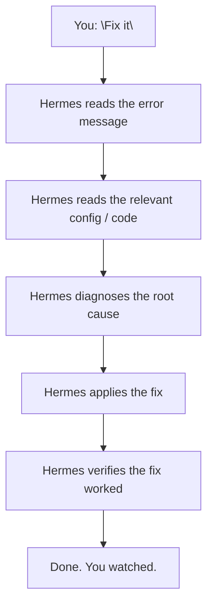

### The Magic Phrases

Just paste the error and say one of these:

```
"Read the error. Diagnose it. Fix it. Verify it works."
"I'm getting this error — fix it and explain what was wrong."
"This cron job failed — read the logs, find why, patch it."
"Hermes is acting weird — run hermes doctor, find issues, fix them."
"Read the last 50 lines of gateway.log. Fix whatever's broken."
```

### Real Example: Broken Cron Job

```
You: "The morning blog cron didn't fire today. Fix it."

Hermes:
  1. Runs: hermes cron list
  2. Finds job c6e4d1c962bd — status: error
  3. Runs: hermes cron log c6e4d1c962bd
  4. Reads: "API error 429: rate limit exceeded"
  5. Runs: hermes config get providers.openrouter
  6. Finds: only one API key configured
  7. Adds credential pool fallback
  8. Patches the cron retry settings
  9. Runs: hermes cron test c6e4d1c962bd
  10. Confirms: "Fixed. Added second API key to pool, set retry to 
      3 attempts with 30s delay. Test run succeeded."
```

You did nothing. Hermes diagnosed, fixed, and verified — all by itself.

### Real Example: Hermes Config Drift

```
You: "Hermes has been slow lately. Diagnose and optimize."

Hermes:
  1. Runs: hermes doctor
  2. Checks config size, context window usage, active tools
  3. Finds: 14 toolsets loaded (you only use 5 regularly)
  4. Finds: compression threshold at 0.70 (too high)
  5. Reads: config.yaml
  6. Patches: enabled_toolsets to only needed ones
  7. Patches: compression.threshold to 0.40
  8. Runs: hermes status --all
  9. Reports: "Trimmed 9 unused toolsets, tightened compression. 
      Your context window is now 60% larger per session."
```

### Real Example: Skill Gone Stale

```
You: "The blog skill keeps failing on Tuesdays. Fix it."

Hermes:
  1. Loads skill: blog
  2. Reads the SKILL.md and linked scripts
  3. Runs: hermes cron log <blog-job-id>
  4. Finds: "Tuesday topic generation fails — API returns empty array"
  5. Reads the topic generation script
  6. Finds: hardcoded category filter that returns 0 results on Tuesdays
  7. Patches the script with fallback categories
  8. Tests with a dry run
  9. Patches the skill with a new pitfall entry
  10. Reports: "Fixed. Added fallback category list. Updated skill 
      with pitfall documentation."
```

### When Self-Debug Doesn't Work

| Situation | What to do |
|-----------|-----------|
| Model keeps looping on the same wrong fix | `/stop`, then explain the error differently |
| Hermes can't see the error (gateway-side) | Check `gateway.log` manually, paste the relevant lines |
| Config is so broken Hermes won't start | `hermes doctor --fix` from terminal |
| The model itself is the problem | Switch models: `/model openai/gpt-4o` |

💡 **Tip:** After Hermes fixes its own problem, say "Save this as a skill." It'll document the diagnosis + fix so it never has to re-learn it. Each self-debug makes Hermes smarter permanently.

---

**Progress: Chapter 8 complete.** Next up: **Chapter 9 — Real Business Use Cases** — 10 scenarios with actual ROI numbers, showing how people make money with Hermes.

---

*Previous: [Chapter 7 — Advanced Configuration](ch07-advanced-config.md) · Next: [Chapter 9 — Real Business Use Cases](ch09-business-use-cases.md)*
