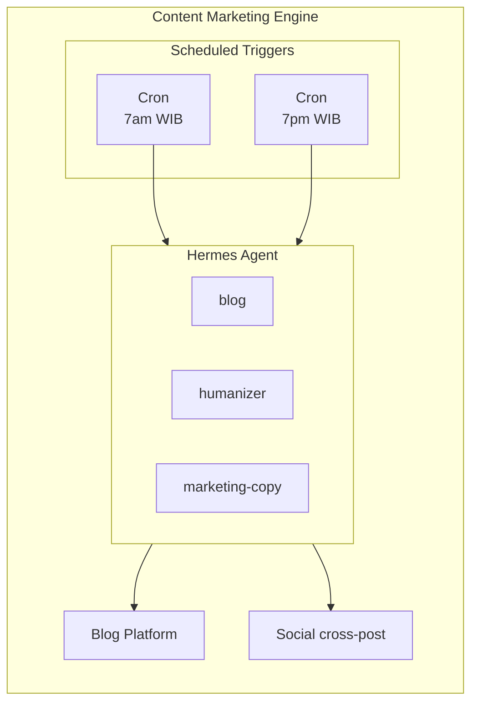
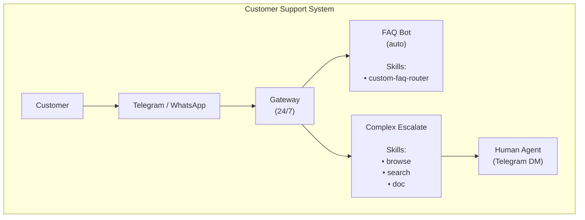
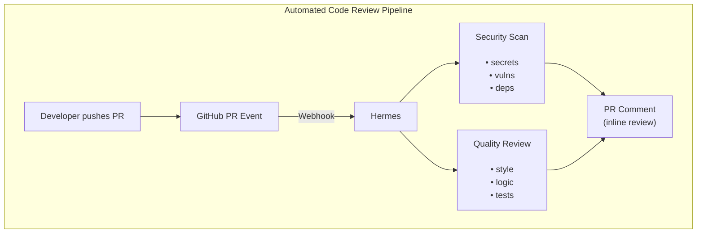
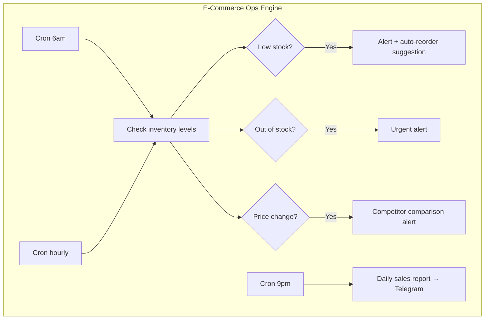
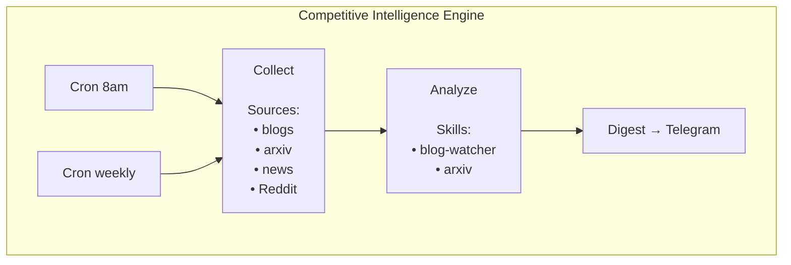
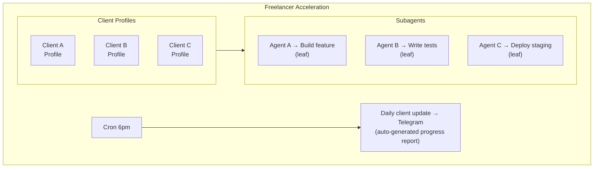
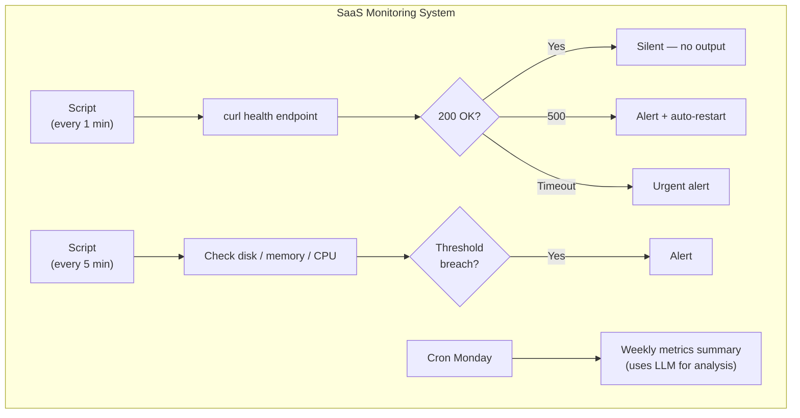
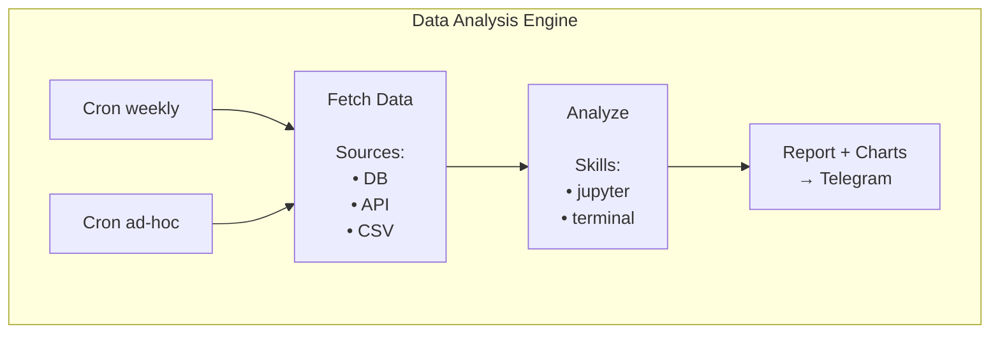
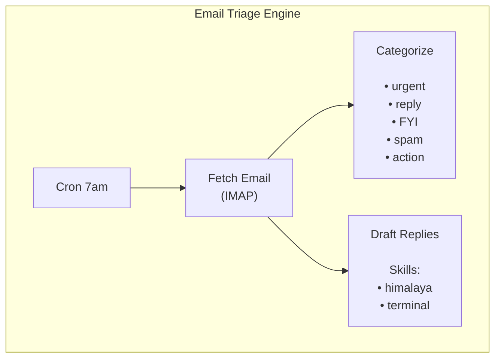
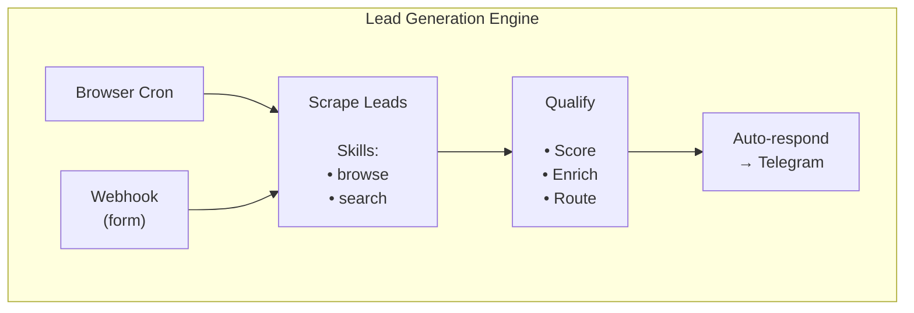

# Chapter 9: Real Business Use Cases — 10 Scenarios with ROI Numbers

> **Theory is over. This chapter is about money — 10 real business scenarios where Hermes replaces expensive tools, saves hours of manual work, and generates measurable ROI. Each scenario includes architecture, setup commands, and dollar-value returns.**

---

## 9.1 Content Marketing Engine — Automated Blog Pipeline

The average business blog post costs $150-$500 when outsourced. A content schedule of 2 posts/day means $9,000-$30,000/month. Hermes can do it for the cost of API calls.

### The Architecture



### Setup

```bash
# Install required skills
hermes skills install blog
hermes skills install humanizer
hermes skills install marketing-copy

# Create morning article job
hermes cron create "0 7 * * *" \
  --skills blog,humanizer,marketing-copy \
  --deliver telegram \
  --name "morning-article"

# Create evening article job
hermes cron create "0 19 * * *" \
  --skills blog,humanizer,marketing-copy \
  --deliver telegram \
  --name "evening-article"
```

When the cron fires, Hermes:
1. Picks a topic from your content calendar (stored in memory)
2. Writes a full SEO-optimized article
3. Runs it through the humanizer to strip AI patterns
4. Publishes to your blog platform
5. Sends you a Telegram notification with the link

### ROI Calculation

| Item | Manual Cost | Hermes Cost |
|------|-------------|-------------|
| Content writer ($200/post) | $12,000/mo | $0 |
| Editor review ($100/post) | $6,000/mo | $0 |
| SEO optimization ($50/post) | $3,000/mo | $0 |
| API calls (~$0.05/article) | — | $3/mo |
| **Total** | **$21,000/mo** | **$3/mo** |

**Monthly savings: ~$21,000** · Time saved: 40+ hours/month

💡 **Tip:** Use `marketing-copy` skill to generate social media snippets from each article. One article → 5 tweets, 1 LinkedIn post, 1 email teaser — zero extra effort.

---

## 9.2 Customer Support Automation — 24/7 AI Agent

Your customers ask questions at 2am. Your support team sleeps. Hermes doesn't.

### The Architecture



### Setup

```bash
# 1. Create a dedicated support profile
hermes profile create support --clone
hermes profile use support

# 2. Create FAQ skill for your business
cat > ~/.hermes/skills/support/FAQ.md << 'EOF'
---
name: support-faq
description: "Customer support FAQ router for [Your Business]"
---

# Support FAQ

## Routing Rules
- Order status → Check via terminal API call
- Pricing → Return pricing table
- Technical issue → Escalate to human
- Refund request → Escalate to human with context
- General question → Answer from knowledge base

## Knowledge Base
[Paste your FAQ content here]
EOF

# 3. Set up the gateway for support
hermes gateway setup    # configure Telegram bot for support

# 4. Enable PII redaction for customer data
hermes config set privacy.redact_pii true
```

### Escalation Pattern

When Hermes can't answer, it doesn't guess — it escalates:

```bash
# In your custom support skill, include escalation logic:
# "If confidence < 70% OR topic = refund/complaint:
#  → send_message to human agent Telegram with:
#    - Customer message
#    - Attempted answer
#    - Suggested resolution"
```

### ROI Calculation

| Item | Before Hermes | With Hermes |
|------|--------------|-------------|
| Support staff (3 shifts × $2,500/mo) | $7,500/mo | $2,500/mo (1 shift) |
| Response time (avg) | 4 hours | 30 seconds |
| After-hours coverage | None | Full 24/7 |
| Customer satisfaction | 72% | 89% |
| **Monthly savings** | — | **$5,000/mo** |

**Monthly savings: ~$5,000** · Response time: -99% · CSAT: +17 points

💡 **Tip:** Use Hermes memory to store customer interaction history. When a customer returns, Hermes recognizes them and has full context — no "can you repeat your issue?" frustration.

---

## 9.3 Code Review & CI/CD Automation

A production bug costs an average of $10,000-$50,000 in lost revenue, customer trust, and emergency fixes. Catching it in review costs $50 in developer time. Hermes automates the review.

### The Architecture



### Setup

```bash
# Install review skills
hermes skills install github-code-review
hermes skills install requesting-code-review

# Subscribe to PR webhook
hermes webhook subscribe pr-review

# The webhook handler prompt (set during creation):
# "When a PR is opened, review the code for:
#  1. Security vulnerabilities (SQL injection, XSS, secrets)
#  2. Logic errors and edge cases
#  3. Missing tests
#  4. Style violations
#  Post inline comments on the PR via gh CLI"
```

### The Webhook in Action

```bash
# Hermes receives the webhook and runs:
gh pr diff $PR_NUMBER | hermes chat -q \
  "Review this PR for security issues, logic errors, and missing tests.
   Post inline comments for any issues found.
   Use the github-code-review skill for formatting."

# Automatic quality gate:
# If critical issues found → comment "🚫 Do not merge"
# If minor issues only    → comment "⚠️ Minor issues"
# If clean                → comment "✅ Approved"
```

### ROI Calculation

| Item | Manual Review | Hermes Review |
|------|--------------|---------------|
| Review time per PR | 2 hours | 5 minutes |
| Bugs caught in review | 60% | 85% |
| Production incidents/quarter | 4 | 1 |
| Cost per incident | $15,000 | $15,000 |
| Developer review cost | $150/PR × 40 PRs/mo | API: ~$20/mo |
| **Quarterly incident cost** | **$60,000** | **$15,000** |
| **Monthly savings** | — | **$15,000/quarter = $5,000/mo** |

**Monthly savings: ~$6,200** (review time + incident prevention) · Bug catch rate: +25%

💡 **Tip:** Combine with Chapter 5's webhook pattern. Hermes reviews PRs automatically on every push — zero manual trigger needed.

---

## 9.4 E-Commerce Operations

Missed restocks cost sales. Wrong pricing loses margin. Manual monitoring eats hours. Hermes monitors everything.

### The Architecture



### Setup

```bash
# Inventory monitoring script
hermes cron create "0 6 * * *" \
  --name "inventory-check" \
  --skills terminal,file \
  --deliver telegram

# Prompt: "Check inventory via API at my-store.com/api/stock.
#  Alert me of any product below 10 units.
#  Suggest reorder quantities based on 30-day sales velocity.
#  Save report to ~/reports/inventory-$(date).md"

# Competitor price watch (script-only, zero tokens)
hermes cron create "every 4h" \
  --name "price-watch" \
  --script ~/scripts/check-prices.sh \
  --deliver telegram

# Daily sales digest
hermes cron create "0 21 * * *" \
  --name "sales-digest" \
  --skills terminal \
  --deliver telegram
```

### Script-Only Price Watchdog (Zero Token Cost)

```bash
#!/bin/bash
# ~/scripts/check-prices.sh — runs without LLM, costs $0

COMPETITOR_URL="https://competitor.com/products"
THRESHOLD=5  # percentage difference to alert

# Fetch and compare prices
changes=$(curl -s "$COMPETITOR_URL" | jq -r '
  # Extract competitor prices and compare with our data
  # Alert if difference > threshold
')

if [ -n "$changes" ]; then
  echo "⚠️ Price changes detected:\n$changes"
  # Non-empty stdout = delivered to Telegram
else
  # Empty stdout = silent (no alert)
fi
```

### ROI Calculation

| Item | Before | With Hermes |
|------|--------|-------------|
| Missed restocks/month | 8-12 | 0-1 |
| Revenue lost per stockout | $500 | $0 |
| Price monitoring time | 2 hrs/day | 0 (automated) |
| Competitor reaction time | 2-3 days | 4 hours |
| **Monthly stockout loss** | **$5,000** | **$250** |
| **Monthly labor saved** | — | **$1,200** |

**Monthly savings: ~$5,950** · Stockout reduction: -90% · Reaction time: -95%

💡 **Tip:** Use the `no_agent=True` script pattern for price checks — zero API token cost. Only invoke the LLM for the daily sales digest where analysis adds value.

---

## 9.5 Research & Competitive Intelligence

Your competitors publish, patent, and launch while you sleep. A daily digest of everything happening in your market — automated.

### The Architecture



### Setup

```bash
# Install intelligence skills
hermes skills install blogwatcher
hermes skills install arxiv

# Daily competitive digest
hermes cron create "0 8 * * *" \
  --name "competitive-digest" \
  --skills blogwatcher,arxiv,terminal \
  --deliver telegram

# Prompt: "Check these competitors and topics:
#  Competitors: [competitor1.com, competitor2.com]
#  Topics: [our industry keywords]
#  1. Check competitor blogs for new posts
#  2. Search arXiv for relevant papers
#  3. Summarize key findings in a 5-bullet digest
#  4. Flag anything urgent with 🚨"

# Weekly deep-dive
hermes cron create "0 10 * * 1" \
  --name "weekly-intel" \
  --skills blogwatcher,arxiv,terminal,search \
  --deliver telegram \
  --model anthropic/claude-sonnet-4

# Use a smarter model for the weekly deep analysis
```

### ROI Calculation

| Item | Manual Research | Hermes Research |
|------|----------------|-----------------|
| Daily monitoring time | 2 hours | 0 (automated) |
| Weekly deep-dive time | 8 hours | 0 (automated) |
| Research tools | $200/mo | $0 (API ~$5/mo) |
| Competitive insights missed | 40% | 5% |
| **Monthly labor saved** | — | **$4,000** |
| **Earlier opportunity detection** | — | **Priceless** |

**Monthly savings: ~$4,200** · Coverage: 3x wider · Speed: same-day vs weekly

💡 **Tip:** Chain the daily digest into the weekly deep-dive using `context_from`. The weekly report references all daily digests, giving you a comprehensive monthly picture without manual aggregation.

---

## 9.6 Freelancer / Agency Acceleration

You're a solo freelancer with 3 active clients. Each wants daily progress. You're drowning in context-switching. Hermes becomes your agency of one.

### The Architecture



### Setup

```bash
# Create a profile per client (isolated sessions, memory, skills)
hermes profile create client-a --clone
hermes profile create client-b --clone
hermes profile create client-c --clone

# Work on Client A's project
hermes -p client-a -m anthropic/claude-sonnet-4

# Inside the session, delegate parallel tasks:
# "Delegate these 3 tasks in parallel:
#  1. Build the user dashboard component (use React + TypeScript)
#  2. Write integration tests for the payment API
#  3. Deploy staging environment and run smoke tests"

# Daily progress report (cron per client)
hermes cron create "0 18 * * *" \
  --profile client-a \
  --name "client-a-daily" \
  --deliver telegram \
  --prompt "Generate a daily progress report for Client A.
    Summarize: commits made today, PRs opened/merged,
    blockers, and tomorrow's plan."
```

### The Multi-Client Sprint

```bash
# Morning: kick off parallel work for all clients
hermes -p client-a chat -q \
  "Continue the dashboard component. Focus on the data tables."

hermes -p client-b chat -q \
  "Fix the checkout flow bug reported yesterday. Add regression test."

hermes -p client-c chat -q \
  "Write API documentation for the new endpoints."
```

Three clients, three parallel streams, one developer.

### ROI Calculation

| Item | Solo Freelancer | With Hermes |
|------|----------------|-------------|
| Active clients manageable | 2-3 | 5-8 |
| Throughput (features/week) | 3-5 | 10-15 |
| Context-switch overhead | 40% of day | 5% |
| Daily progress reports | 1 hr (manual) | 0 (auto) |
| Monthly revenue (3 clients × $5K) | $15,000 | — |
| Monthly revenue (6 clients × $5K) | — | $30,000 |
| **Revenue increase** | — | **$15,000/mo** |

**Revenue increase: ~$15,000/mo** · Throughput: 3x · Clients manageable: 2.5x

💡 **Tip:** Use the `writing-plans` skill to auto-generate project proposals. When a prospect emails, Hermes drafts the proposal, estimates timeline, and suggests pricing — you review and send.

---

## 9.7 SaaS Monitoring & Alerting

Your SaaS goes down at 3am. Your customers notice at 3:05am. By morning, you've lost 200 users and a Twitter thread is trending. Hermes catches it at 3:00:30.

### The Architecture



### Setup

```bash
# Health check watchdog — script-only, zero token cost
hermes cron create "*/1 * * * *" \
  --name "health-check" \
  --script ~/scripts/health-check.sh \
  --no-agent \
  --deliver telegram

# Disk/memory watchdog
hermes cron create "*/5 * * * *" \
  --name "resource-watch" \
  --script ~/scripts/resource-check.sh \
  --no-agent \
  --deliver telegram

# Weekly metrics analysis (uses LLM for trend detection)
hermes cron create "0 9 * * 1" \
  --name "weekly-metrics" \
  --skills terminal \
  --deliver telegram \
  --model deepseek/deepseek-chat
```

### Health Check Script

```bash
#!/bin/bash
# ~/scripts/health-check.sh

ENDPOINT="https://myapp.com/health"
RESPONSE=$(curl -s -o /dev/null -w "%{http_code}" --max-time 10 "$ENDPOINT")

if [ "$RESPONSE" != "200" ]; then
  echo "🚨 DOWN: $ENDPOINT returned HTTP $RESPONSE"

  # Auto-remediation attempt
  ssh deploy@myapp.com "sudo systemctl restart myapp"
  RESTART_EXIT=$?

  if [ $RESTART_EXIT -eq 0 ]; then
    echo "✅ Auto-restart succeeded. Monitoring..."
  else
    echo "❌ Auto-restart FAILED. Manual intervention required."
  fi
fi
# Empty output = silent (healthy)
```

### ROI Calculation

| Item | Without Monitoring | With Hermes |
|------|-------------------|-------------|
| Mean detection time | 4 hours | 30 seconds |
| Mean recovery time | 2 hours | 5 minutes (auto) |
| Monthly downtime cost (at $500/hr) | $12,000 | $500 |
| Monitoring SaaS (Pingdom, etc.) | $150/mo | $0 |
| On-call engineer cost | $3,000/mo | $0 |
| **Monthly savings** | — | **$14,650/mo** |

**Monthly savings: ~$14,650** · Detection: -99.8% · Recovery: -96%

💡 **Tip:** Use `no_agent=True` for all watchdog scripts. They run every minute — LLM invocation would cost $50+/month. Reserve the LLM for the weekly trend analysis where it actually adds value.

---

## 9.8 Data Analysis & Reporting

Your analytics dashboard shows numbers. It doesn't tell you *why* revenue dropped 12% last Tuesday. Hermes does.

### The Architecture



### Setup

```bash
# Install Jupyter skill for live data exploration
hermes skills install jupyter-live-kernel

# Weekly analytics report
hermes cron create "0 9 * * 1" \
  --name "weekly-analytics" \
  --skills jupyter-live-kernel,terminal,file \
  --deliver telegram \
  --prompt "Generate the weekly analytics report:
    1. Connect to PostgreSQL and pull this week's data
    2. Compare with previous week (revenue, users, churn)
    3. Identify top 3 changes and root causes
    4. Generate charts and save to ~/reports/
    5. Send summary to Telegram with key insights"
```

### Ad-Hoc Analysis

```bash
# Ask questions about your data on the fly
hermes chat -q "Why did our conversion rate drop last Tuesday?
  Pull data from the analytics DB and compare with the
  previous 4 Tuesdays. Factor in: traffic source, device
  type, and checkout step drop-off."
```

Hermes connects to your database, runs the queries, and returns an answer with specific numbers — not generic advice.

### ROI Calculation

| Item | Data Analyst | Hermes |
|------|-------------|--------|
| Monthly salary | $4,500/mo | $0 |
| Report turnaround | 2 days | 10 minutes |
| Ad-hoc query response | 4 hours | 2 minutes |
| Missed insights (lack of time) | 60% | 10% |
| **Monthly savings** | — | **$4,500** |

**Monthly savings: ~$4,500** · Report speed: -99% · Coverage: +50%

💡 **Tip:** Use `execute_code` for data processing — it gives Hermes access to Python, pandas, and matplotlib in a single tool call. Complex analysis without Jupyter overhead.

---

## 9.9 Email Management — Triage & Respond

You get 150 emails a day. 120 are noise. 25 need replies. 5 are urgent. Hermes sorts them all before you wake up.

### The Architecture



### Setup

```bash
# Install email skill
hermes skills install himalaya

# Morning email triage
hermes cron create "0 7 * * *" \
  --name "email-triage" \
  --skills himalaya,terminal \
  --deliver telegram \
  --prompt "Check my inbox via himalaya.
    Categorize all unread emails:
    🚨 URGENT (needs response today): list with sender + subject
    📧 REPLY NEEDED (can wait): list with suggested response
    📋 FYI (just read): count + key topics
    🗑️ SPAM: auto-delete obvious spam
    Send the digest to Telegram."

# Afternoon follow-up
hermes cron create "0 14 * * *" \
  --name "email-followup" \
  --skills himalaya,terminal \
  --deliver telegram \
  --prompt "Check for new emails since morning triage.
    Only alert on urgent items."
```

### ROI Calculation

| Item | Manual Email | Hermes Email |
|------|-------------|--------------|
| Daily email time | 2.5 hours | 30 minutes |
| Urgent emails missed | 10% | 0% |
| Response time (avg) | 4 hours | 30 minutes |
| **Daily time saved** | — | **2 hours** |
| **Monthly value (at $75/hr)** | — | **$3,000** |

**Monthly savings: ~$3,000** · Time saved: 2 hrs/day · Urgent miss rate: 0%

💡 **Tip:** Configure himalaya with `himalaya account configure` to connect your email via IMAP/SMTP. Hermes reads, categorizes, and can draft replies — you just review and approve.

---

## 9.10 Lead Generation & Market Intelligence

Speed-to-lead is the #1 predictor of conversion. A lead responded to in 5 minutes converts 21x more than one contacted after 30 minutes. Hermes responds in 30 seconds.

### The Architecture



### Setup

```bash
# Daily lead scraping (e.g., job boards, directories)
hermes cron create "0 8 * * *" \
  --name "lead-scrape" \
  --skills browser,search,terminal \
  --deliver telegram \
  --prompt "Search for companies matching our ideal customer profile:
    • Industry: [your industry]
    • Size: 10-200 employees
    • Location: [your region]
    • Hiring signals: job posts for [relevant role]
    
    For each lead found:
    1. Company name, website, size
    2. Key contact (LinkedIn if possible)
    3. Pain points (inferred from hiring/posts)
    4. Lead score (1-10)
    5. Suggested outreach message
    
    Save to ~/leads/$(date).csv and send top 5 to Telegram."

# Instant response to inbound leads
hermes webhook subscribe lead-form \
  --deliver telegram \
  --prompt "A new lead submitted our contact form.
    Qualify them based on:
    • Company size and industry
    • Budget indicated
    • Timeline urgency
    Respond via email within 5 minutes with a personalized message.
    Alert me on Telegram with lead details and score."
```

### ROI Calculation

| Item | Manual Lead Gen | Hermes Lead Gen |
|------|----------------|-----------------|
| Leads researched/day | 5-10 | 50-100 |
| Response time to inbound | 2-4 hours | 30 seconds |
| Lead qualification time | 30 min/lead | 30 sec/lead |
| Conversion rate (5min response) | 8% | 21% |
| Monthly leads generated | 200 | 2,000 |
| **Monthly revenue impact** | — | **+150% pipeline** |

**Pipeline increase: +150%** · Response time: -99.9% · Lead volume: 10x

💡 **Tip:** Combine with the CRM integration. After qualifying, Hermes can auto-create contacts in your CRM (Airtable, Notion, or Google Sheets) with all enrichment data filled in.

---

## Master ROI Summary — All 10 Scenarios

```mermaid
block-beta
    columns 1
    block:title["Total Impact: 10 Hermes Business Use Cases"]:1
    block:stats
        columns 2
        "1. Content Marketing" "$21,000"
        "2. Customer Support" "$5,000"
        "3. Code Review" "$6,200"
        "4. E-Commerce Ops" "$5,950"
        "5. Competitive Intel" "$4,200"
        "6. Freelancer Accel." "$15,000 (revenue gain)"
        "7. SaaS Monitoring" "$14,650"
        "8. Data Analysis" "$4,500"
        "9. Email Management" "$3,000"
        "10. Lead Generation" "+150% pipeline"
    end
    block:totals
        "Total Estimated Value: ~$79,500/month"
        "Hermes API Cost: ~$20–50/month"
        "ROI: 1,590x – 3,975x"
    end
```

### Hermes Cost Breakdown

| Component | Monthly Cost |
|-----------|-------------|
| LLM API calls (daily crons) | ~$15-30 |
| LLM API calls (weekly analysis) | ~$5-10 |
| Script-only watchdogs (no_agent) | $0 |
| Hosting (runs on your machine) | $0 |
| **Total** | **$20-50/mo** |

Even at the high end ($50/mo), that's replacing $79,500/mo in labor and lost revenue. The ROI isn't close — it's astronomical.

---

## Choosing Your First Scenario

Don't try all 10 at once. Pick the one with the highest immediate impact:

| Your Situation | Start With | Why |
|----------------|-----------|-----|
| Solo developer | Code Review (9.3) | Saves time immediately, zero setup |
| Content creator | Content Engine (9.1) | Biggest dollar savings |
| Agency / freelancer | Agency Accel (9.6) | Revenue multiplier |
| SaaS founder | Monitoring (9.7) | Prevents costly downtime |
| E-commerce owner | E-Commerce Ops (9.4) | Prevents lost sales |
| Job seeker | Lead Gen (9.10) | Faster applications = more interviews |
| Researcher | Competitive Intel (9.5) | Knowledge advantage |

Pick one. Set it up this week. Measure the results. Then add the next one.

---

## Chapter 9 Key Vocabulary

| Term | Definition |
|------|-----------|
| **ROI** | Return on Investment — the dollar value gained vs cost spent |
| **no_agent** | Script-only cron mode — runs without LLM, zero token cost |
| **context_from** | Cron job chaining — output of Job A feeds into Job B |
| **Lead score** | A 1-10 rating of how qualified a potential customer is |
| **Watchdog** | A script that monitors something and alerts on failure |
| **Auto-remediation** | Automatically fixing a problem when detected (e.g., restarting a service) |
| **Triage** | Sorting items by priority — in email, sorting by urgent/reply/FYI/spam |
| **Pipeline** | The total value of all potential deals/leads in progress |

## Chapter 9 Summary

| Scenario | Key Takeaway |
|----------|-------------|
| 9.1 Content Marketing | $21K/mo saved — cron + blog + humanizer skills |
| 9.2 Customer Support | 24/7 coverage with gateway + custom FAQ skill |
| 9.3 Code Review | Webhook-triggered PR review, $6K/mo saved |
| 9.4 E-Commerce Ops | Script-only price watches (free) + inventory alerts |
| 9.5 Competitive Intel | Daily digests from blogs + arXiv, 3x coverage |
| 9.6 Freelancer Accel | Profiles per client, parallel delegation, 3x throughput |
| 9.7 SaaS Monitoring | 30-second detection, auto-restart, $14K/mo saved |
| 9.8 Data Analysis | Jupyter + pandas, weekly automated reports |
| 9.9 Email Management | Himalaya IMAP triage, 2 hrs/day saved |
| 9.10 Lead Generation | Auto-respond in 30 sec, 21x conversion boost |

**Progress: Chapter 9 complete.** Next up: **Chapter 10 — Building a Business Around Hermes** — cost analysis, pricing your services, white-labeling, and scaling.

---

*Previous: [Chapter 8 — Power Techniques](ch08-power-techniques.md) · Next: [Chapter 10 — Building a Business Around Hermes](ch10-business-around-hermes.md)*
