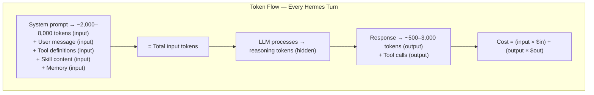
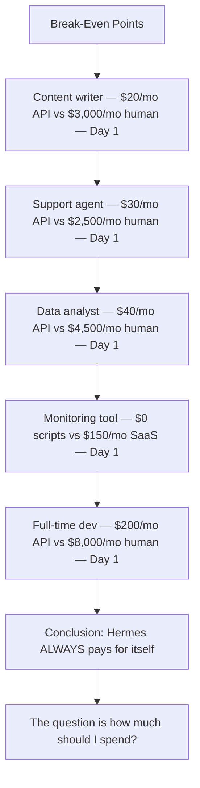
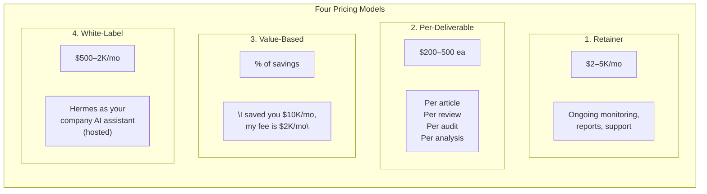
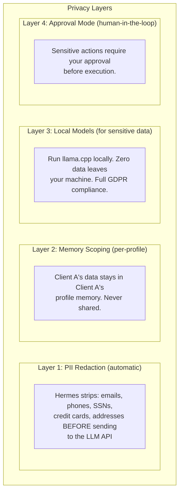
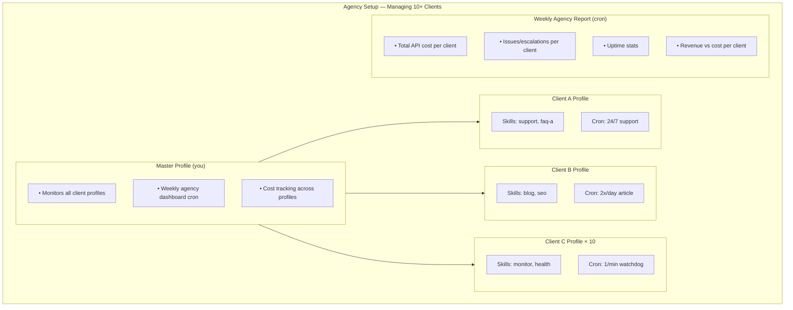
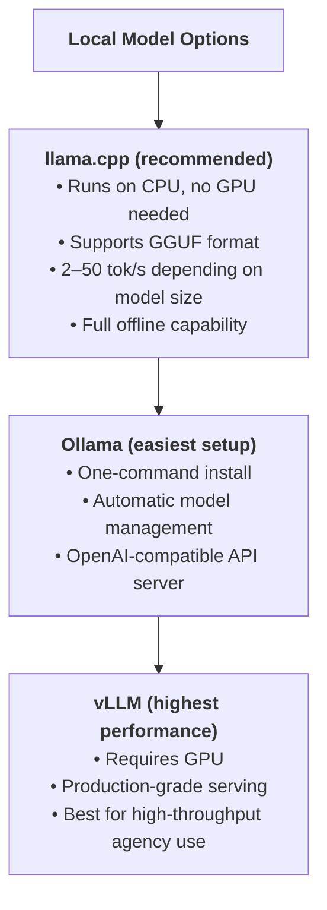
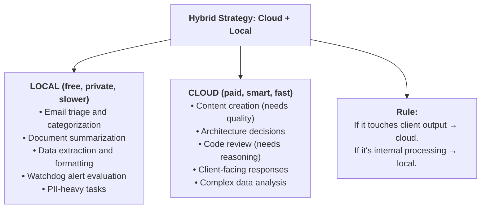
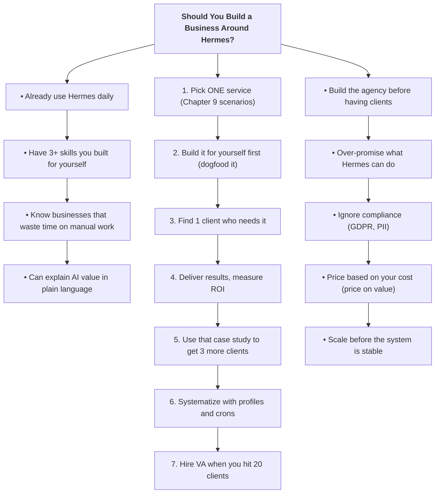

# Chapter 10: Building a Business Around Hermes — Costs, Pricing, and Scaling

> **You've seen what Hermes can do. Now learn how to turn it into revenue — whether you're a freelancer pricing AI services, an agency scaling with automation, or an entrepreneur building a product on top of Hermes. This chapter covers every dollar, every model, every scale strategy.**

---

## 10.1 Cost Analysis — What Hermes Actually Costs

Before you price your services, you need to know your costs. Every Hermes invocation has a price tag. Let's break it down.

### The Token Economics

Every time Hermes thinks, it consumes tokens. Here's what that means in dollars:



### Model Pricing Comparison

| Model | Input ($/M tokens) | Output ($/M tokens) | Best For |
|-------|--------------------|---------------------|----------|
| deepseek/deepseek-chat | $0.14 | $0.28 | Daily crons, bulk work |
| google/gemini-2.0-flash | $0.10 | $0.40 | Fast, cheap tasks |
| openai/gpt-4o-mini | $0.15 | $0.60 | Balanced daily use |
| anthropic/claude-haiku-4 | $0.80 | $4.00 | Quality daily work |
| openai/gpt-4o | $2.50 | $10.00 | Complex analysis |
| anthropic/claude-sonnet-4 | $3.00 | $15.00 | Architecture, review |
| openai/gpt-5.4-mini | $0.60 | $2.40 | Good middle ground |

### Real-World Monthly Cost Scenarios

| Usage Pattern | Model | Monthly API Cost |
|---------------|-------|------------------|
| Light: 20 messages/day | deepseek-chat | ~$2-5 |
| Light: 20 messages/day | claude-sonnet-4 | ~$30-60 |
| Medium: 5 crons + 50 msgs/day | gpt-4o-mini | ~$15-30 |
| Medium: 5 crons + 50 msgs/day | claude-sonnet-4 | ~$80-150 |
| Heavy: 10 crons + 100 msgs/day | deepseek-chat | ~$20-40 |
| Heavy: 10 crons + 100 msgs/day | gpt-4o | ~$100-250 |
| Agency: 20 crons + 200 msgs/day | deepseek-chat | ~$40-80 |
| Agency: 20 crons + 200 msgs/day | claude-sonnet-4 | ~$300-600 |

💡 **Tip:** The cheapest model that does the job is the right model. Use DeepSeek for bulk crons and GPT-4o-mini for daily chat. Reserve Claude Sonnet for complex architecture decisions only.

### Break-Even Analysis

When does Hermes pay for itself?



---

## 10.2 Pricing Your AI-Powered Services

You've automated your workflow. Now sell it. Here's how to price AI-powered services for profit.

### Pricing Models



### Pricing by Service Type

| Service | Your Cost (API) | Price to Client | Margin |
|---------|-----------------|-----------------|--------|
| Blog article (SEO, 2000 words) | $0.05 | $200-500 | 99.9% |
| Daily social media (5 posts) | $0.10/day | $500/mo | 99% |
| Weekly analytics report | $0.50 | $500-1,000/mo | 99% |
| PR code review (per PR) | $0.02 | $50-100 | 99.9% |
| 24/7 customer support chatbot | $30/mo | $1,000-3,000/mo | 97-99% |
| Competitive intelligence weekly | $1/mo | $500-1,500/mo | 99% |
| Full monitoring + alerting | $0 (scripts) | $500-1,000/mo | 100% |
| Lead qualification pipeline | $5/mo | $1,000-2,000/mo | 99% |

### The Profit Formula

```
Revenue = Clients × Services × Price
Cost    = API calls + Your time (setup + maintenance)
Profit  = Revenue - Cost

Example agency setup:
  5 clients × 3 services × $500 avg = $7,500/mo revenue
  API costs: ~$100/mo
  Your time: ~10 hrs/mo (setup + monitoring)
  Profit: $7,400/mo at $740/hr effective rate
```

💡 **Tip:** Never price based on your API cost. Price based on the **value delivered**. A blog article that generates $5,000 in sales is worth $500 regardless of whether it cost you $0.05 or $50 to produce.

---

## 10.3 Building Reusable Skill Packages to Sell

Skills aren't just for your own use. Package them as products.

### What Makes a Sellable Skill

A sellable skill solves a specific, painful, expensive problem:

```mermaid
flowchart TD
    title["<b>Sellable Skill Checklist</b>"]
    good1["✅ Solves a specific pain point"]
    good2["✅ Saves 5+ hours per week"]
    good3["✅ Works out of the box (minimal config)"]
    good4["✅ Has clear ROI the client can measure"]
    good5["✅ Doesn't require technical knowledge to use"]
    good6["✅ Can be demonstrated in 5 minutes"]
    bad1["❌ Generic (e.g., \"write better code\")"]
    bad2["❌ Requires custom setup per client"]
    bad3["❌ Vague ROI (\"saves time\")"]
    bad4["❌ Needs a developer to operate"]
    title --> good1 --> good2 --> good3 --> good4 --> good5 --> good6
    title --> bad1 --> bad2 --> bad3 --> bad4
```

### Example: The "Auto-SEO Blog" Skill Package

```bash
# What the client gets:
~/skills/auto-seo-blog/
├── SKILL.md              # Core skill logic
├── templates/
│   ├── article.md        # Article template
│   ├── meta-tags.md      # SEO meta template
│   └── social-snippets.md # Cross-post templates
├── scripts/
│   ├── publish.sh        # Auto-publish script
│   └── analytics.sh      # Track performance
└── references/
    ├── style-guide.md    # Brand voice guide
    └── keyword-strategy.md # SEO keywords
```

### How to Package It

```bash
# 1. Build the skill locally
hermes skills create auto-seo-blog

# 2. Test it thoroughly on your own content first

# 3. Document the ROI
# "This skill generates 2 SEO-optimized articles/day.
#  At $200/article market rate, that's $12,000/mo value.
#  API cost: $3/mo."

# 4. Publish to skills hub
hermes skills publish auto-seo-blog

# 5. Or sell directly as a package
# Bundle: skill + setup + 1 month support = $500-2,000
```

### Skill Package Pricing

| Package | Includes | Price |
|---------|----------|-------|
| Basic skill | SKILL.md + templates | $100-300 |
| Pro package | Skill + scripts + references | $300-800 |
| Enterprise | Pro package + setup + 3 months support | $1,000-3,000 |
| Custom build | Bespoke skill built for client's workflow | $2,000-10,000 |

💡 **Tip:** The best marketing is a live demo. Set up the skill on a prospect's Hermes instance, run it in front of them, and show the results in real-time. The ROI sells itself.

---

## 10.4 White-Labeling Hermes for Clients

You don't sell "Hermes." You sell "Your AI Assistant." The client never needs to know what's under the hood.

### The White-Label Architecture

```mermaid
flowchart TD
    subgraph WhiteLabel["White-Label Setup"]
        subgraph ClientView["Client Sees"]
            Bot["\"Acme Corp AI Assistant\"\n(Telegram bot with their\nbranding, name, avatar)"]
        end
        Bot --> Managed["You Manage"]
        subgraph Managed["You Manage"]
            Profile["Hermes Profile: acme-corp\n• Custom skills (FAQ, etc.)\n• Company knowledge base\n• Approved actions only\n• Memory scoped to Acme\n• Your API key (not theirs)"]
        end
    end

    Finances["Client pays: $1,000–3,000/mo\nYour cost: $30–100/mo (API)\nYour margin: 90–97%"]
```

### Setup Steps

```bash
# 1. Create an isolated profile for the client
hermes profile create acme-corp

# 2. Configure with scoped skills and knowledge
hermes -p acme-corp skills create acme-support
# Build the FAQ skill with their support docs

# 3. Set up their Telegram bot
# Create a new bot via @BotFather with their branding
# Configure the gateway to use this bot for acme-corp profile

# 4. Lock down permissions
hermes -p acme-corp config set approvals.mode strict
hermes -p acme-corp config set privacy.redact_pii true
hermes -p acme-corp config set tools.enabled "terminal,file,browser,search"

# 5. Pre-load company knowledge into memory
hermes -p acme-corp memory add \
  "Acme Corp sells widgets. Support email: support@acme.com.
   Refund policy: 30 days. Shipping: 3-5 business days.
   API docs at docs.acme.com"

# 6. Start the gateway
hermes -p acme-corp gateway run
```

### Client Onboarding Checklist

- [ ] Create client profile with `--clone`
- [ ] Create branded Telegram bot via BotFather
- [ ] Build custom FAQ skill from their support docs
- [ ] Load company knowledge into profile memory
- [ ] Configure approval mode (`strict` for new clients)
- [ ] Enable PII redaction
- [ ] Set up monitoring cron (health check on their gateway)
- [ ] Test with 20 real support questions
- [ ] Hand over the Telegram bot link to client
- [ ] Schedule weekly review of unanswered questions

### White-Label Pricing Tiers

| Tier | Features | Price/mo |
|------|----------|----------|
| Starter | FAQ bot (50 Q&As), Telegram only | $500-800 |
| Professional | Full support + email triage + reports | $1,000-2,000 |
| Enterprise | Custom skills + monitoring + Slack + WhatsApp | $2,000-5,000 |
| Managed | Full operations — you handle everything | $3,000-10,000 |

💡 **Tip:** Start clients on the Starter tier. Let them see results for 2 weeks, then upsell to Professional. The upgrade pays for itself when they see the weekly analytics report showing how many support tickets Hermes handled.

---

## 10.5 Compliance & Data Privacy

When you handle client data, compliance isn't optional. Here's how to stay safe.

### The Privacy Stack



### Configuration

```bash
# Enable all privacy layers
hermes config set privacy.redact_pii true          # Layer 1
hermes config set privacy.redact_patterns          # Custom patterns
  "email,phone,ssn,credit_card,iban,ip_address"

# Profile isolation is automatic (Layer 2)
# Each profile has its own memory, sessions, and skills

# Local model for sensitive clients (Layer 3)
hermes config set providers.local.type llama-cpp
hermes config set providers.local.model ~/models/llama-3-8b-q4_k_m.gguf

# Approval mode (Layer 4)
hermes config set approvals.mode strict
# Options: off (YOLO), smart (auto-approve low-risk), strict (ask always)
```

### GDPR Compliance Checklist

- [ ] PII redaction enabled on all profiles
- [ ] Client data isolated per profile (no cross-contamination)
- [ ] Session data stored locally (not in cloud)
- [ ] LLM provider has data processing agreement (DPA)
- [ ] Client can request data deletion (`hermes profile delete`)
- [ ] Audit trail enabled (`hermes config set audit.enabled true`)
- [ ] Local model option available for high-sensitivity clients
- [ ] Memory export available for data portability requests

### When to Use Local Models

| Scenario | Cloud Model | Local Model |
|----------|-------------|-------------|
| Public content (blog, social) | ✅ | — |
| Internal analytics | ✅ | ⚠️ (if data is sensitive) |
| Customer PII (names, emails) | ⚠️ (with redaction) | ✅ |
| Financial data (transactions) | ❌ | ✅ |
| Healthcare/medical data | ❌ | ✅ |
| Legal documents | ❌ | ✅ |
| Government/classified | ❌ | ✅ |

💡 **Tip:** For clients with strict compliance requirements, run a local model via `llama-cpp` skill. Zero data leaves their infrastructure. Slower, but bulletproof for GDPR, HIPAA, and SOC2.

---

## 10.6 Scaling — The Multi-Profile Agency

You have 10 clients. Each has their own Hermes profile, skills, and crons. You need a system to manage it all without drowning.

### The Agency Architecture



### Setup Script

```bash
#!/bin/bash
# agency-setup.sh — bootstrap a new client in 5 minutes

CLIENT_NAME=$1
CLIENT_INDUSTRY=$2

if [ -z "$CLIENT_NAME" ]; then
  echo "Usage: ./agency-setup.sh <client-name> <industry>"
  exit 1
fi

echo "Setting up $CLIENT_NAME..."

# 1. Create profile
hermes profile create "$CLIENT_NAME" --clone

# 2. Create client directory
mkdir -p ~/clients/$CLIENT_NAME/{skills,reports,leads}

# 3. Copy industry-specific skill template
cp -r ~/.hermes/skills/templates/$CLIENT_INDUSTRY/* \
      ~/.hermes/profiles/$CLIENT_NAME/skills/

# 4. Set up monitoring cron
hermes cron create "*/5 * * * *" \
  --profile "$CLIENT_NAME" \
  --name "$CLIENT_NAME-monitor" \
  --script ~/clients/$CLIENT_NAME/scripts/monitor.sh \
  --no-agent \
  --deliver telegram

# 5. Set up weekly report
hermes cron create "0 9 * * 1" \
  --profile "$CLIENT_NAME" \
  --name "$CLIENT_NAME-weekly" \
  --deliver telegram \
  --prompt "Generate weekly report for $CLIENT_NAME.
    Include: API costs, issues handled, uptime, suggestions."

echo "✅ $CLIENT_NAME profile created and crons active."
echo "Next: customize skills and load knowledge base."
```

### Cost Tracking

```bash
# Add to your master profile cron — track costs across all clients
hermes cron create "0 8 * * 1" \
  --name "agency-costs" \
  --skills terminal,file \
  --deliver telegram \
  --prompt "Generate the weekly agency cost report.
    For each client profile, check:
    1. API token usage (from logs)
    2. Cron execution count
    3. Errors and escalations
    
    Format as a table:
    Client | API Cost | Revenue | Margin | Issues
    
    Flag any client where margin drops below 80%."
```

### Scaling Limits

| Clients | API Cost/mo | Your Time/mo | Revenue/mo | Profit/mo |
|---------|-------------|--------------|------------|-----------|
| 1-3 | $50-150 | 5 hrs | $2,000-6,000 | $1,850-5,850 |
| 4-10 | $150-500 | 15 hrs | $8,000-20,000 | $7,500-19,500 |
| 10-20 | $500-1,000 | 25 hrs | $20,000-50,000 | $19,000-49,000 |
| 20+ | $1,000+ | 40+ hrs | $50,000+ | Need VA/helper |

💡 **Tip:** At 20+ clients, hire a virtual assistant to handle first-line support and client communication. You focus on building skills and onboarding. Hermes handles the automation. The VA handles the humans.

---

## 10.7 Future-Proofing — Local Models & Edge Deployment

API costs will fluctuate. Providers will change pricing. The only hedge? Local models that you control completely.

### The Local Model Stack



### Setting Up llama.cpp with Hermes

```bash
# 1. Install llama.cpp
git clone https://github.com/ggerganov/llama.cpp
cd llama.cpp && make

# 2. Download a model (example: Llama 3 8B quantized)
# From huggingface.co — search for "llama 3 8b gguf q4_k_m"
# Save to ~/models/

# 3. Configure Hermes to use local model
hermes config set providers.local.type llama-cpp
hermes config set providers.local.model ~/models/llama-3-8b-q4_k_m.gguf
hermes config set providers.local.context_size 4096

# 4. Switch to local model for specific tasks
hermes -m local "Summarize this document"   # Free, private
hermes -m deepseek/deepseek-chat "..."       # Cloud, smarter
```

### Hybrid Strategy: Cloud + Local



### Edge Deployment — Hermes on a Phone

Yes, you can run a local LLM on your phone and Hermes can connect to it:

```bash
# On Android (Termux):
pkg install llama-cpp
# Download model (Q4 quantized for mobile)
llama-cli -m ~/models/gemma-2b-q4.gguf -c 2048 --host 0.0.0.0 --port 8080

# Configure Hermes to use your phone as provider
hermes config set providers.phone.type openai-compatible
hermes config set providers.phone.base_url http://192.168.1.100:8080/v1
```

💡 **Tip:** A 2B-parameter model at Q4 quantization runs at 15-25 tokens/second on a modern phone (Snapdragon 8 Gen 3, Exynos 1580). Not fast enough for complex tasks, but perfect for simple triage and categorization — and completely free.

---

## The Business of Hermes — Decision Framework



---

## Chapter 10 Key Vocabulary

| Term | Definition |
|------|-----------|
| **White-label** | Selling a product under your brand that's built on another platform |
| **Retainer** | Monthly fee for ongoing services |
| **Value-based pricing** | Charging based on the outcome delivered, not hours spent |
| **PII** | Personally Identifiable Information — names, emails, phone numbers |
| **GDPR** | General Data Protection Regulation — EU data privacy law |
| **GGUF** | Model format for llama.cpp — quantized for efficient CPU inference |
| **Edge deployment** | Running models on local/endpoint devices instead of cloud |
| **Margin** | Revenue minus costs — your actual profit percentage |
| **Break-even** | The point where revenue covers all costs |
| **Dogfooding** | Using your own product before selling it to others |

## Chapter 10 Summary

| Topic | What You Learned |
|-------|-----------------|
| 10.1 Cost Analysis | Real API costs per model — $2/mo (DeepSeek) to $600/mo (Claude heavy) |
| 10.2 Pricing | Four pricing models — retainer, per-deliverable, value-based, white-label |
| 10.3 Skill Packages | How to package and sell reusable skills at $100-$10,000 |
| 10.4 White-Labeling | Profile-per-client setup — 90-97% margins at $500-$10K/mo |
| 10.5 Compliance | PII redaction, memory scoping, local models, GDPR checklist |
| 10.6 Scaling | Agency architecture for 10-20 clients — $19K-$49K/mo profit |
| 10.7 Future-Proofing | Hybrid cloud + local strategy, edge deployment, phone-based LLMs |

**Progress: Chapter 10 complete. All 10 chapters done.** 🎉

You've gone from zero to building a business around Hermes. The appendices cover reference material — CLI commands, provider configs, troubleshooting, and the full skills catalog.

---

*Previous: [Chapter 9 — Real Business Use Cases](ch09-business-use-cases.md) · Next: [Appendix A — CLI Reference →](appendix-a-cli-reference.md)*
